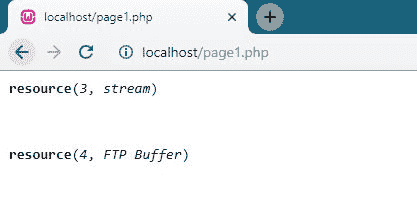
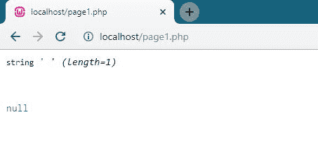
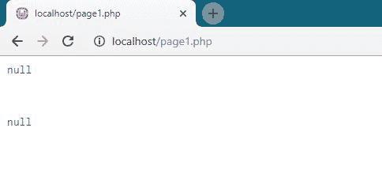

# 特殊类型

> 原文：<https://www.javatpoint.com/php-special-types>

PHP 中有两种特殊的数据类型

1.  [资源](#resource)
2.  [零](#null)

* * *

## 资源数据类型:

它指的是外部资源，如数据库连接、文件传输协议连接、文件指针等。简单来说，资源是一个特殊的变量，它携带着对外部资源的引用。

## 例 1

```php
<?php
	$conn = ftp_connect("127.0.0.1") or die("Could not connect");
	echo get_resource_type($conn);
?>

```


## 例 2

```php
<?php
	$conn= ftp_connect("127.0.0.1") or die("could not connect");
	echo $conn;
?>

```


## 例 3

```php
<?php
	$handle = fopen("tpoint.txt", "r");
	var_dump($handle);
	echo "<br>";
	$conn= ftp_connect("127.0.0.1") or die("could not connect");
	var_dump($conn);
?>

```



* * *

## 空数据类型:

Null 类型的变量是没有任何数据的变量。在 PHP 中，null 不是一个值，我们可以基于 3 个条件将其视为一个 null 变量。

1.  如果变量没有设置任何值。
2.  如果变量设置为空值。
3.  如果变量值未设置。

## 例 1

```php
<?php

	$empty=null;
var_dump($empty);
?>

```


## 例 2

```php
<?php
    	$a1 = " ";
   	 var_dump($a1);
    	echo "<br />";
    	$a2 = null;
    	var_dump($a2);
?>

```



## 例 3

```php
<?php
	$x = NULL;
	var_dump($x);
	echo "<br>";
	$y = "Hello javatpoint!";
	$y = NULL;
	var_dump($y);
?>

```

