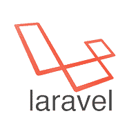
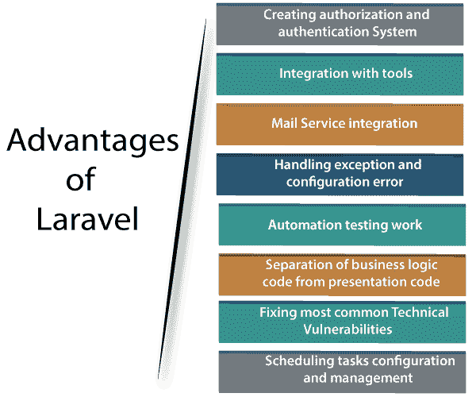

# Laravel 教程

> 噻:[https://www . javatppoint . com/laravel](https://www.javatpoint.com/laravel)

Laravel 教程提供基本和高级概念。我们的 Laravel 教程是为初学者和专业人士设计的。

**Laravel** 是一个开源的 PHP 框架。它还提供了丰富的功能集，包含了 PHP 框架的基本特性，如 Codelgniter、Yii 和其他编程语言，如 Ruby on Rails。

我们的 Laravel 教程包括了所有的主题，如介绍，Laravel 的历史，安装，Laravel 路线，Laravel 控制器，Laravel 视图等。

## 什么是 Laravel？

Laravel 是一个使用 MVC 架构的 PHP 框架。

**在哪里，**

*   **框架:**它是程序员使用的方法、类或文件的集合，他们也可以通过使用自己的代码来扩展它的功能。
*   **架构:**是框架遵循的具体设计模式。Laravel 遵循的是 MVC 架构。

**我们先来了解一下 MVC 架构。**

MVC 分为三个字母，如下所示:

*   **M:**‘M’代表**车型**。模型是处理数据库的类。例如，如果我们在一个应用程序中有用户，那么我们将有一个处理数据库以查询用户表的用户模型。如果我们有用户模型，那么我们也将有一个用户表。我们从示例中得出结论，该模型将有一个特定模型的表。
*   **V:**‘V’代表**观**。视图是一个处理 HTML 的类。我们在浏览器中的应用程序上看到的一切都是视图或表示。
*   **C:**‘C’代表**控制器**。控制器是处理模型和视图的中间人。控制器是从模型中检索数据并将数据发送到视图类的类。

Laravel 是一个开源的 PHP 框架。它还提供了丰富的功能集，包含了 PHP 框架的基本特性，如 Codelgniter、Yii 和其他编程语言，如 Ruby on Rails。

## Laravel 的优势

**以下是 Laravel 的一些优势:**

*   **创建授权和认证系统**
    网络应用程序的每个所有者都确保未经授权的用户不会访问安全或付费资源。它提供了一种实现身份验证的简单方法。它还提供了一种组织授权逻辑和控制资源访问的简单方法。
*   **与工具的集成**
    Laravel 与很多构建更快应用的工具进行了集成。不仅需要构建应用程序，还需要创建更快的应用程序。与缓存后端的集成是提高 web 应用程序性能的主要步骤之一。Laravel 集成了一些流行的缓存后端，如 **Redis** 、 **Memcached** 。
*   **邮件服务集成**
    Laravel 与邮件服务集成。该服务用于向用户的电子邮件发送通知。它提供了一个干净简单的应用编程接口，允许您通过自己选择的本地或基于云的服务快速发送电子邮件。
*   **处理异常和配置错误**
    处理异常和配置错误是影响应用可用性的主要因素。软件应用处理错误的方式对用户的满意度和应用的可用性有着巨大的影响。组织不想失去客户，所以对他们来说，Laravel 是最好的选择。在 Laravel 中，错误和异常处理是在新的 Laravel 项目中配置的。
*   **自动化测试工作**
    测试一个产品是非常重要的，以确保软件运行没有任何错误、bug 和崩溃。我们知道自动化测试比手动测试耗时少，所以自动化测试比手动测试更受欢迎。Laravel 是在考虑测试的情况下开发的。
*   **业务逻辑代码与呈现代码的分离**
    业务逻辑代码与呈现代码的分离允许 HTML 布局设计者改变外观，而无需与开发人员交互。如果在业务逻辑代码和表示代码之间提供分离，开发人员可以更快地解决错误。我们知道 Laravel 遵循 **MVC 架构**，所以分离已经完成。
*   **修复最常见的技术漏洞**
    **安全漏洞**是 web 应用开发中最重要的例子。一个美国组织，即 OWASP 基金会，定义了最重要的安全漏洞，如 SQL 注入、跨站点请求伪造、跨站点脚本等。开发人员需要考虑这些漏洞，并在交付前修复它们。Laravel 是一个安全的框架，因为它保护 web 应用程序免受所有安全漏洞的攻击。
*   **调度任务配置和管理**
    web app 需要一些任务调度机制来及时执行任务，比如什么时候给订阅者发邮件，什么时候一天下来清理数据库表。为了调度任务，开发人员需要首先为每个任务创建 **Cron 条目**，但是 **Laravel 命令调度器**定义了一个命令调度，它需要服务器上的一个条目。

## 先决条件

在学习 Laravel 之前，你应该对 PHP 有一个基本的了解。

## 观众

我们的 Laravel 教程旨在帮助初学者和专业人士。

## 问题

我们向您保证，您不会在本 Laravel 教程中发现任何问题。但是如果有任何错误，请在联系表格中发布问题。

* * *