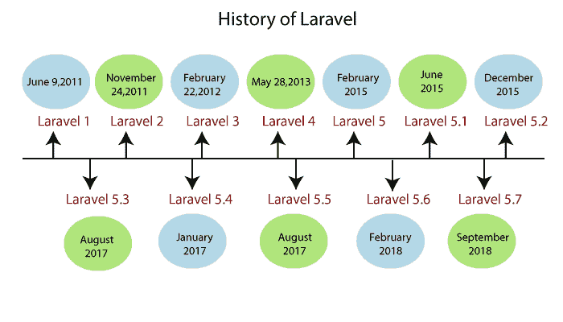

# 拉弗尔历史

> 原文：<https://www.javatpoint.com/history-of-laravel>

**2011 年，** Codeigniter 是 php 中最流行的框架。它被广泛使用，因为它很容易学习，并且有很好的记录。Web 开发人员使用 CodeIgniter 框架创建了许多项目，但是它缺少某些基本功能，例如用户授权和身份验证。**泰勒·奥特韦尔**启动了 Laravel 的开发，为 **Codeigniter** 框架提供了一个替代方案。

## Laravel 的版本

### 拉维尔 1 号

Laravel 的第一个测试版于 2011 年 6 月 9 日发布，在发布了一个测试版之后，Laravel 1 在一个月内就发布了。Laravel 1 有一些内置的特性，例如身份验证、用于数据库操作的雄辩 ORM、本地化、模型和关系、简单的路由机制、缓存、会话、视图、通过模块和库的可扩展性以及 HTML 助手。

Laravel 1 不遵循 MVC 框架，但是开发人员使用这个框架，因为它的语法非常清楚。在开发了 Laravel 1 之后，Taylor Otwell 增加了新的特性，例如验证方法、分页、命令行包安装程序和雄辩的 ORM。由于增加了新功能，开发了一个新版本，即 Laravel 2，这个版本在不到六个月的时间内就开发出来了。

### 拉维尔 2 号

Laravel 2 版本于 2011 年 11 月 24 日发布。Laravel 2 消除了 Laravel 1 中提出的问题，Laravel 2 遵循 MVC 架构。Laravel 2 可以认为是一个真正的 MVC 框架。2011 年 9 月，Laravel 2 发布了对控制器的内置支持，称为 blade 的模板引擎，控制原理反转(IOC)。由于控制器的加入，Laravel 2 框架成为一个完全合格的 MVC 框架。这个框架的主要缺点是它取消了对第三方模块的支持。

### 拉维尔 3 号

Laravel 3 版本于 2012 年 2 月 22 日发布。这个版本的发布包括一些基本特性，例如单元测试集成、Artisan 命令行界面、数据库迁移、事件、会话驱动程序、数据库驱动程序等等。Laravel 3 是各种 web 应用程序中使用的最稳定、最简单的框架。Laravel 3 作为稳定版本进入市场，很多开发者开始转向 Laravel 框架。在 Laravel 3 发布五个月后，框架的创建者开始着手创建框架的新版本，即 Laravel 4。

### 拉维尔 4 号

Laravel 版本于 2013 年 5 月 28 日发布，即版本 3 发布后一年零三个月。尽管发布新版本是框架不断发展的标志，但它正在降低框架的可信度。开发人员要求稳定性，所以 Laravel 4 进入市场，实现了 PHP 开发的光明前景。

Laravel 4 是从零开始编写的，是相互集成的组件的集合。这些组件的管理是通过称为 Composer 的依赖项管理器来完成的。Laravel 4 有一套扩展的特性，以前没有其他版本的 Laravel 提供过，例如数据库种子、消息队列、内置邮件程序、具有作用域的雄辩 ORM、软删除等等。

### 拉维尔 5 号

Laravel 5 版本于 2015 年 2 月发布，是之前版本 Laravel 4 的增强版。Laravel 5 中增加的新功能是通过一个名为 Scheduler 的包定期调度执行的任务，Scheduler 是一个名为 Flysystem 的抽象层，它允许以与本地文件系统酏相同的方式使用远程存储，通过使用 Socialite 包简化了身份验证。它还引入了一个新特性，即针对已开发应用程序的目录树结构。

### 拉维尔 5.1

Laravel 5.1 于 2015 年 6 月发布。它包括新的目录结构、简化的方法注入等新特性，并引入了路由缓存的概念。

### 拉维尔 5.2

Laravel 5.2 于 2015 年 12 月发布，该版本增加的功能有身份验证支架、阵列验证、服务器监控和 Laravel 收银台。

### 拉维尔 5.3

Laravel 5.3 于 2016 年 8 月发布。它包括诸如 Laravel 回声、新的通知系统、Laravel Scout 和护照等功能。

### 拉维尔 5.4

Laravel 5.4 于 2017 年 1 月发布。它包括诸如拉弗尔黄昏，拉弗尔混合，自动门面等功能，并提供路由方面的改进。

### 拉维尔 5.5

Laravel 5.5 版本于 2017 年 8 月发布。PHP 7 的引入是为了增强 Laravel 应用程序的性能。它还包括路由方法和自动包发现等新功能，可以自动添加包。

### 拉维尔 5.6

Laravel 5.6 版本于 2018 年 2 月发布。它包括新的功能，如新的刀片指令和应用编程接口控制器生成。这个版本还增加了新的功能，如氩和密码散列支持。Bootstrap 4 是在 Laravel 5.6 发布之前发布的，所以 Bootstrap 4 是在这个版本中引入的。

### 拉韦勒 5.7

Laravel 5.7 版本于 2018 年 9 月发布，包括 Laravel 转储服务器和 Laravel Nova 等功能。这个版本还增加了一些额外的功能，如网址生成器和可调用语法，以及改进的错误消息。

* * *