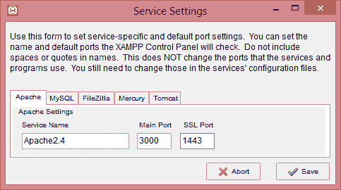

# XAMPP 装置

> 原文：<https://www.javatpoint.com/laravel-xampp-installation>

以下是安装 PHP 环境所需的步骤:

*   点击下面的链接下载 Windows XAMPP:[https://www.apachefriends.org/download.html](https://www.apachefriends.org/download.html)。单击给定链接时，屏幕显示如下:

*   下载 **PHP 7.3.9 版**。要下载这个版本，点击**下载**按钮。
*   点击文件，即[xampp-windows-x64-7.3.9-0-VC15-installer.exe](https://downloadsapachefriends.global.ssl.fastly.net/7.3.9/xampp-windows-x64-7.3.9-0-VC15-installer.exe?from_af=true)安装 XAMPP。
*   当您单击下载的文件时，屏幕显示如下:

*   点击**是**按钮。
*   点击**是**按钮后，出现警告，但忽略该警告，点击**确定**按钮。
*   点击**确定**按钮，出现如下设置窗口:

*   点击**下一步**按钮。
*   在下面的画面中选择**组件**，然后点击**下一步**按钮。

*   选择要安装 **XAMPP** 的文件夹，点击**下一步**按钮。

*   点击**下一步**按钮。

*   下面的屏幕显示设置准备安装，点击**下一步**按钮。

*   安装过程开始，如下图所示:

*   安装完成后，屏幕出现，要求完成一个 **XAMPP 设置向导**。

*   点击**完成**按钮。
*   选择语言，然后点击**保存**按钮。

*   选择语言后，出现如下所示的 **XAMPP 控制面板**:

在上面的面板中，您可以启动或停止 Apache、MySQL。当我们运行 Apache 时，我们会得到一个错误，端口被阻止或缺少一些依赖项。在这种情况下，我们需要提供一些独特的端口。

**以下是提供唯一端口所需的步骤:**

*   点击**配置**按钮，然后点击 **Apache(httpd.config)文件**。

*   更新端口号，即 **80** 用某个唯一的号码。假设我提供了 3000 端口号，那么用 3000 端口号替换 80 端口号的所有外观。

*   点击 **Apache(httpd-ssl.config)** 文件。

*   用一些唯一的号码更新端口号，即 **443** 。假设我提供了 **1443** 端口号，那么用 1443 端口号替换 443 端口号的所有外观。

*   点击**配置**按钮。

*   点击**配置**按钮，屏幕显示如下:

*   点击**服务和端口设置**，屏幕显示如下:

*   将主端口从 80 更改为 3000，将 SSL 端口从 443 更改为 1443。

*   点击**保存**按钮。
*   现在，启动 **Apache 服务器**。

上图屏幕显示 Apache 服务器已经用端口(1443，3000)启动，其中 3000 为**主端口**，1443 为 **SSL 端口**。

* * *