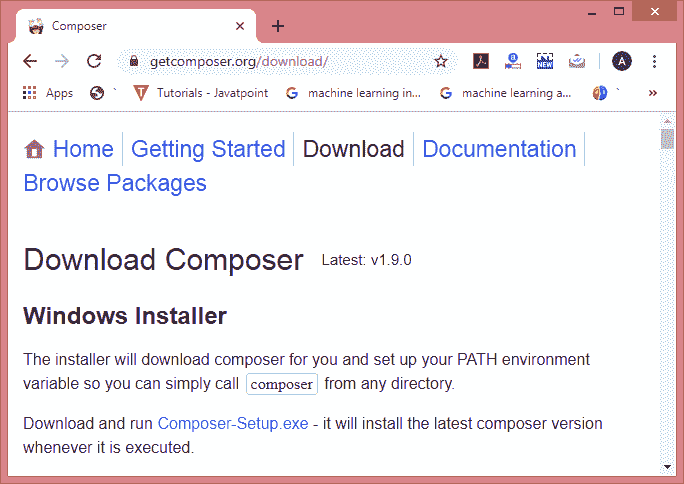
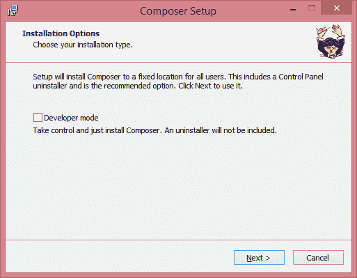
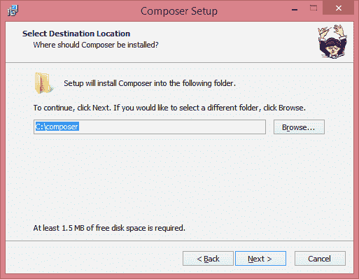
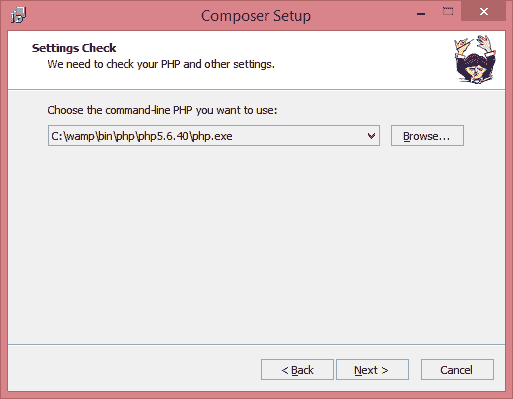
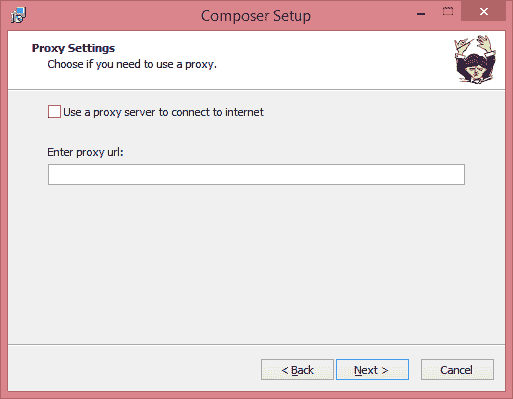
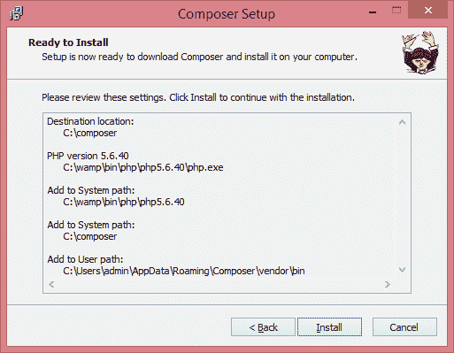
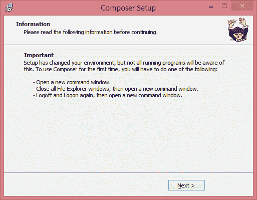
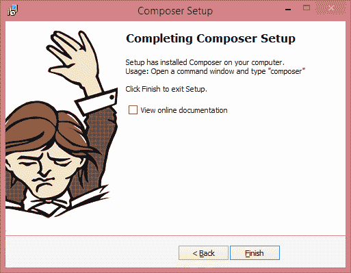
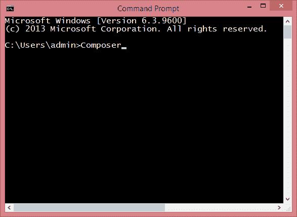
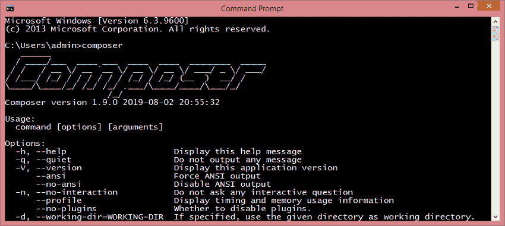

# 作曲家装置

> 原文:[https://www.javatpoint.com/laravel-composer-installation](https://www.javatpoint.com/laravel-composer-installation)

## 什么是作曲家？

Composer 是一种 PHP 编程语言的依赖关系管理器，它管理 PHP 软件和所需库的依赖关系。**尼尔斯·阿德曼**和**乔迪·博加亚诺**发展了作曲家。他们于 2011 年 4 月开始开发，首先于 2012 年 3 月 1 日发布。

Composer 通过**命令行**运行。编写器的主要目的是为应用程序安装**依赖项**或**库**。该编辑器还为用户提供了在 **Packagist** 上安装 PHP 应用程序的功能，其中 Packagist 是包含所有可用包的主存储库。

Composer 为库提供了自动加载功能，以方便第三方代码的使用。

**以下是 Composer 中使用的一些重要命令:**

*   **要求**
    **要求**命令用于将库或包作为参数添加到文件 **composer.json** 中，然后安装。假设我想在 composer.json 文件中添加 **facebook php SDK** 。
    下面给出的是 **require** 命令的语法:

```php

{
      "require":
      {
           "facebook/php-sdk": "3.2.*",
      }
}

```

*   **安装**
    安装命令用于安装 **composer.json** 文件中的所有库或包。该命令用于从 **composer.json** 文件下载所有的 PHP 依赖库。
*   **更新**
    更新命令用于根据 composer.json 文件中提到的版本更新 **composer.json** 文件中的所有库或包。我们可以说**更新**命令将依赖关系更新到最新版本。
*   **移除**
    移除命令用于卸载库或包，并将其从 **composer.json** 文件中移除。

### 下载作曲者的步骤:

**下载作曲者的步骤如下:**

*   点击以下链接下载作曲家:[https://getcomposer.org/download/](https://getcomposer.org/download/)。
*   要下载视窗作曲，点击链接**Composer-Setup.exe**。



*   点击以上链接，下载**Composer-Setup.exe**文件。
*   要安装 **Composer** ，运行下载的文件。
*   点击下载的文件后，屏幕显示如下:



在上图中选择开发者模式，点击**下一步**按钮。

*   选择要安装作曲者设置的路径，然后点击**下一步**按钮。



*   选择命令行 PHP 的路径，路径为“***c:\ wamp \ bin \ PHP \ PHP 5 . 6 . 40 \ PHP . exe***”。



*   如果您想使用代理，请选中代理服务器的复选框并输入代理 url。这里，我在没有代理服务器的情况下使用 Composer，所以我取消选中该框。点击**下一步**按钮。



*   下面的屏幕显示设置准备安装，点击**安装**按钮。



*   点击**安装**按钮后，屏幕显示如下:



*   点击**下一步按钮。**
*   如果您想查看在线文档，请勾选**查看在线文档**框，点击**完成**按钮。



作曲家的安装完成了。现在我们将检查 composer 是否安装成功。要检查这一点，请打开**命令提示符**并键入**作曲家**。



输入作曲者后，按回车键。



上面的屏幕显示作曲者已经成功安装。

* * *