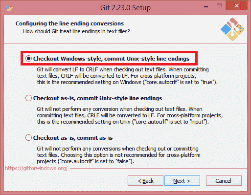

# Git 安装

> 哎哎哎:# t0]https://www . javatppoint . com/laravel-git 安装

## Git 是什么？

Git 是一个免费的开源版本控制系统，旨在以速度和效率处理从非常小的项目到大项目的一切。我们知道每个项目都有不同的版本；Git 允许您保存项目的不同版本并与其他人共享。

Git 是一个命令行控制系统，类似于我们在 **Linux** 中使用的系统。PHP 主要在 Linux 环境下工作，这就是安装 XAMPP 的原因。XAMPP 包含诸如 Apache、SQL 之类的工具，所有这些工具都非常适合 Linux 服务器。由于这个原因，linux 环境命令被称为 **Git** 。

Git 用于开发人员、市场营销、产品管理、设计师、客户支持、人力资源以及任何管理预算的人。

## Git 的优势:

使用 Git 为商业和个人目的提供版本控制的项目数量。

**我们来了解一下 Git 的好处:**

*   **性能**
    当我们谈论版本控制系统时，Git 提供了最好的性能。在 Git 中，提交、分支和合并都经过优化，与其他系统相比提供了更好的性能。
*   **安全**
    Git 使用密码方法，即 SHA 1 来处理安全。此算法用于管理版本、文件和目录，以便您的工作不会被破坏。
*   **分支模型**
    Git 提供了与其他系统不同的分支模型。Git 允许您提供多个相互独立的分支。它还为您提供了无摩擦的内容切换(在新的提交、代码和返回之间来回移动)、基于角色的代码和一次性实验(如果尝试了一些东西，但它不起作用，那么删除它不会丢失任何代码)。
*   **临时区域**
    Git 有一个中间阶段，称为“**临时区域**或“**索引**”，其中索引允许您仅提交自上次提交以来已完成的更改或修改的某些部分。
*   **分布式**
    Git 是一个分布式版本控制系统，这意味着它不在工作副本上工作，但是它获得了一个本地存储库，该存储库具有完整的提交历史。
*   **开源**
    如今，开源是软件交易最重要的特征。它允许您邀请来自世界各地的所有开发人员，并可以通过添加新功能和附加插件为软件做出贡献。这使得软件功能强大。

## 安装 Git 的步骤

以下是安装 Git 所需的步骤:

*   点击给定链接下载 Git:[ttps://Git-SCM . com/downloads](https://git-scm.com/downloads)
*   点击窗口链接下载窗口 Git。
*   点击窗口后，下载开始。

*   运行下载的文件，即**Git-2.23.0-64-bit.exe**。
*   当您点击下载的文件时，屏幕显示如下，点击下一步按钮。

*   选择要在其中安装 Git 安装程序的目标文件夹。选择目标文件夹后，点击**下一步**按钮。

*   选择要在 Git 中安装的组件。

*   也选择桌面图标上的**。**
*   选择开始菜单文件夹，点击**下一步**按钮。

*   点击**下一步**按钮。

*   从命令行选择 **Git，也可以从下面屏幕的 3 rd 派对软件**中选择，然后点击**下一步**按钮。

*   从下面的屏幕中选择选项，即“**打开**，然后点击**下一步**按钮。

*   选择**选项，使用 OpenSSL 库**，然后点击**下一步**按钮。

*   选择**签出窗口式选项，提交 Unix 风格的行尾**，然后点击**下一步**按钮。

*   选择选项，即**使用 MinTTY** ，然后点击**下一步**按钮。

*   选择要启用的功能。

*   点击**安装**按钮。

*   下面的屏幕显示安装完成。

*   点击**启动**按钮。

* * *