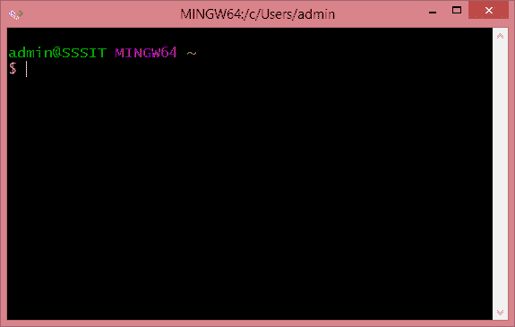
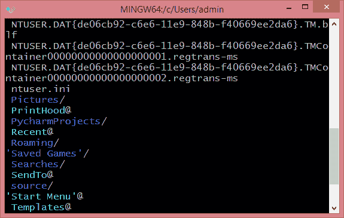
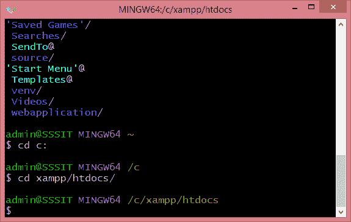
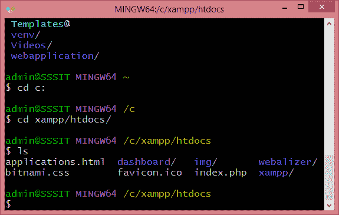
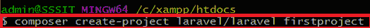
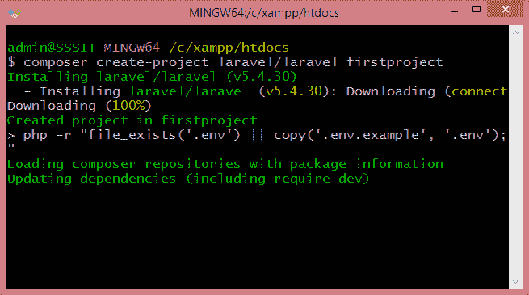
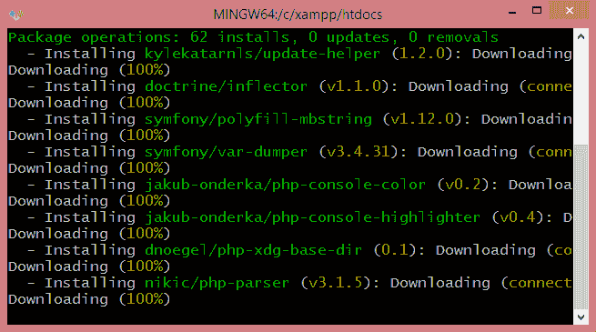
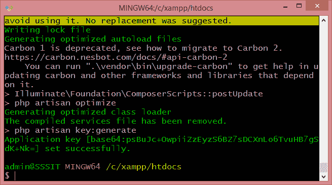
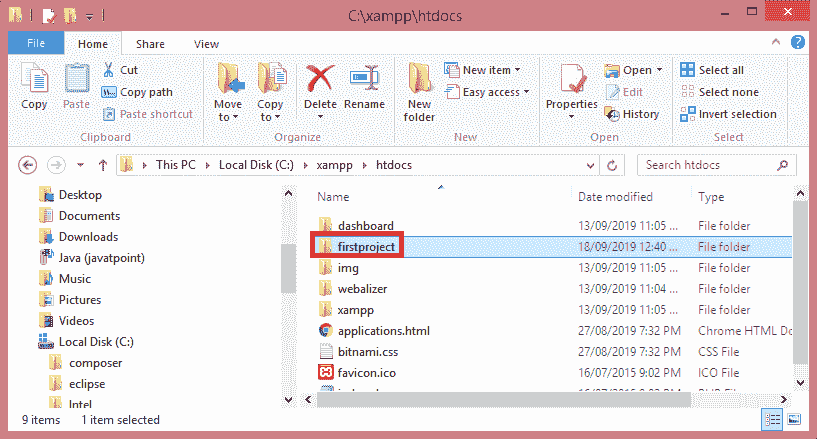
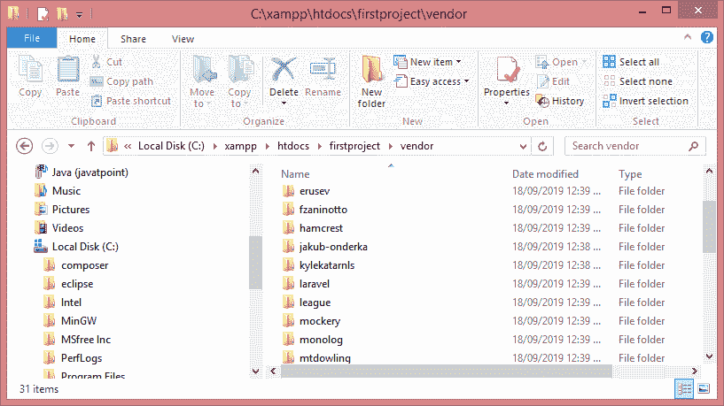

# 创建第一个 Laravel 项目

> 原文：<https://www.javatpoint.com/creating-first-laravel-project>

在本主题中，我们将创建第一个 laravel 项目。为了创建 **Laravel** 项目，我们将使用 **Git** 和 **Composer** 。

**以下是创建第一个 laravel 项目所需的步骤:**

*   打开 **Git Bash 窗口**。



*   输入 **ls** 命令了解当前位置。



目前，我们在根目录中。

*   现在我们在 Xampp 文件夹中创建一个 Laravel 项目。首先，我们需要移动到 xampp 文件夹，在那里我们创建一个新的 laravel 项目。



在上图中， **cd c:** 命令用于移动到 c 驱动器，然后我们使用命令 **cd xampp/htdocs/** 移动到 xampp 文件夹。

*   首先，我们使用 **ls** 命令查看项目列表。



上面的屏幕显示列表为空，即 xampp 文件夹中没有可用的项目。现在，我们首先清除屏幕，并创建一个新的 laravel 项目。

*   创建一个新的 laravel 项目。



在上面的屏幕中，我们使用命令**composer create-project laravel/laravel first project**。

**在哪里，**

**laravel/laravel:** 是厂商包。
**第一个项目:**是一个项目名称。

#### 注意:如果我们没有提到版本，那么 composer 会用最新版本自动创建新的 laravel 项目。

我们也可以使用下面的命令来创建一个新的 laravel 项目:

```php

composer create-project ?prefer-dist laravel/laravel project_name 5.2.29
composer create-project laravel/laravel project_name 5.2.31 ?prefer-dist

```

*   下面的屏幕显示 laravel 的安装已经开始。




*   一旦 laravel 的安装完成，就会创建一个应用程序密钥。



*   安装成功后，转到 **xampp/htdocs** 文件夹，在那里我们可以找到**第一个项目**。



*   转到**第一个项目**文件夹，然后点击**供应商**文件夹，在那里你会找到所有的依赖项。



* * *