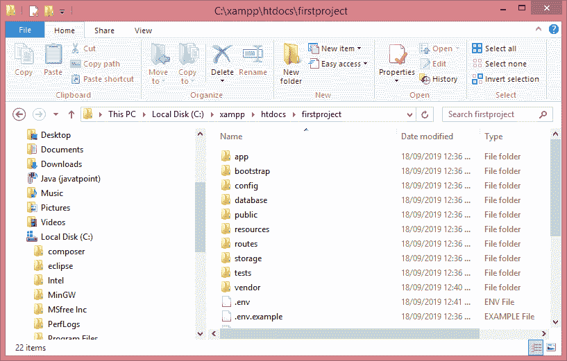
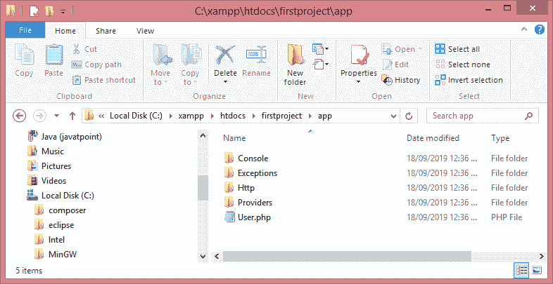
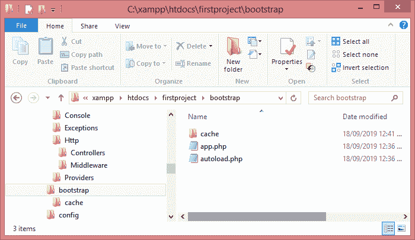
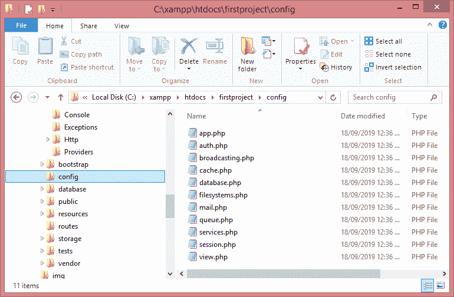
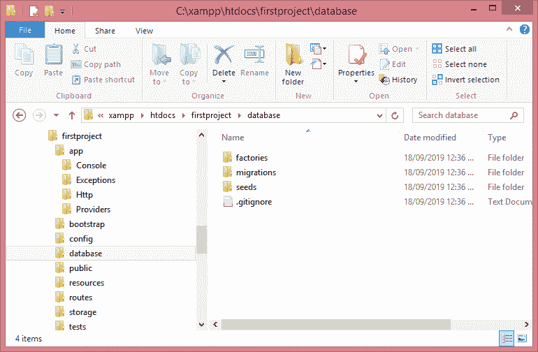
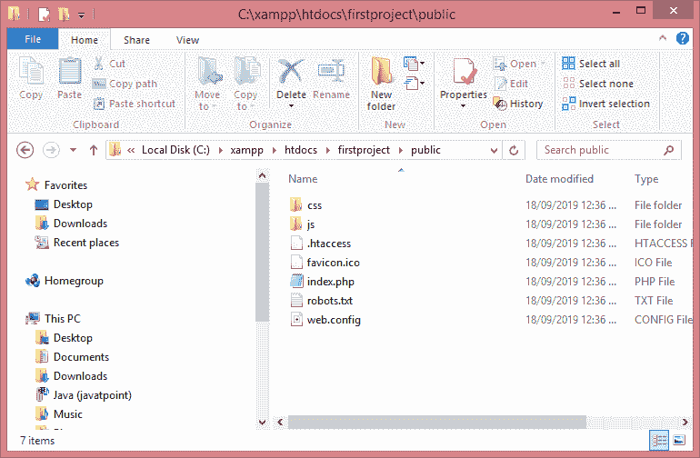
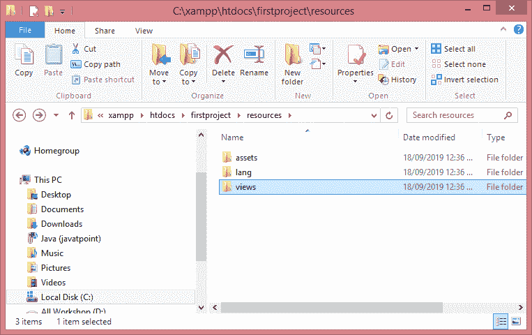
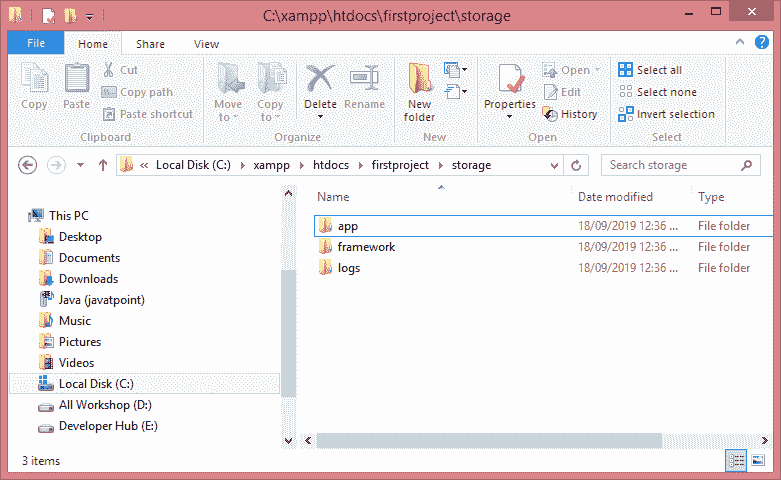

# Laravel 应用结构

> 原文:[https://www.javatpoint.com/laravel-application-structure](https://www.javatpoint.com/laravel-application-structure)

应用程序结构是项目中可用的文件夹、子文件夹和文件的结构。在 Laravel 中创建项目后，生成的应用程序结构如下图所示:

## Laravel 的应用目录

app 文件夹是 Laravel 中的主要文件夹之一，因为大部分代码都写在 app 文件夹中。应用程序文件夹包含以下子文件夹:

*   安慰
*   例外
*   超文本传送协议（Hyper Text Transport Protocol 的缩写）
*   提供者

**控制台**

控制台文件夹包含 Laravel 所需的 artisan 命令。它包含用适当的签名声明的命令。

**异常**

异常文件夹包含各种异常处理程序。它处理由 Laravel 项目引发的异常。异常目录包含处理异常的方法。

例外目录包含处理所有例外的文件 handle.php。

**Http**

http 文件夹是 app 文件夹的子文件夹。它有子文件夹，如控制器、中间件和请求。Laravel 遵循 MVC 架构，因此 http 包括控制器、视图和请求。

**在哪里，**

*   **中间件:**是 http 目录的子文件夹。它提供了过滤机制以及请求和响应之间的通信。
*   **请求:**它是 http 的一个子文件夹，包含了一个应用程序的所有请求。

**提供商**

Providers 目录用于包含为核心服务器注册事件所需的所有服务提供者，并为 Laravel 应用程序提供配置。

## Laravel 的引导目录

引导目录保存引导 Laravel 应用程序和配置自动加载所需的文件。引导文件夹包含用于缓存 web 应用程序的子文件夹缓存。它还包含文件**app.php**，用于初始化引导所需的脚本。

上图显示了引导目录的结构。它包含一个文件夹，即**缓存**和两个文件，**app.php**和**autoload.php**。

## Laravel 的配置目录

配置的目录包含 Laravel 应用程序所需的各种配置文件。如下图所示，**配置的**目录中有各种文件，每个文件都按照它们的名称执行它们的功能。

## 拉弗尔的数据库目录

数据库目录保存数据库文件。它包含子文件夹**工厂**、**移民**和**种子**。数据库目录的结构如下所示:

**数据库目录由三个子文件夹组成:**

*   **factors:**factors 文件夹用于生成海量的数据记录。
*   **迁移:**迁移文件夹用于迁移 web 应用程序中的数据库。
*   **种子:**种子文件夹包含用于执行单元测试数据库的类。

## 拉弗尔公共目录

公共目录是一个根文件夹，包含用于初始化 Laravel 网络应用程序的前端控制器。以下是公共目录的子文件夹:

*   **。htaaaccess:**用于服务器配置。
*   **Javascript 和 CSS:** 这些文件被认为是 web 应用程序的主要资产。
*   **index.php:** 该文件用于初始化 web 应用程序。

**公共目录的结构如下截图所示:**

## 拉弗尔的资源目录

资源目录保存用于增强 web 应用程序的文件。它包含以下子文件夹:

*   **资产:**该文件夹包含用于设计网络应用程序的文件，如 LESS 和 SCSS。
*   **Lang:**Lang 文件夹提供本地化或国际化的配置。
*   **视图:**视图文件夹包含用于与最终用户交互的 html 文件，在 MVC 架构中也发挥着重要作用。

**资源目录结构如下:**

## 拉弗尔的存储目录

存储目录包含那些在 Laravel 项目运行时经常需要的文件。它包含以下文件夹:

*   **App:** 包含经常调用的文件。
*   **框架:**它包含模板、基于文件的会话和文件缓存。
*   **日志:**该文件夹跟踪异常和错误日志。

**存储目录的结构如下截图所示:**

## 拉弗尔的测试目录

测试目录保存了所有的自动化单元测试用例。测试类的命名约定是 **camel_case** 但是根据一个类的功能遵循命名约定。

## 拉弗尔的供应商目录

供应商目录包含 composer 依赖项，例如，要安装 Laravel 安装程序，需要 composer。供应商文件夹包含所有 composer 依赖项。

* * *