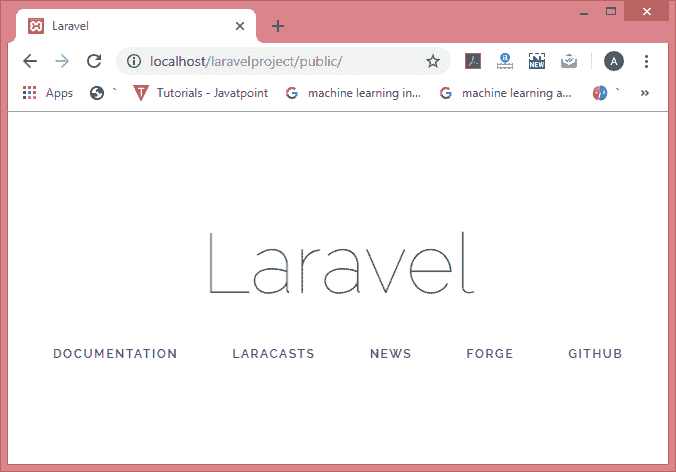
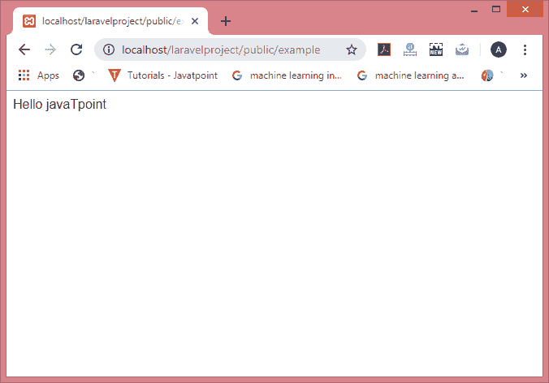

# 基本路由

> 原文:[https://www.javatpoint.com/laravel-basic-routing](https://www.javatpoint.com/laravel-basic-routing)

路由是 Laravel 的基本概念之一。路由的主要功能是将所有应用程序请求路由到适当的控制器。

## 默认路由文件

所有 Laravel 路线都在位于**路线**目录中的路线文件中定义。当我们创建一个项目时，会在项目内部创建一个路径目录。**路由/web.php** 目录包含您的 web 界面的路由文件的定义。web.php 的路由由提供会话状态和 CSRF 保护等功能的网络中间件组分配。 **routes/api.php** 中定义的路由被分配了 **API** 中间件组，它们是无状态的。

我们将从在 **routes/web.api** 文件中定义路由开始。routes/web.php 中定义的路由可以通过向浏览器输入定义的 URL 来访问。让我们通过一个例子来理解这一点。

**默认路由文件的定义。**

```php
<?php
Route::get('/', function ()
 {    
return view ('welcome');
});

```

在上面的例子中，Route 是定义静态方法 get()的类。get()方法包含参数“/”和函数()闭包。“/”定义根目录，函数()定义 get()方法的功能。

在上面的路由中，url 是'/'；因此，我们在网页浏览器中输入了**localhost/laravelpproject/public URL**。

**输出:**



由于该方法返回了**视图(“欢迎”)**，因此上面的输出显示了 Laravel 的欢迎视图。

**我们再看一个例子。**

现在，我们在这个例子中提供了另一个 url。

```php
<?php
Route::get('/example', function ()
 {    
return "Hello javaTpoint";
});

```

在上面的例子中，路由定义在哪个 URL 中是'/example '，所以我们需要在 web 浏览器中输入 URL "**localhost/laravelpproject/public/example**"。

**输出:**



## CSRF 保护

指向网络路由文件中定义的发布、放置或删除路由的 HTML 表单应该包含 CSRF 令牌字段。如果不包括 CSRF 令牌字段，则请求将被拒绝。

```php
<form method="POST" action="/profile">
    @csrf
    ...
</form>

```

**路由器定义可以响应以下 http 动词的路由:**

**Route::get($uri，$ callback)；**

**Route::post($uri，$ callback)；**

**Route::put($uri，$ callback)；**

**Route::patch($uri，$ callback)；**

**Route::delete($uri，$ callback)；**

**Route::options($uri，$ callback)；**

有时，当您需要注册一个响应多个 http 动词的路由时会出现这种情况，这可以通过使用 match()方法来实现。有时您想要注册一个响应所有 http 动词的节点，所以我们使用 any()方法。

```php

Route::match(['get', 'post'], '/', function () {
//
});
Route::any('/', function () 
{
//
})

```

**最常用的两种路由方式是:**

*   **Redirect()方法**
    Redirect()方法用于从一个网址导航到另一个网址。这种方法为从一个 URI 到另一个 URI 提供了方便或快捷的方式。借助这种方法，您不需要定义完整的路线。
    使用 redirect()方法有两种方式:
    **第一种方式是在 get()方法中声明 redirect()方法:**

```php
<?php
Route::get('hello', function () {
    return redirect('/');
})

```

**第二种方式是直接访问 redirect()方法。**

```php
<?php
Route::redirect('hello','/');

```

在上述情况下，两条路由都是从/hello 导航到根目录，即“/”。

*   **View()方法**
    View()方法用于返回另一个 URL 的视图。

```php
<?php
Route::get('/', function () {
    return view('welcome');
});
<?php
Route::view('/','welcome');

```

* * *