# Laravel 路由参数

> 原文：<https://www.javatpoint.com/laravel-routing-parameters>

**我们可以使用两种类型的参数:**

*   **所需参数**
*   **可选参数**

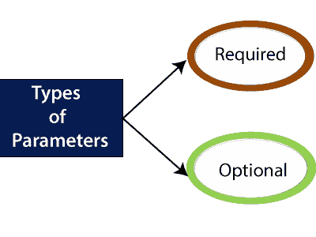

## 所需参数

所需的参数是我们在网址中传递的参数。有时你想捕捉 URI 的一些片段，那么这可以通过将参数传递给网址来实现。例如，您希望从 URL 中捕获用户 id。

**我们来看看没有路由参数的例子。**

```php
<?php
Route::get('/', function()
{
  return "This is a home page"; 
}
);
Route::get('/about', function()
{
  return "This is a about us page"; 
}
);
Route::get('/contact', function()
{
  return "This is a contact us page"; 
}
);

```

**输出**

**当我们输入 URL“localhost/laravelpproject/public/”时。**

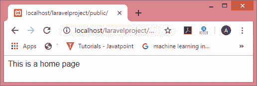

**当我们输入网址“localhost/laravelpproject/public/about”时。**

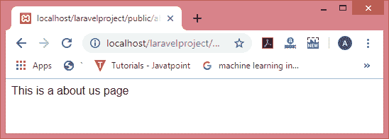

**当我们输入网址“localhost/laravelpproject/public/contact”时。**

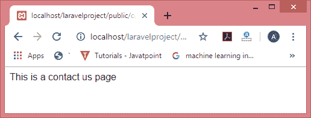

**我们来看看有路由参数的例子。**

```php

Route::get('/post/{id}', function($id)
{
  return "id number is : ". $id; 
}
);

```

路由参数包含在{}括号内，参数必须包含字母字符。它不应该包含“-”字符，您可以使用“_”字符来代替使用该字符。

路由参数在路由回调中可用。路由参数的语法如下:

**回调/控制器参数的名称**

其中控制器参数是路由参数。

**输出**

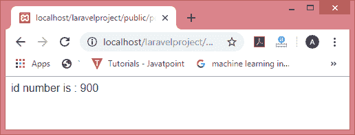

**我们来看看有多个路由参数的例子。**

```php

//We can also pass the multiple parameters.

Route::get('/post/{id}/{name}', function($id,$name)
{
  return "id number is : ". $id ." ".$name; 
}
);

```

**输出**

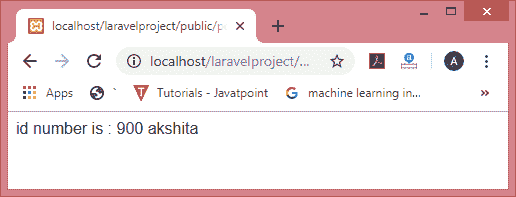

## 可选参数

假设您希望偶尔指定路线参数，为了实现这一点，您可以将路线参数设为可选。要使路线参数可选，可以放置“？”参数名称后的运算符。如果您想提供可选参数，请确保您也为变量提供了默认值。

**我们通过一些例子来了解一下。**

**例 1:**

```php

Route::get('user/{name?}', function ($name=null) {
    return $name;
});

```

当我们不向 URL 传递任何变量时，输出将是:

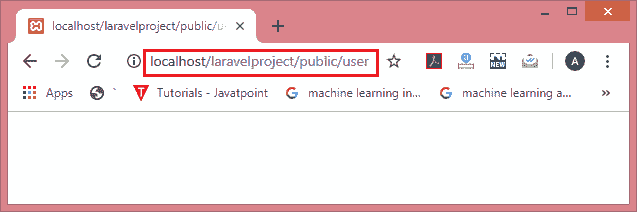

当我们在 URL 中传递“ **akshita** ”时，那么输出将是:

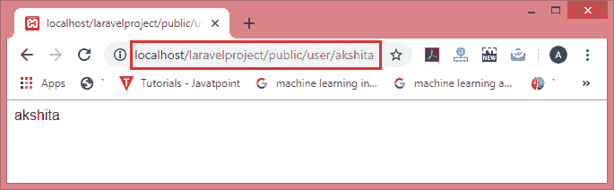

从上面的输出中，我们观察到我们在 URL 中传递的参数是可选的。因为我们已经将参数的默认值设置为空，所以如果我们不传递任何参数，它将返回空值。如果我们在 URL 中传递参数，那么将显示参数的值。

**例 2:**

```php

Route::get('user/{name?}', function ($name = 'himani') {
    return $name;
});

```

**在上面的例子中，我们提供了默认值‘himani’。**

**输出**

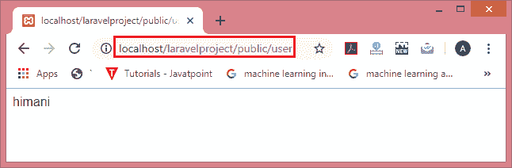

在上面的例子中，我们没有传递任何参数，所以返回默认值。

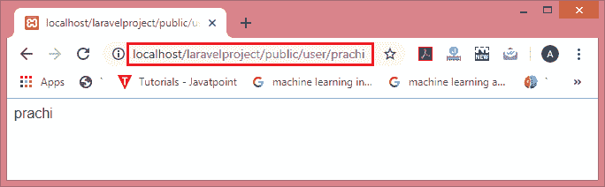

## 正则表达式约束

这些约束可以通过在路线实例上使用 where 方法来格式化路线参数。“where”方法接受参数的名称和正则表达式约束，该约束定义了应该如何约束参数。

**我们通过一些例子来了解一下。**

**例 1:**

**假设我们希望将用户名作为路由参数传递，该参数只包含字母字符。**

```php
Route::get('user/{name?}', function ($name=null) {
    return $name;
})->where('name','[a-zA-Z]+');

```

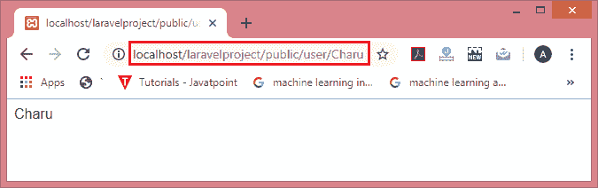

**例 2:**

**我们来考虑一个只接受数值的例子。**

```php
Route::get('user/{id?}', function ($id=null) {
    return "id is : ". $id;
}->where('id','[0-9]+');

```

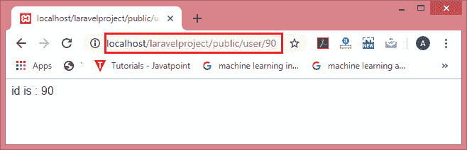
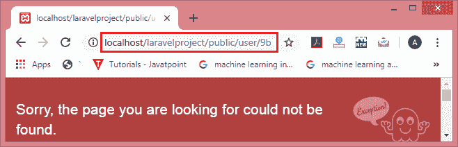

**例 3:**

**我们来考虑一个接受字母数字字符的例子。**

```php
Route::get('user/{id}/{name}', function ($id,$name) {
    return "id is : ". $id ." ,".  "Name is : ".$name ;
})->where(['id'=>'[0-9]+', 'name'=>'[a-zA-Z]+']);

```

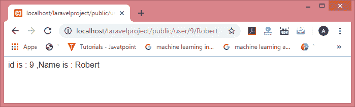

## 全局约束

您总是希望路由参数受正则表达式约束；然后可以使用模式方法。您可以在 RouteServiceProvider 的引导方法中定义这些模式。

当我们有多条路线时，使用全局约束，相同的约束应用于所有路线。在全局约束中，我们不必使用 where 子句将约束单独应用于每条路由，我们只需要在 boot()方法中定义模式，它将应用于所有路由。

**我们通过一个例子来理解这一点。**

**第一步:在 RouteServiceProvider.php 文件的引导方式中添加模式。**

```php

public function boot()
{
Route::pattern('id', '[0-9]+');
parent::boot();
}

```

**第二步:在 web.php 文件中添加路线。**

```php

Route::get('user/{id}', function ($id) {
 return $id;
});
Route::get('post/{id}', function ($id) {
 return $id;
});

```

**输出**

**当我们将路由参数传递给“/user”URL 时，那么输出将是:**

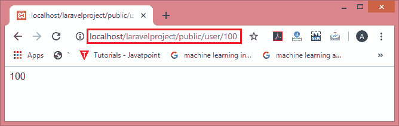

**当我们将路由参数传递给“/post”URL 时，那么输出将是:**

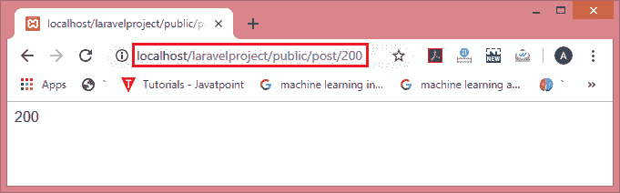

* * *