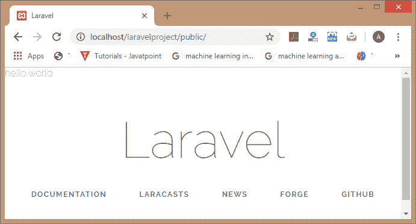

# Laravel 中间件

> 原文：<https://www.javatpoint.com/laravel-middleware>

中间件充当用户和请求之间的一层。这意味着当用户请求服务器时，请求将通过中间件，然后中间件验证请求是否通过身份验证。如果用户的请求通过了验证，那么该请求将被发送到后端。如果用户请求没有通过验证，那么中间件会将用户重定向到登录屏幕。

除了身份验证之外，还可以使用额外的中间件来执行各种任务。例如，CORS 中间件负责向所有响应添加头部。

Laravel 框架包括认证、CSRF 保护等几个中间件，这些都位于**app/Http/中间件**目录下。

我们可以说中间件是一个 http 请求过滤器，您可以在其中检查条件。

**在中间件中，我们将讨论以下主题:**

*   制作中间件
*   应用中间件
*   检查中间件中的条件
*   路由中间件

## 创建中间件

键入命令 **php artisan make:中间件“中间件的名称”**。


在上面的屏幕中，我们键入命令“ **php artisan make:中间件 CheckAge** ”，其中 **CheckAge** 是中间件的名称。上面的窗口显示中间件已经成功创建，名称为“**检查年龄**”。

要查看 CheckAge 中间件是否已创建，请转到您的项目。我们的项目名是 laravelpproject，所以中间件的路径应该是:**C:\ xampp \ htdocs \ laravelpproject \ app \ Http \中间件**。


## 应用中间件

中间件可以应用于所有的网址，也可以应用于某些特定的网址。

**让我们将中间件应用于所有的 URL。**

**第一步:**打开 kernel.php 文件。如果我们想将中间件应用于所有的 URL，那么在中间件的数组中添加中间件的路径。

```php
<?php
namespace App\Http;
use Illuminate\Foundation\Http\Kernel as HttpKernel;
class Kernel extends HttpKernel
{
    /**
     *  The application's global HTTP middleware stack.
     *
     * These middleware are run during every request to your  application.
     *
     * @var array
     */
 protected $middleware = [ \Illuminate\Foundation\Http\Middleware\CheckForMaintenanceMode::class,
\Illuminate\Foundation\Http \Middleware\ValidatePostSize::class,
 \App\Http\Middleware\TrimStrings::class,
 \App\Http\Middleware\CheckAge
::class,
  \Illuminate\Foundation\Http\Middleware\ConvertEmptyStringsToNull::class,
    ];

   /**
     * The application's route middleware groups.
     *
     * @var array
     */

protected $middlewareGroups = [
        'web' => [
            \App\Http\Middleware\EncryptCookies::class,

  \Illuminate\Cookie\Middleware\AddQueuedCookiesToResponse::class,

\Illuminate\Session\Middleware\StartSession::class,

// \Illuminate\Session\Middleware\AuthenticateSession::class,
            \Illuminate\View\Middleware 
\ShareErrorsFromSession::class,

  \App\Http\Middleware\VerifyCsrfToken::class,

\Illuminate\Routing\Middleware\SubstituteBindings::class,
        ],

        'api' => [
            'throttle:60,1',
            'bindings',
        ],
    ];

 /**
     * The application's route middleware.
     *
     * These middleware may be assigned to groups or used individually.
     *
     *  
@var array
     */
    protected $routeMiddleware = [

'auth' => \Illuminate\Auth\Middleware\Authenticate::class,
        'auth.basic' => \Illuminate\Auth\Middleware 
\AuthenticateWithBasicAuth::class,

'bindings' => \Illuminate\Routing\Middleware\SubstituteBindings::class,

'can' => \Illuminate\Auth\Middleware\Authorize::class,
        'guest' => \App\Http\Middleware 
\RedirectIfAuthenticated::class,

    'throttle' => \Illuminate\Routing\Middleware\ThrottleRequests::class,
    ];
}

```

**第二步:**在 Git Bash Window 中输入 **php 工匠发球**命令。


**第三步:**打开**CheckAge.php**文件，这是您作为中间件创建的。

```php
<?php

namespace App\Http\Middleware;

use Closure;

class CheckAge

{

/**
     * Handle an incoming request.
     *
     * @param  \Illuminate\Http 
\Request  $request
     * @param  \Closure  $next
     * @return mixed
     */
  public function handle($request, Closure $next)
 {
 //return "middleware";
echo "hello world";
return $next($request);
}
}

```

**第四步:**现在，输入网址“[http://localhost/laravelpproject/public/](http://localhost/laravelproject/public/)”。



**让我们将中间件应用于一些特定的路由。**

**第一步:**打开 kernel.php 文件。如果我们想将中间件应用于一些特定的路由

```php
<?php
namespace App\Http;
use Illuminate\Foundation\Http\Kernel as HttpKernel;
class Kernel extends HttpKernel
{
    /**
     *  The application's global HTTP middleware stack.
     *
     * These middleware are run during every request to your  application.
     *
     * @var array
     */
  protected $middleware = [
   \Illuminate\Foundation\Http\Middleware\CheckForMaintenanceMode::class,
   \Illuminate\Foundation\Http\Middleware\ValidatePostSize::class,
  \App\Http\Middleware\TrimStrings::class,

\Illuminate\Foundation\Http\Middleware\ConvertEmptyStringsToNull::class,
    ];
 /**
     * The application's route middleware groups.
     *
     * @var array
     */
 protected $middlewareGroups = [
 'web' => [
  \App\Http\Middleware\EncryptCookies::class,
  \Illuminate\Cookie\Middleware\AddQueuedCookiesToResponse::class,
  \Illuminate\Session\Middleware\StartSession::class,
  // \Illuminate\Session\Middleware\AuthenticateSession::class,
  \Illuminate\View\Middleware \ShareErrorsFromSession::class,
 \App\Http\Middleware\VerifyCsrfToken::class,
 \Illuminate\Routing\Middleware\SubstituteBindings::class,
 ],

 'api' => [
            'throttle:60,1',
            'bindings',
        ],
    ];
 /**
     * The application's route middleware.
     *
     * These middleware may be assigned to groups or used individually.
     *
     *  
@var array
     */
    protected $routeMiddleware = [

'auth' => \Illuminate\Auth\Middleware\Authenticate::class,
        'auth.basic' => \Illuminate\Auth\Middleware 
\AuthenticateWithBasicAuth::class,

'bindings' => \Illuminate\Routing\Middleware\SubstituteBindings::class,

'can' => \Illuminate\Auth\Middleware\Authorize::class,
        'guest' => \App\Http\Middleware 
\RedirectIfAuthenticated::class,

    'throttle' => \Illuminate\Routing\Middleware\ThrottleRequests::class,

'age' =>  \App\Http\Middleware\CheckAge::class ];

}

```

在上面的代码中，我们添加了代码，即**‘’age’=>\ App \ Http \中间件\ CheckAge::class’**，其中 age 是中间件的名称。现在，我们可以将“age”中间件用于一些特定的路由。

**第二步:**打开**CheckAge.php**文件，这是您作为中间件创建的。

**第三步:**在**web.php**文件中添加中间件代码。

```php
Route::Get('/',function()
{
  return view('welcome');
})-> middleware('age');
Route::Get('user/profile',function()
{
  return "user profile";
});

```

在上面的代码中，我们在“/”根 URL 中添加了中间件，在“用户/配置文件”URL 中没有添加中间件。

**输出:**

**当我们访问根 URL 时，输出将是:**


上面的输出显示，中间件代码也已经被访问，因为它正在显示一个“hello world”。

**当我们访问 URL，即/user/profile 时，那么输出将是:**


上面的输出表明中间件代码没有被访问过。

**当参数在网址中传递时。**

**web.php**

```php
Route::Get('/{age}',function($age)
{
  return view('welcome');
})-> middleware('age');

```

**CheckAge.php**

```php
<?php
namespace App\Http\Middleware;
use Closure;
class CheckAge
{
 /**
 * Handle an incoming request.
 *

* @param
  \Illuminate\Http\Request  $request
 * @param  \Closure  $next
 * @return mixed
 */
  public function handle($request, Closure $next)
 {
 //return "middleware";
echo "this is checkage middleware";
return $next($request);
}}

```

**输出**


## 检查中间件中的条件

中间件也可以用来检查条件。让我们通过一个例子来理解。

```php
Route::Get('/{age}',function($age)
{
  return view('welcome');
})-> middleware('age');

```

```php
<?php
namespace App\Http\Middleware;
use Closure;
class CheckAge
{

/**
     * Handle an incoming request.
     *

* @param
  \Illuminate\Http\Request  $request

 * @param  \Closure  $next
     * @return mixed
     */

   public function handle($request, Closure $next)

{
  //return "middleware";
if($request->age>10)
{
echo "Age is greater than 10";
}
else
{
echo"Age is not greater than 10";
}
return $next($request);

}}

```

**输出:**


* * *