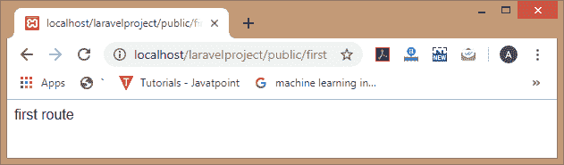
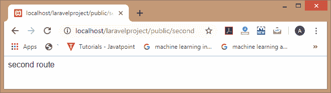
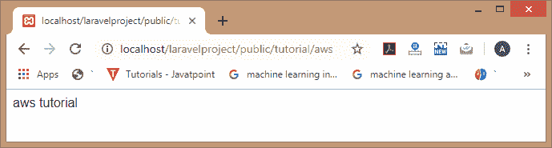
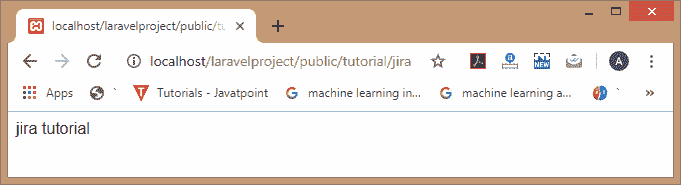
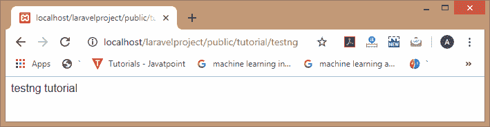
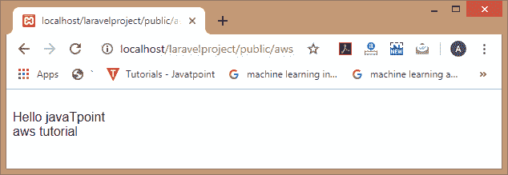
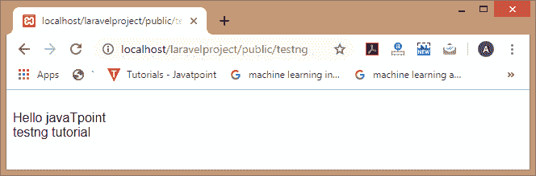

# 路由组

> 原文：<https://www.javatpoint.com/laravel-route-groups>

路线组是 Laravel 中的一个基本功能，它允许您对所有路线进行分组。当您想要将属性应用于所有路由时，路由组是非常有用的。如果使用路线组，则不必将属性单独应用于每条路线；这避免了重复。它允许您共享中间件或名称空间等属性，而无需在每个单独的路由上定义这些属性。这些共享属性可以以数组格式作为第一个参数传递给 **Route::group** 方法。

### 路由组的语法

```php

Route::group( [ ] , callback);

```

### 因素

**[ ]:** 是作为第一个参数传递给 group 方法的数组。

### 路由组示例

**web.php**

```php

Route::group([], function()
{
   Route::get('/first',function()
 {
   echo "first route";
 });
Route::get('/second',function()
 {
   echo "second route";
 });
Route::get('/third',function()
 {
   echo "third route";
 });
});

```

在上面的代码中，我们定义了**组()**方法，它包含两个参数，即数组和闭包。在闭包中，我们可以定义任意多的路径。在上面的代码中，我们定义了三条路线。

**输出:**

**当我们访问 URL“localhost/laravelpproject/public/first”时，那么输出将是:**



**当我们访问 URL“localhost/laravelpproject/public/second”时，那么输出将是:**



**当我们访问 URL“localhost/laravelpproject/public/third”时，那么输出将是:**


## 路径前缀

当我们想要提供一个通用的网址结构时，就要使用路径前缀。

我们可以使用路由组中的前缀数组选项为组内定义的所有路由指定前缀。

**我们通过一个例子来了解一下。**

**web.php**

```php
Route::group(['prefix' => 'tutorial'], function()
{
   Route::get('/aws',function()
 {
   echo "aws tutorial";
 });
Route::get('/jira',function()
 {
   echo "jira tutorial";
 });
Route::get('/testng',function()
 {
   echo "testng tutorial";
 });
});

```

上述代码包含三条路由，可通过以下网址访问:

/教程/aws



/教程/支尔格



**/教程/测试**



## 中间件

我们还可以将中间件分配给一个组中的所有路由。可以使用中间件方法在创建组之前定义中间件。

**我们通过一个例子来了解一下。**

**web.php**

```php
Route::middleware(['age'])->group( function()
{

   Route::get('/aws',function()
 {
   echo "aws tutorial";
 });
Route::get('/jira',function()
 {
   echo "jira tutorial";
 });
Route::get('/testng',function()
 {
   echo "testng tutorial";
 });

});

```

**CheckAge.php(中间件)**

```php
<?php
namespace App\Http\Middleware;
use Closure;
class CheckAge

{
/**
     * Handle an incoming request.
     *

* @param
  \Illuminate\Http\Request  $request

 * @param  \Closure  $next
     * @return mixed
     */

   public function handle($request, Closure $next)

{

//return "middleware";
echo "Hello javaTpoint <br>";
return $next($request);

}
}

```

**输出:**





## 路由名称前缀

name 方法用于在每个路由名称前加上一些指定的字符串。在 name 方法中，我们需要指定前缀中带有尾随字符的字符串。

**我们来看一个例子。**

**web.php**

```php
Route::name('admin.')->group(function()
{
   Route::get('users', function()
{
 return "admin.users";
})->name('users');
});

```

在上面的代码中，路线的名称是 **admin.users** 。

* * *