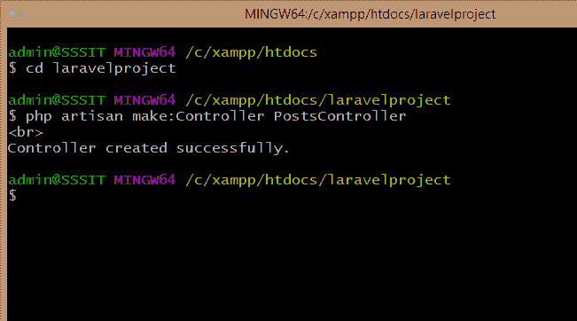
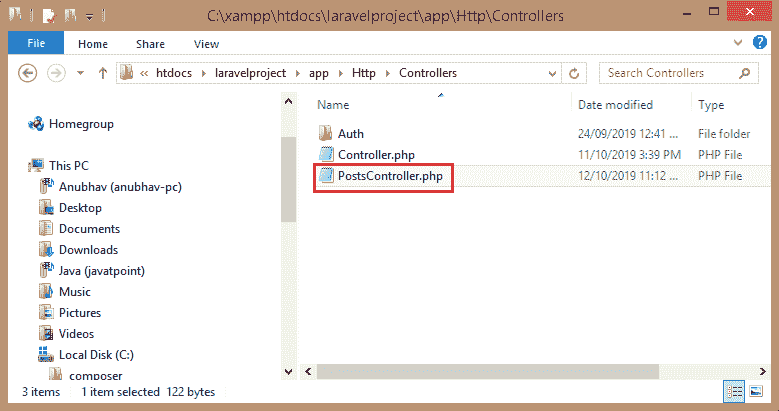
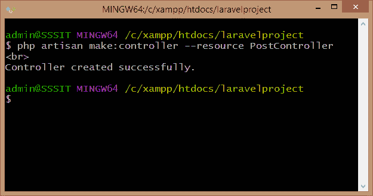
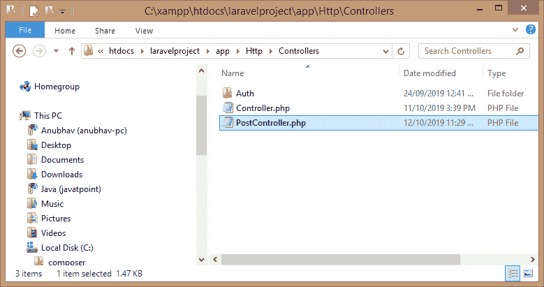

# 控制器是什么？

> 原文：<https://www.javatpoint.com/laravel-controllers>

Laravel 控制器是 Laravel 框架中的一个基本特性。最初，我们以路由文件中闭包的形式处理请求逻辑；现在，代替在路由文件中使用闭包，我们使用控制器类。控制器用于处理单个类内的请求逻辑，控制器在“**app/http/controller**”目录中定义。Laravel 框架遵循 MVC(模型视图控制器)架构，其中控制器充当在模型和视图之间来回移动流量的角色。

控制器的默认文件在 **app/http/Controllers** 目录下。

```php
<?php
namespace App\Http\Controllers;
use Illuminate\Foundation\Bus\DispatchesJobs;
use Illuminate\Routing\Controller as BaseController;
use Illuminate\Foundation\Validation\ValidatesRequests;
use Illuminate\Foundation\Auth\Access\AuthorizesRequests;
class Controller extends BaseController
{
  use AuthorizesRequests, DispatchesJobs, ValidatesRequests;
}

```

在上面的代码中，使用了命名空间，因为它允许您在同一个应用程序的不同部分中使用相同的函数名和类。例如，

```php

namespace App\Http\functions1;
namespace App\Http\functions2;

```

假设我们必须运行名为的函数，即 **RunQuery()** 。它们在不同的目录**函数 1** 和**函数 2** 中可用，因此我们可以说名称空间避免了相同函数名称之间的冲突。

**使用**将类导入到当前文件中。

**我们来看看如何通过 Git Bash Window 创建控制器。**

**第一步:**打开 Git Bash 窗口，在 Git Bash 窗口中键入命令“PHP artisan make:Controller PostsController”创建控制器。



上图显示名为**后置控制器**的控制器已成功创建。

**第二步:**现在移动到你的项目，看看**后置控制**文件是否已经创建。文件的路径是:

**C:\ xampp \ htdocs \ laravelpproject \ app \ Http \ Controllers**



上图显示**后置控制器**文件被创建。

**PostsController.php**文件的默认代码如下:

```php
<?php

namespace App\Http\Controllers;

use Illuminate\Http\Request;

class PostsController extends Controller

{

//

}

```

上面的代码包含扩展控制器类的类，但是这个类不包含创建、更新或删除等功能。现在我们将看到如何创建包含一些默认功能的控制器。

为了创建控制器，我们将首先从项目中删除**PostsController.php**，这是我们在上一步中创建的。

**输入命令:**

**PHP artisan make:controller-resource post controller**，这个命令用来创建控制器。



现在，移至您的项目，查看**后控制器**文件是否已创建。文件的路径应该是:

**C:\ xampp \ htdocs \ laravelpproject \ app \ Http \ Controllers**



上图显示**后控器**文件创建成功。

**PostController.php**文件的默认代码如下:

```php
<?php
namespace App\Http\Controllers;
use Illuminate\Http\Request;
class PostController extends Controller
{
    /**
     * Display a listing of the resource.
     *
     * @return \Illuminate\Http\Response
     */
public function index()
{
        //
 }

/**
     * Show the form for creating a new resource.
     *
     * @return \Illuminate\Http\Response
 */
 public function create()
 {
   //
 }

 /**
     * Store a newly created resource in storage.
     *
     * @param  \Illuminate\Http\Reques $request
     * @return \Illuminate\Http\Response
     */
public function store(Request $request)
{

        //
 }

  /**
     * Display the specified resource.
     *
     * @param  int  $id
     * @return \Illuminate\Http\Response
     */

public function show($id)

{

//

}

  /**
     * Show the form for editing the specified resource.
     *
     * @param  int  $id
     * @return  
\Illuminate\Http\Response
     */

public function edit($id)

{

//

}

   /**
     * Update the specified resource in storage.
     *
     * @param  \Illuminate\Http\Request   
$request
     * @param  int  $id
     * @return \Illuminate\Http\Response
     */

public function update(Request $request, $id)

{

//

}

/**
     * Remove the specified resource from storage.
     *
     * @param  int  $id
     * @return  
\Illuminate\Http\Response
     */

public function destroy($id)

 {

//

}
}

```

上述代码包含用于对资源执行各种操作的函数，例如:

**create():** 用于新建资源。

**store():** 用于存储指定的资源。

**update():** 用于更新存储中指定的资源。

**destroy():** 用于从存储中删除指定的资源。

* * *