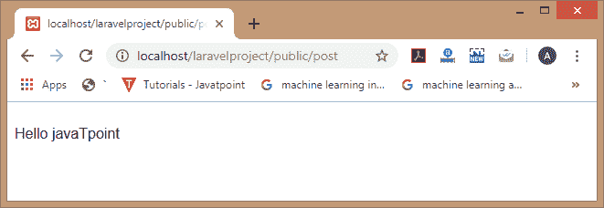
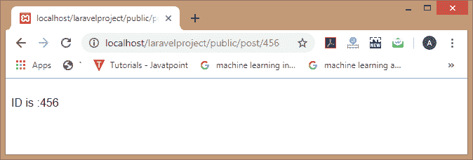
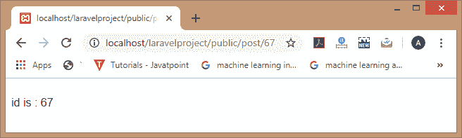
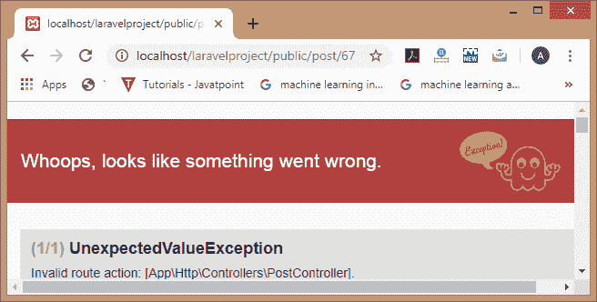

# 路由控制器

> 原文:[https://www.javatpoint.com/laravel-routing-controllers](https://www.javatpoint.com/laravel-routing-controllers)

路由控制器允许您使用处理请求的方法创建控制器类。

现在，我们将通过一个例子来了解路由控制器。

**第一步:**首先，我们需要创建一个控制器。在上一个主题中，我们已经创建了名为“**后控制器**的控制器。

**第二步:**打开**web.php**文件，写下如下代码:

```php

Route::get('/post','PostController@index');

```

在上面的代码中， **/post** 是我们想要访问的 URL，**后置控制器**是控制器的名称。“**索引**是**PostController.php**文件中可用方法的名称，@index 表示当我们访问“/post”URL 时，应该点击 index()方法。

**第 3 步:**添加如下所示的高亮显示的代码:

```php
<?php
namespace App\Http\Controllers;
use Illuminate\Http\Request;
class PostController extends Controller
{
    /**
     * Display a listing of the resource.
     *
     * @return \Illuminate\Http\Response
     */
public function index()
{
      return "Hello javaTpoint";}     →
/**
     * Show the form for creating a new resource.
     *
     * @return \Illuminate\Http\Response
 */
public function create()
{
        //
}
/**
     * Store a newly created resource in storage.
     *
     * @param  \Illuminate\Http\Reques $request
     * @return \Illuminate\Http\Response
     */
public function store(Request $request)

{

        //

 }
 /**
     * Display the specified resource.
     *
     * @param  int  $id
     * @return \Illuminate\Http \Response
*/
public function show($id)
{
        //
}
/**
     * Show the form for editing the specified resource.
     *
     * @param  int  $id
     * @return  \Illuminate\Http\Response
     */
public function edit($id)
{
        //
 }

/**
     * Update the specified resource in storage.
     *
     * @param  \Illuminate\Http\Request   
$request
     * @param  int  $id
     * @return \Illuminate\Http\Response
     */

public function update(Request $request, $id)
{
        //
}

/**
     * Remove the specified resource from storage.
     *
     * @param  int  $id
     * @return  
\Illuminate\Http\Response
     */
 public function destroy($id)
 {
       //
  }
}

```

**第四步:**在浏览器中输入网址，即**localhost/laravelpproject/public/host**，输出如下图:

**输出**



到目前为止，我们已经观察到如何访问控制器。现在，我们将看到如何将数据传递给控制器类。

**向控制器传递数据**

**让我们通过一个例子来了解如何将数据传递给控制器:**

**第一步:**打开**web.php**文件，添加如下代码:

**Route::get('/post/{id} '，'[【邮件保护】](/cdn-cgi/l/email-protection)')；**

上述代码在“/post”URL 中包含“id”参数。

**步骤 2:** 编辑 PostController.php 文件。

```php

public function index($id)
{
    return "ID is :". $id;
}

```

在上面的例子中，我们已经更新了 index()方法。我们已经在 index()方法中传递了“id”参数。

**第三步:**在网页浏览器中输入网址“**localhost/laravelpproject/post/100**，输出如下:



## 控制器和命名空间

当我们在 **Route::get()** 方法中指定控制器类时，那么我们就不需要指定完整的控制器命名空间。当 **RouteServiceProvider** 加载所有包含名称空间的路由文件时，我们只需要指定位于名称空间的**App/Http/controller**部分之后的类名。

如果完整的控制器类是**App/Http/Controller/Post/Post Controller**，那么我们可以注册控制器的路由，如下所示:

**路线::获取('邮政\ '，'邮政\ [【邮件保护】](/cdn-cgi/l/email-protection))；**

## 单动作控制器

如果我们想在控制器中使用单一方法，那么我们可以在控制器上使用 **single __invoke()** 方法。

当我们使用 php artisan:make controller 命令创建控制器时，那么**后控制器**文件的结构将是:

```php
<?php
namespace App\Http\Controllers;
use Illuminate\Http\Request;
class PostController extends Controller
{

      //

}

```

**现在，我们在一个后控制类中添加 __invoke()函数的代码:**

```php
<?php
namespace App\Http\Controllers;
use Illuminate\Http\Request;
class PostController extends Controller
{
    //
 public function __invoke($id)
{
  return "id is : ". $id;
}
}

```

最后，我们在**web.php**文件中添加代码，负责处理动作。

```php

route::get('/post/{id}','PostController');

```

上面的代码遇到了一个后控制器类的 __invoke()方法。这表明我们不需要编写@invoke 方法来访问单个动作控制器。

**输出**

当我们输入 URL '**localhost/laravelpproject/public/post/67**'时，那么输出将是:



如果没有指定动作，也就是我们忘记写 __invoke()方法，那么就会抛出**意外值表达式**。

假设我们从后控制类中移除 **__invoke()** 方法，那么输出将是:



* * *