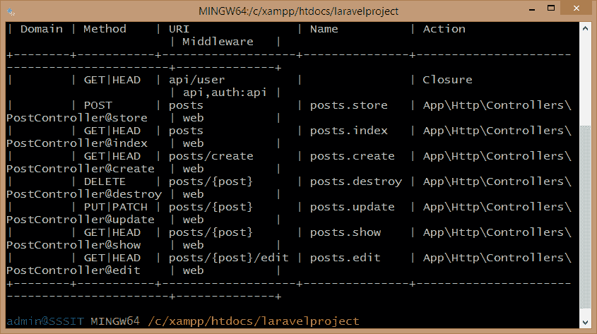
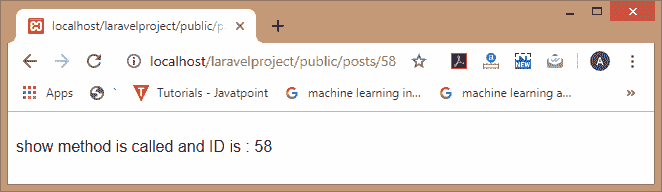
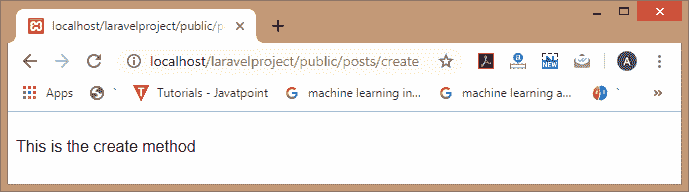
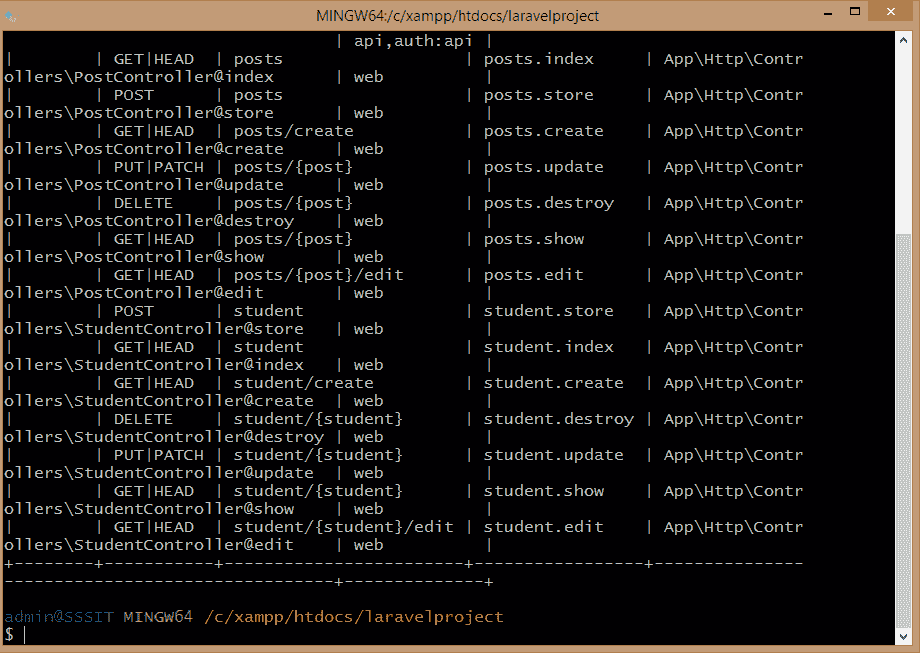
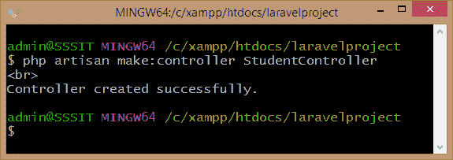
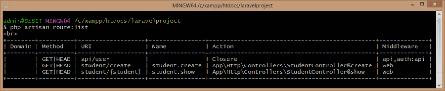
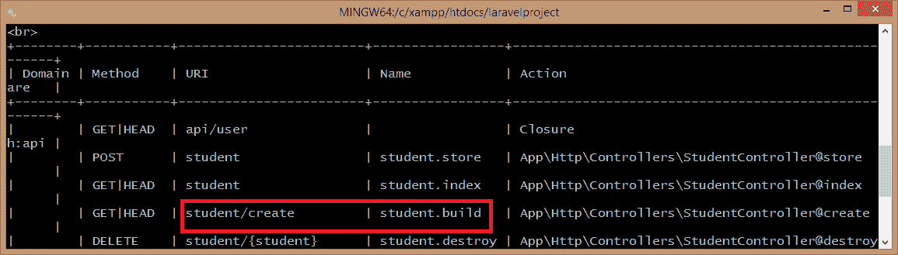
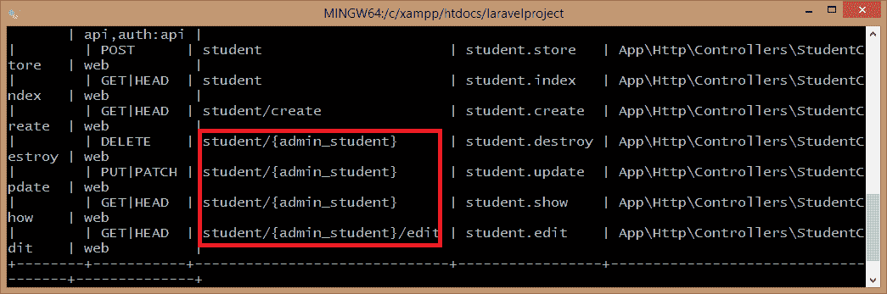

# Laravel 资源控制器

> 原文：<https://www.javatpoint.com/laravel-resource-controllers>

Laravel 资源控制器在一行代码中提供了到控制器的 CRUD 路由。资源控制器用于创建一个处理应用程序存储的所有 http 请求的控制器。

resource()是一个类似 get()方法的静态函数，它提供了对我们可以在控制器中使用的多条路由的访问。

**资源()方法的语法:**

**路由::资源(' posts '，' post controller ')；**

在上面的语法中，“posts”包含所有路由，“PostController”是控制器的名称。在这种情况下，我们不需要像在 get()方法中那样指定@index 之类的方法名，因为 create()，store()，destroy()方法已经在 PostController 类中可用。

**我们通过一个例子来了解一下:**

**步骤 1:** 使用下面给出的命令创建控制器:

```php

php  artisan make:controller PostController -resource;

```

上述命令将在**app/Http/Controller/post Controller . PHP**目录下创建控制器。**后控制器**类包含每个资源操作的方法。

PostController.php 文件的结构如下:

```php
<?php
namespace App\Http\Controllers;
use Illuminate\Http\Request;
class PostController extends Controller
{
    /**
     * Display a listing of the resource.
     * @return \Illuminate\Http\Response
     */
public function index()
{

//

}
/**
     * Show the form for creating a new resource.
     * @return \Illuminate\Http\Response

*/
 public function create()
{

//

}
/**
     * Store a newly created resource in storage.
     *
     * @param  \Illuminate\Http\Request   $request
     * @return \Illuminate\Http\Response
     */
public function store(Request $request)
{

//

}
/**
     * Display the specified resource.
     * @param  int  $id
     * @return \Illuminate\Http\Response
     */
public function show($id)
{

  //
}
/**
     * Show the form for editing the specified resource.
     * @param  int  $id
     * @return  \Illuminate\Http\Response
     */
 public function edit($id)

{

//

}
/**
     * Update the specified resource in storage.
     * @param  \Illuminate\Http\Request   $request
     * @param  int  $id
     * @return \Illuminate\Http\Response
     */
 public function update(Request $request, $id)
{

//

}
/**
     * Remove the specified resource from storage.
     * @param  int  $id
     * @return  \Illuminate\Http\Response
     */
 public function destroy($id)
 {

//}}

```

**第二步:**现在，我们需要向控制器注册资源丰富的路由，可以通过以下方式完成:

```php

Route::resource('posts','PostController');

```

打开 Git Bash 窗口，输入命令 **php artisan 路线:列表**。该命令产生以下输出:



resource()方法中的 post 参数产生上面输出中显示的名称或资源，以及它对应的方法。在上面的输出中，posts.destroy 向 Delete 方法发送了一个参数，这在 Laravel 中非常特殊。

**我们通过一个例子来理解资源的概念。**

**访问后控制器类**的 show()方法

假设我们要调用 PostController.php 文件的 **show()** 方法。为此，请在 show()方法中添加代码。我在 show()方法中添加了以下代码:

```php

public function show($id)
{
return "show method is called and ID is : ". $id;
}

```

我们知道**post . show**的 URI 是 post/{ post }，这意味着我们还需要输入参数才能访问**后控器**类的 show()方法。

假设我输入的网址是“**localhost/laravelpproject/public/post/58**”，那么输出将是:



**访问后控制器类**的 create()方法

**第一步:**首先，我们需要在 create()方法中添加代码。我添加了以下代码:

```php

public function create()
{
     return "This is the create method";
}

```

我们知道**post . create**的 URI 是 posts.create，所以访问 create()方法的 URL 应该是“**localhost/laravelpproject/public/post/create**”。

**第二步:**在浏览器中输入网址“**localhost/laravelpproject/public/post/create**，则输出结果为:



### 为多个控制器注册路由

我们可以通过将一个数组传递给 **resources()** 方法来注册多个控制器的路由。假设我想为两个控制器注册路线，如**后控制器**和**学生控制器**。以下是实现这一目标的步骤:

**步骤 1:** 首先，需要使用以下命令创建**后控制器**和**学生控制器**:

```php

Php artisan make:controller PostController;  // to create the PostController.
Php artisan make:controller StudentController;  // to create the StudentController.

```

**第二步:**在**web.php**文件中添加下面给出的代码注册路线:

```php
route::resources(
['posts'=>'PostController',
'student'=>'StudentController']
);

```

**第三步:**输入命令 **php 工匠路线:在 Git Bash Window 上列出**。



上面的屏幕显示后控制器和学生控制器的路线都已注册。

### 部分资源路线

当我们不想为所有方法注册路由时，我们可以通过只指定控制器可以处理的那些函数来实现。

**创建部分资源路线的步骤:**

**步骤 1:** 首先，我们使用以下命令创建 StudentController:

```php

php artisan make:controller StudentController;

```



**步骤 2:** 现在，我们在**web.php**文件中添加以下命令来创建部分资源路线。

```php
Route::resource('student','StudentController',['only' => ['create','show']]);

```

**第 3 步:**要验证上述代码是否注册了指定方法的路由，请在 Git Bash Window 上键入命令“ **php artisan route:list** ”。



上面的屏幕显示 create()和 show()方法的路由已经生成。

### 命名资源路线

控制器的所有方法都有一个默认的路由名称，但是 Laravel 允许您通过传递名称数组来覆盖路由名称。名称数组包含您想要指定的路由的名称。

**我们通过一个例子来理解“资源路由命名”。**

*   我们可以在**web.php**文件中添加下面的代码来命名资源路由。

```php
Route::resource('student', 'StudentController',['names' => ['create' =>'student.build']]);

```

*   现在，输入命令 **php 工匠路线:在 Git Bash 窗口上列出**。



上图显示 create()方法的路径名已被重命名为 **student.build** ，默认名称为 **student.create** 。

### 命名资源路由参数

**Route::resource()** 方法自动生成所有资源路由的路由参数，但是我们可以使用参数数组覆盖路由参数。参数数组是资源名称和路径参数的关联数组。

*   我们可以通过在**web.php**文件中添加以下代码来覆盖路线参数:

```php
Route::resource('student', 'StudentController', ['parameters' => ['student' => 'admin_student']]);

```

上面的代码将路由参数，即 **admin_student** 分配给**学生**资源。

*   要检查所有路由参数的列表，我们使用下面给出的命令:
    **php artisan route:list。**



上图显示 **admin_student** 参数被添加到一条路线中。

* * *