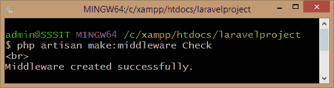
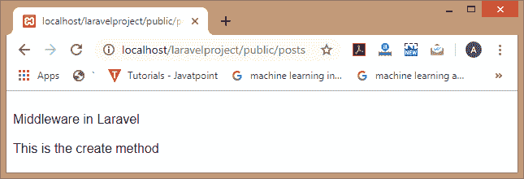
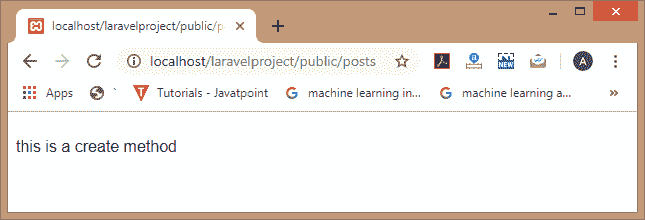
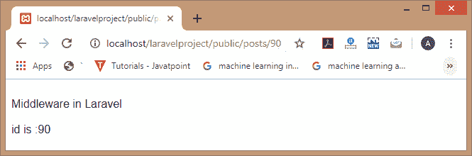

# 控制器中间件

> 原文:[https://www.javatpoint.com/laravel-controller-middleware](https://www.javatpoint.com/laravel-controller-middleware)

我们还可以在您的路由文件中将中间件分配给控制器的路由。

**将中间件分配给控制器有多种方式:**

**将中间件分配给 web.php 文件中的控制器。**

我们可以在**web.php**文件中将中间件分配给控制器。下面是分配中间件所需的步骤:

**第一步:**首先，我们创建一个控制器。在前一个主题中，我们已经创建了名为**后控制器**的控制器。

**第二步:**现在，我们创建中间件，我们要将其分配给**后控制器**。我们使用以下命令来创建中间件:

```php
php artisan make:middleware Check

```

上面的命令创建了名为 Check 的中间件。



**第三步:**打开**laravelpproject/app/http/中间件**目录下创建的**Check.php**文件。

```php
<?php
namespace App\Http\Middleware;
use Closure;
class Check
{
    /**
     * Handle an incoming request.
     * @param  \Illuminate\Http\Request  $request
@param  \Closure  $next
     * @return mixed
     */
    public function handle($request, Closure $next)
   {
        echo "Middleware in Laravel <br><br>";  
        return $next($request);
    }
}

```

**第四步:**现在，我们必须在**kernel.php**文件中添加中间件**Check.php**的路径。

```php
protected $routeMiddleware = [
        'auth' => \Illuminate\Auth\Middleware\Authenticate::class,
        'auth.basic' => \Illuminate\Auth\Middleware\AuthenticateWithBasicAuth::class,
        'bindings' => \Illuminate\Routing\Middleware\SubstituteBindings::class,
        'can' => \Illuminate\Auth\Middleware\Authorize::class,
        'guest' => \App\Http\Middleware\RedirectIfAuthenticated::class,
        'throttle' => \Illuminate\Routing\Middleware\ThrottleRequests::class,
        'age' =>  \App\Http\Middleware\CheckAge::class,
           'check'=>\App\Http\Middleware\Check::class
];

```

在上面的代码中，突出显示的语句添加了中间件的路径，即**检查**。

**步骤 5:** 在**web.php**文件中添加以下代码，将中间件分配给**后控器**。

```php
Route::get('posts', 'PostController@create')->middleware('check');

```

上面的代码将中间件，即检查分配给后控制器。

**第 6 步:**输入网址 http://localhost/laravelpproject/public/post 到 web 浏览器，那么输出会是:



**使用控制器构造器**

我们也可以使用控制器构造函数来分配中间件。它更方便，因为它将中间件限制为控制器类上的特定方法。

**以下是使用控制器构造器分配中间件所需的步骤:**

*   按照前面案例的步骤 1 至步骤 4 进行操作。
*   在**web.php**文件中添加以下代码:

```php
Route::get('posts', 'PostController@create');

```

*   打开**PostController.php**文件。
    如果我们想把中间件分配给后控制者的 **show()** 方法；然后，我们需要在 PostController.php 文件中添加下面的代码。

```php
public function __construct()
    {
        $this->middleware('check')->only('show');
   }  

```

上面的代码将中间件指定为只显示()方法。

在后控制器中添加上述代码后，后控制器的结构如下:

```php
<?php
namespace App\Http\Controllers;
use Illuminate\Http\Request;
class PostController extends Controller
{
    /**
     * Display a listing of the resource.
     * @return \Illuminate\Http\Response
     */

$this->middleware(function ($request, $next) {
    // ...
//  echo "Middleware in Laravel";
    return $next($request);
});

public function index(){
  //
    }
/**
     * Show the form for creating a new resource.
     * @return \Illuminate\Http\Response
     */

public function create(){
    return "this is a create method";
}

/**
     * Store a newly created resource in storage.

     * @param  \Illuminate\Http\Request   
$request
     * @return \Illuminate\Http\Response
     */

public function store(Request $request)
 {
        //
 }

 /**
     * Display the specified resource.
     * @param  int  $id
     * @return \Illuminate\HttpResponse
     */

public function show($id)
  {
        return "id is :". $id;
   }
/**
     * Show the form for editing the specified resource.
     *
     * @param  int  $id
     * @return  
\Illuminate\Http\Response
     */

public function edit($id)

{

//

}

/**
     * Update the specified resource in storage.
     *
     * @param  \Illuminate\Http\Request   
$request
     * @param  int  $id
     * @return \Illuminate\Http\Response
     */

public function update(Request $request, $id)

{

//

}

/**
     * Remove the specified resource from storage.
     * @param  int  $id
     * @return  \Illuminate\Http\Response
     */
   public function destroy($id)
  {

//
    }}

```

**输出**

如果我们访问网址 http://localhost/laravelpproject/public/post，那么输出将是:



上面的输出显示，当我们访问 create()方法时，中间件**Check.php**文件(中间件)将不会被执行。

**如果我们更改 web.php 文件的代码，代码为:**

```php
Route::get('posts/{id}', 'PostController@show');

```

**输出**



在上面的例子中，我们正在访问**PostController.php**文件的 show()方法，所以它也在执行**Check.php**文件(中间件)。

**中间件关闭**

控制器还允许您使用中间件闭包注册路由。它允许应用程序为单个控制器定义中间件，而无需单独定义中间件类。

**中间件闭包的语法**

```php
$this->middleware(function ($request, $next) {
    // ...
  return $next($request);
});

```

* * *