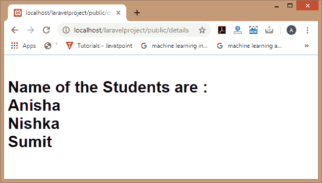
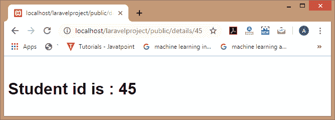
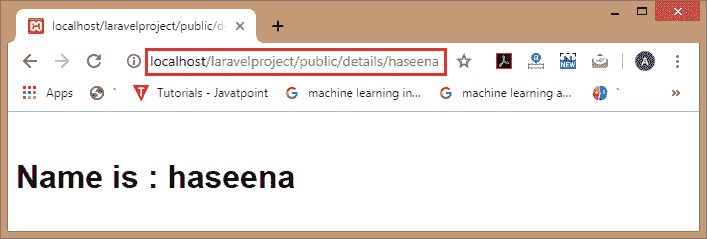
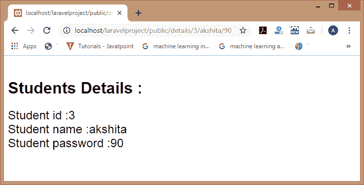

# 将数据传递给视图

> 原文:[https://www.javatpoint.com/laravel-passing-data-to-views](https://www.javatpoint.com/laravel-passing-data-to-views)

在本主题中，我们将学习如何将数据传递给视图。

**将数据传递给视图有多种方式:**

*   通过使用**名称**数组
*   通过使用带有()功能的
***   通过使用**紧凑()**功能**

 **## 名称数组

名称数组是作为第二个参数传递给**视图()**方法的数据数组。

**我们通过一个例子来了解一下。**

**第一步:**首先，我们创建**student.blade.php**，其中包含页面的视图。

**student.blade.php**

```php
<html>
 <body>
 <h1>Name of the Students are : <br>
 <?php 
echo $name1;
echo "<br>";
echo $name2;
echo "<br>";
echo $name3; ?></h1>
</body>
</html>

```

在上面的代码中，我们显示了三个变量的值，即名称 1、名称 2 和名称 3。这三个值从**StudentController.php**文件中检索。

**步骤 2:** 现在，我们创建**StudentController.php**文件。

学生控制器. php.

```php
<?php
namespace App\Http\Controllers;
use Illuminate\Http\Request;
class StudentController extends Controller
{
   public function display()
  {
     return view('student',['name1'=> 'Anisha','name2'=>'Nishka','name3'=>'Sumit']);
  } 
  }

```

在上面的代码中，我们定义了 **display()** 函数，在该函数中我们返回**student.blade.php**文件的视图。

**第三步:**现在，我们在**web.php**文件中定义路线。

**web.php**

```php

Route::get('/details', 'StudentController@display');

```

**输出**



## 带()功能

我们也可以使用带有()功能的**将数据传递给视图。**

*   首先，我们创建包含页面视图的**student.blade.php**文件。

```php
<html>
 <body>
 <h1>Student id is : 
 <?php 
echo $id;
?>
</body>
</html>

```

上面的代码显示了“ **id** 的值。

*   现在，我们创建**StudentController.php**文件。

```php
<?php
namespace App\Http\Controllers;
use Illuminate\Http\Request;
class StudentController extends Controller
{
  public function display($id)
  {
    return view('student')->with('id',$id);
  } 
}

```

在上面的代码中，我们创建了 **display()** 函数，该函数返回**student.blade.php**文件的视图，并且我们通过使用带有()函数的**传递了“ **id** 的值。“ **with()** 函数包含两个参数，即变量名(id)和“ **id** 的值”。**

*   现在，我们定义路线。

```php

Route::get('/details/{id}', 'StudentController@display');

```

**输出**



## 紧凑()函数

compact()函数也用于将数据传递给视图。它包含一个参数，即变量的名称。

**我们通过一个例子来了解一下。**

*   首先，我们创建包含页面视图的**student.blade.php**文件。

```php
<html>
 <body>
 <h1>Name is : 
 <?php 
echo $name;?>
</body>
</html>

```

*   现在，我们创建**StudentController.php**文件。

```php
<?php
namespace App\Http\Controllers;
use Illuminate\Http\Request;
class StudentController extends Controller
{
    public function display($name)
  {
    return view('student?, compact('name'));
  } }

```

*   现在，我们在**web.php**文件中定义路线。

```php

Route::get('/details/{name}', 'StudentController@display');

```

**输出**



我们可以将多个参数传递给 **compact()** 函数。

**我们通过一个例子来了解一下。**

**Student.blade.php**

```php
<html>
 <body>
<h1>Students Details : <br>
<font size='5' face='Arial'>
<?php 
echo "student id is :" .$id;
echo "<br>";
echo "Student name is :" .$name;
echo "<br>";
echo "Student password is :" .$password; ?></h1>
</font>
</body></html>

```

学生控制器. php

```php
<?php
namespace App\Http\Controllers;
use Illuminate\Http\Request;
class StudentController extends Controller
{
   public function display($id,$name,$password)
  {
     return view('student',compact('id','name','password'));
  } 
}

```

**web.php**

```php

Route::get('/details/{id}/{name}/{password}', 'StudentController@display');

```

**输出**



* * ***