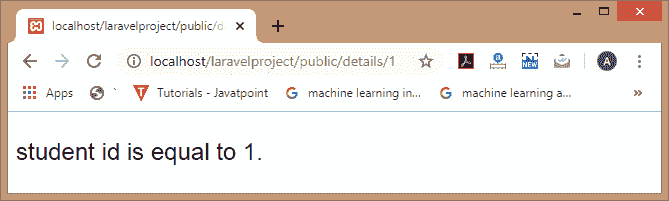
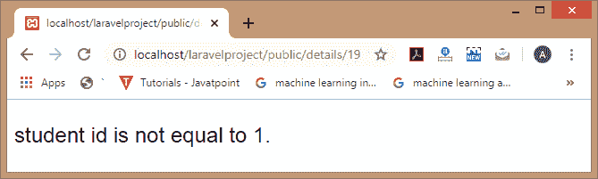
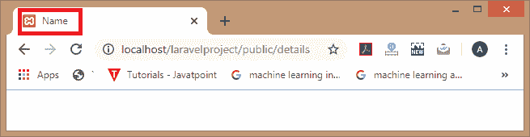
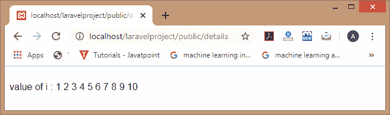
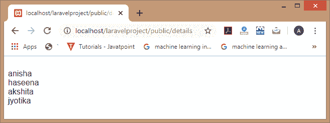
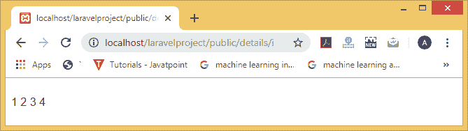

# 刀片模板

> 原文：<https://www.javatpoint.com/laravel-blade-template>

Blade 是 Laravel 框架中一个强大的模板引擎。blade 允许轻松使用模板引擎，这使得语法编写非常简单。blade 模板引擎提供了自己的结构，如条件语句和循环。要创建刀片模板，您只需要创建一个视图文件，并使用. blade.php 扩展名保存它，而不是。php 扩展。刀片模板存储在/resources/view 目录中。使用刀片模板的主要优点是我们可以创建主模板，它可以被其他文件扩展。

## 为什么是刀锋模板？

**使用刀片模板的原因如下:**

*   **显示数据**
    如果你想打印一个变量的值，那么你可以简单地把变量放在花括号里。
    **语法**

```php

{{$variable}};

```

在刀片模板中，我们不需要写 **<之间的代码？php echo $变量；？>** 。以上语法相当于 **<？= $变量？>** 。

*   **三元运算符**
    在刀片模板中，三元运算符的语法可以写成:

```php

{{ $variable or 'default value'}}

```

以上语法相当于 **<？= isset($variable)？$变量:？默认值？？>**

## 刀片模板控制声明

Blade 模板引擎还提供了 laravel 中的控制语句以及控制语句的快捷方式。

```php
<html>
<body>
 <font size='5' face='Arial'>
@if(($id)==1)
student id is equal to 1.
@else
student id is not equal to 1
@endif
</font>
</body>
</html>

```

**输出**




Blade 模板提供了**@除非**指令作为条件语句。上述代码相当于以下代码:

```php
<html>
 <body>
 <font size='5' face='Arial'>
@unless($id==1)
student id is not equal to 1.
@endunless
</font>
</body>
</html>

```



## @hassection 指令

blade 模板引擎还提供了@hasSection 指令，用于确定指定的节是否包含任何内容。

**我们通过一个例子来了解一下。**

```php
<html>
 <body>
<title>
 @hasSection('title')
 @yield('title') - App Name
 @else
 Name
@endif
</title>
</font>
</body>
</html>

```

**输出**



## 刀片环

刀片模板引擎提供循环，如@for、@endfor、@foreach、@endforeach、@while 和@endwhile 指令。这些指令用于创建 php 循环等价语句。

**@为循环**

*   **首先，我们在资源/视图目录中创建 student.blade.php 文件。**

**Student.blade.php**

```php
value of i :
@for($i=1;$i<11;$i++)
{{$i}}
@endfor

```

*   **现在，在 PostController.php 文件中添加以下代码。**

```php

public function display()
{
return view('student');
}

```

*   在**web.php**文件中添加路线。

```php

Route::get('/details', 'PostController@display');

```

**输出**



**@foreach 循环**

*   首先，我们在资源/视图目录中创建**student.blade.php**文件。

```php
@foreach($students as $students)
{{$students}}<br>
@endforeach

```

*   现在，在**PostController.php**文件中添加以下代码。

```php
public function display()
{
   return view('student', ['students'=>['anisha','haseena','akshita','jyotika']]);
}

```

在上面的代码中，我们将学生数组传递给**student.blade.php**文件。

*   在**web.php**文件中添加路线。

```php

Route::get('/details', 'PostController@display');

```

**输出**



**@while 循环**

*   **首先，我们在资源/视图目录中创建 student.blade.php 文件。**

```php
@while(($i)<5)
javatpoint
{{$i++}}
@endwhile

```

*   **现在，在 PostController.php 文件中添加以下代码。**

```php

public function display($i)
{
   return view('student');
}

```

*   **在 web.php 文件中添加路线。**

```php

Route::get('/details/{i}', 'PostController@display');

```

**输出**



* * *