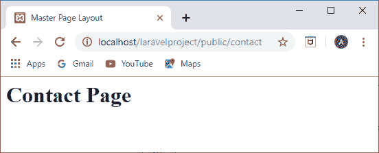
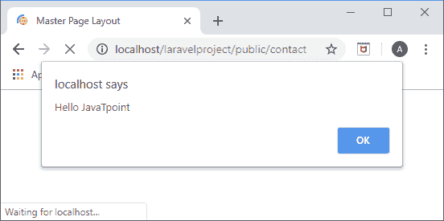
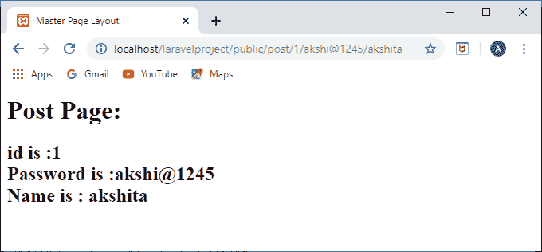
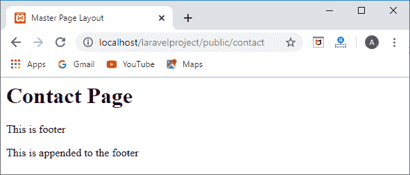

# 模板继承

> 原文:[https://www.javatpoint.com/laravel-template-inheritance](https://www.javatpoint.com/laravel-template-inheritance)

## 母版页布局

母版页布局定义了所有网页的通用布局。所有 web 应用程序都有母版页布局来定义所有网页的通用布局。刀片模板引擎定义了可以由所有网页扩展的主布局。主页布局在**/资源/视图/布局/** 目录下。

**我们通过一个例子来了解一下。**

*   首先，在**资源/视图/** 目录中创建名为“**布局**的文件夹。
*   现在，在布局文件夹“**master.blade.php**”中创建新文件。
*   我们在**master.blade.php**文件中添加以下代码。

**master.blade.php**

```php
<html>
<head>
<title> Master Page Layout </title>
</head>
<body>
<div class="container">
@yield('content')
</div>
@yield('footer')
</body>
</html>

```

在上面的代码中，我们使用了@yield 指令。 **@yield** 用于显示内容。@yield('content ')显示“content”的内容，而@yield('footer ')显示页脚的内容。

## 扩展主布局

*   现在，我们将在**contact.blade.php**文件中扩展上述主布局，如下所示:

**Contact.blade.php**

```php
@extends('layout.master')
@section('content')
<h1>Contact Page </h1> 
@stop

```

在上面的代码中，我们使用了 **@extends** 指令。“ **@extends** ”指令用于继承**contact.blade.php**文件中的刀片布局。“@节(‘content’)”定义了内容的节。

*   现在，在**web.php**文件中添加以下路线。

```php

Route::get('/contact', function () {
    return view('contact');
});

```

**输出**



我们还可以在**contact.blade.php**文件中添加 javascript 代码。假设我在**contact.blade.php**文件中添加了以下代码。

```php
@section('footer')
<script> alert("Hello JavaTpoint") </script>	
@stop

```

在上面的代码中，我创建了警报框，它显示消息“**你好 JavaPoint**”。

**输出**



**我们再来看看刀片模板的另一个例子。**

*   我们创建一个名为“**post.blade.php**”的新文件。

**post.blade.php**

```php
@extends('layout.master')
@section('content')
<h1>Post Page:</h1>
<h2>id is :{{$id}}<br> Password is :{{$password}}<br>Name is : {{$name}}</h2>
@stop

```

上面的代码定义了我们分别显示 id、密码和名称的内容部分。

*   现在，我们创建一个名为“**PostController.php**的控制器。

**PostController.php**

```php
<?php

namespace App\Http\Controllers;

use Illuminate\Http\Request;

class PostController extends Controller
{
    //
 public function show_post($id,$password,$name)
{
  return view('post',compact('id','password','name'));
}}

```

在**PostController.php**文件中，我们定义了一个名为 **show_post()** 的新函数，该函数将数据传递给**post.blade.php**文件。

*   最后，我们在**web.php**文件中定义一条路线。

**web.php**

```php

Route::get('/post/{id}/{password}/{name}','PostController@show_post');

```

**输出**



到目前为止，我们已经看到**post.blade.php**和**contact.blade.php**文件都在扩展主布局文件。这是主布局的主要优势，即每个文件都可以扩展主文件的布局并添加自己的功能。

## @parent 指令的使用

使用 **@parent** 指令是为了显示在主布局中定义的部分的内容。

**我们通过一个例子来了解一下。**

*   **首先，我们创建一个主文件。**

**master.blade.php**

```php
<html>
<head>
<title> Master Page Layout </title>
</head>
<body>
<div class="container">
@yield('content')
</div>
@section('footer')
This is footer 
@show
</body>
</html>

```

*   现在，我们创建**contact.blade.php**，其中我们扩展了上面的**master.blade.php**文件。

```php
@extends('layout.master')
@section('content')
<h1>Contact Page</h1>
@stop 
@section('footer')
@parent
<p>this is appended</p>
@stop

```

在上面的代码中， **@parent** 指令将段落内容添加到页脚部分。

**输出**



* * *