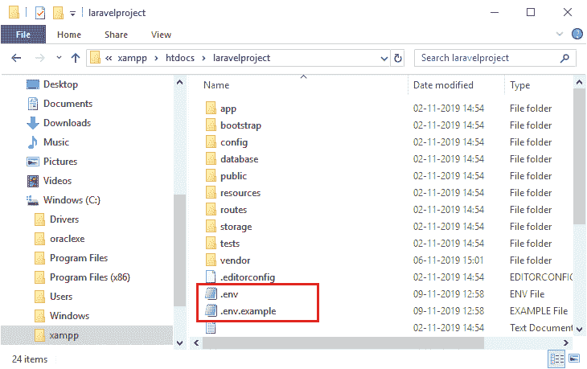
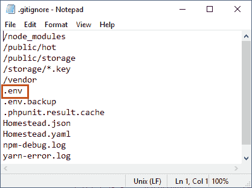
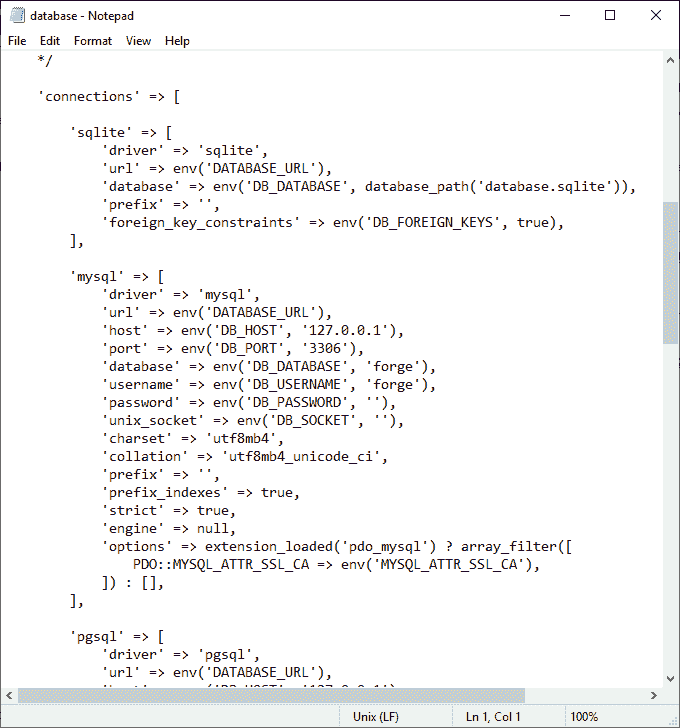

# 拉弗尔移民

> 原文:[https://www.javatpoint.com/laravel-migration](https://www.javatpoint.com/laravel-migration)

## 什么是 Laravel 迁移？

Laravel 迁移是 Laravel 中的一个重要特性，它允许您在数据库中创建一个表。它允许您修改和共享应用程序的数据库模式。您可以通过添加新列或删除现有列来修改表。

## 为什么我们需要 Laravel 迁移？

假设我们在一个团队中工作，一些想法需要在表格中进行更改。在这种情况下，需要传递 SQL 文件，一些团队成员必须导入该文件，但是团队成员忘记导入 SQL 文件。在这种情况下，应用程序将无法正常工作，为了避免这种情况，Laravel Migration 应运而生。

Laravel 迁移允许您添加新列或删除数据库中的记录，而不删除已经存在的记录。

## 环境配置

在本主题中，我们将了解配置和环境文件。在 laravel 项目中，这两个文件由作曲者自动创建，它们是**。env** 和**文件。这两个文件都存在于**c:/xampp/htdocs/project _ name**目录中。**

上面的截图显示，我们在一个项目中有两个环境文件，即**。环境**和**环境示例**。让我们简单了解一下这些文件。

**。环境:**的。env 文件是项目中的一个文件，它包含键值对中的各种设置。在 laravel 项目代码中，我们可以使用函数 **env('键')**获得这些设置。

如果我们是一个团队，那么**。env** 文件未提交给应用程序源代码管理。因为每个开发人员都需要不同的环境配置来使用您的应用程序，如果他们在。env 文件。那个。env 文件包含无法共享的敏感凭据。使用 git 存储库的规则是。env 文件没有提交到存储库，所以它包含在**中。gitignore** 文件。

上图截图显示**。env** 文件包含在**中。gitignore** 文件。

**. env . example:****. env . example**文件包含在存储库中，但不包含在**中。gitignore** 文件。它作为一个示例文件工作，这样开发人员就可以知道应用程序需要哪些键值对。

现在，我们来看看如何使用**。env** 文件。打开**目录下的**database.php**文件。下面给出的截图显示了一个**database.php**文件的内容。**

上图截图显示**database.php**文件返回一个数组。它返回一个**connections【】**数组，该数组返回不同数据库的连接，如 SQLite、MySQL 等。在 database.php 文件中，通过使用 **env(键，值)**函数将值分配给变量。

* * *