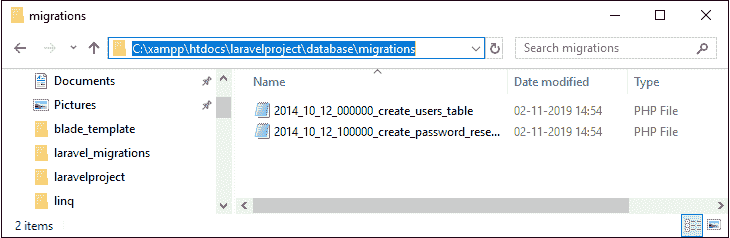
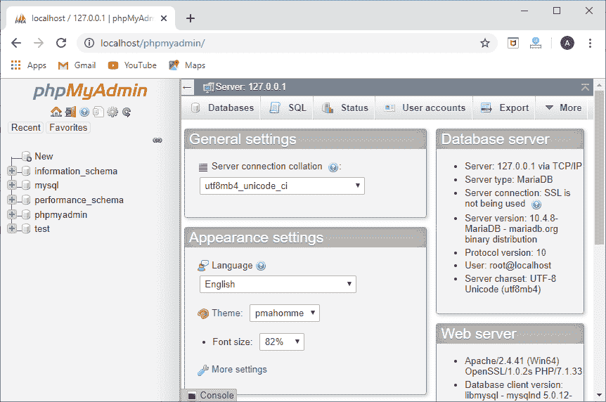
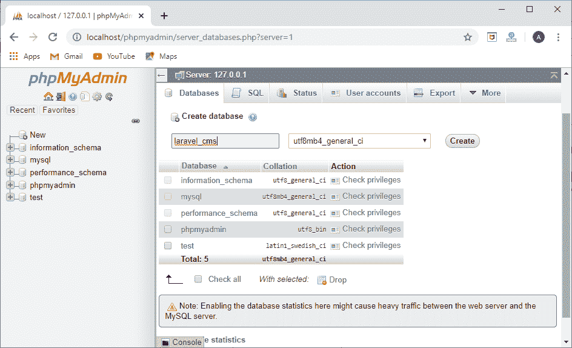
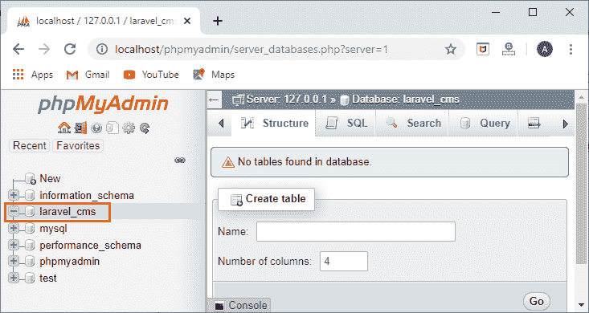
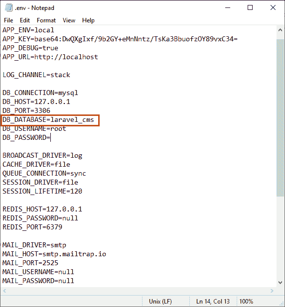
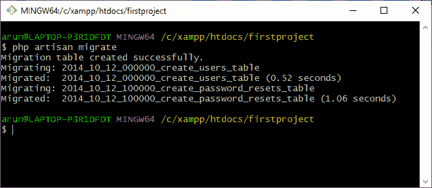
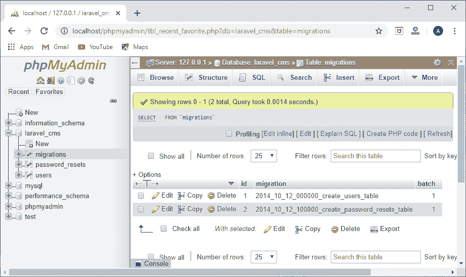
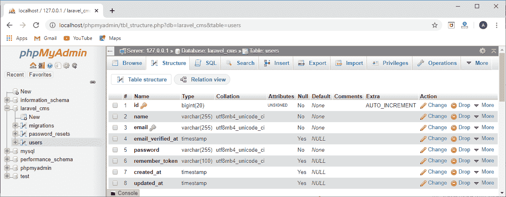

# 拉弗尔迁移结构

> 原文：<https://www.javatpoint.com/laravel-migration-structure>

正如我们所知，迁移是 Laravel 中的一个重要特性，它帮助我们以有序模式在数据库中创建表。有序模式意味着，如果我们有一个运行 php artisan 命令的类，它将创建包含所有字段和列的表。

**我们来了解一下迁移结构。**

**步骤 1:** 移至**C:\ xampp \ htdocs \ laravelpproject \ database \ migrations**目录。



上面的截图显示我们已经打开了包含两个 php 文件的**迁移**文件夹。这些文件就是类。文件名称为**2014 _ 10 _ 12 _ 000000 _ create _ users _ table**，其中 **2014_10_12_000000** 代表时间， **create_users_table** 不代表表名而是迁移名称。

**第二步:**双击该类，将带我进入扩展**迁移**的特定类。

```php
<?php
use Illuminate\Support\Facades\Schema;
use Illuminate\Database\Schema\Blueprint;
use Illuminate\Database\Migrations\Migration;

class CreateUsersTable extends Migration
{
    /**
     * Run the migrations.
     *
     * @return void
     */
    public function up()
    {
            Schema::create('users', function (Blueprint $table) {
            $table->bigIncrements('id');
            $table->string('name');
            $table->string('email')->unique();
            $table->timestamp('email_verified_at')->nullable();
            $table->string('password');
            $table->rememberToken();
            $table->timestamps();
        });
    }

    /**
     * Reverse the migrations.
     *
     * @return void
     */
    public function down()
    {
        Schema::dropIfExists('users');
    }
}

```

在上面的代码中，我们观察到迁移类包含两个方法，即 **up()** 方法和 **down()** 方法。up()方法用于创建新表，将新列或索引添加到数据库中，而 down()方法与 up()方法相反，即它删除字段。上面的类基本上是在数据库中创建表。up()方法运行静态方法，即使用**模式**类创建()。

```php

public function up()
{
    Schema::create('users',function(Blueprint $table)
    {
        //
    });
}

```

在以上 **up()** 方法的语法中，Schema 是类，【create】是 **Schema** 类的静态函数。create()方法包含两个参数，即表名和闭包函数。“用户”是表和闭包函数的名称，其中带有对象的**蓝图**类作为参数传递。**$表**用于创建用户表中的列。

**$ table->big Increments(' id '):**表示 **$table** 正在执行 increments()方法，该方法正在用户表中创建 **id** 列，并且该“ **id** ”是自动递增的。

**$ table->string(' name '):**表示 **$table** 实现了 **string()** 方法，即在 users 表中创建 name 列。

**$table- >字符串(【email】)->unique():**表示 **$table** 实现了**字符串()**方法，即在用户表中创建 email 列。它还实现了 unique()函数，这意味着电子邮件应该是唯一的。

**$table- >时间戳(' email_verified_at')- >可空():**这意味着$table 实现了**时间戳()**方法，该方法正在用户表中创建 **email_verified_at** 列。该函数还创建了两个列，即 **created_at** 和 **updated_at** ，当添加或更新新记录时，这两个字段会自动更新。

down()方法的代码如下:

```php

Schema::dropIfExists('users');

```

在上面的代码中，我们观察到 down()方法通过使用 Schema 类调用 dropIfExists(' user ')函数。该功能检查“**用户**表是否存在，如果“**用户**存在，则删除用户表。

#### 注意:到目前为止，我们已经了解了默认已经创建的表或者只是一个蓝图。但是，我们也可以根据应用程序的功能创建自己的表。

**要运行上述代码，请遵循以下步骤:**

*   打开 **xampp** 中的 **phpmyadmin** 。



*   点击标签中出现的**数据库**。
*   输入数据库名称，然后点击**创建**按钮。



*   点击**创建**按钮后，我们可以看到面板左侧创建了 **laravel_cms** 。



*   打开**。env** 文件，并添加您在上一步中添加的数据库名称。



用您创建的名称更新数据库名称，如上图所示。

*   打开 Git Bash 窗口，输入命令“ **php artisan migrate** ”。该命令的输出如下图所示:



上面的截图显示迁移表已经创建。

*   下面的截图显示了 phpmyadmin 中的迁移表。



*   下面的截图显示了“**用户”**表的结构。



上面的输出显示了在 Git bash 窗口中运行迁移后，已经创建了“**用户**”表。

* * *