# 生成迁移

> 原文:[https://www.javatpoint.com/laravel-generating-migrations](https://www.javatpoint.com/laravel-generating-migrations)

在前一个主题中，我们已经了解了 laravel 项目中已经提供的迁移知识。现在，我们将学习如何生成我们自己的迁移。

## 生成迁移的步骤

**以下是生成迁移的步骤:**

*   打开 Git bash 窗口，键入下面给出的命令:'
    **PHP artisan make:migration create _ post _ table-create = " post "**

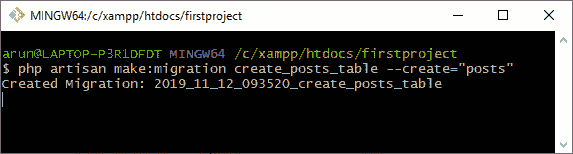

上面的输出显示已经创建了名为“**create _ post _ table**”的迁移表。“**-create =”post**”是创建名为“**post**的表的标志。我们遵循相同的规则来命名迁移表，就像 laravel 对默认迁移表所做的那样。

*   要查看迁移表，请打开目录“**C:\ xampp \ htdocs \ first project project \ database \ migrations**”。

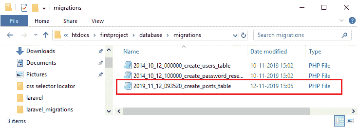

上面的输出显示名为“**create _ post _ table**”的迁移表已经创建成功。

*   打开迁移文件，这个文件的结构如下:

```php
class CreatePostsTable extends Migration
{
    /**
     * Run the migrations.
     *
     * @return void
     */
    public function up()
    {
            Schema::create('posts', function (Blueprint $table) {
            $table->bigIncrements('id');
            $table->timestamps();
        });
    }

    /**
     * Reverse the migrations.
     *
     * @return void
     */
    public function down()
    {
        Schema::dropIfExists('posts');
    }
}

```

上面的代码是新生成的包含两个方法的类，即 **up()** 方法和 **down()** 方法。up()方法实现了 create()方法，该方法包含两个参数，即表(帖子)的名称和闭包函数。闭包函数包含蓝图类，其对象$table 作为参数。这两列是由 Laravel 创建的；第一列是名为“id”的自动增量列，第二列是时间戳类型。

假设我添加了两列，如下代码所示:

```php
public function up()
    {
        Schema::create('posts', function (Blueprint $table) {
            $table->bigIncrements('id');
            $table->string('title')->unique();
            $table->text('body');
            $table->timestamps();
        }); }	

```

现在我们将进行迁移来运行上面的代码。打开 Git bash 窗口运行迁移命令。

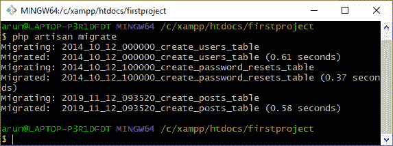

上述命令在数据库中创建迁移表。

打开 **phpmyadmin** 查看迁移表。

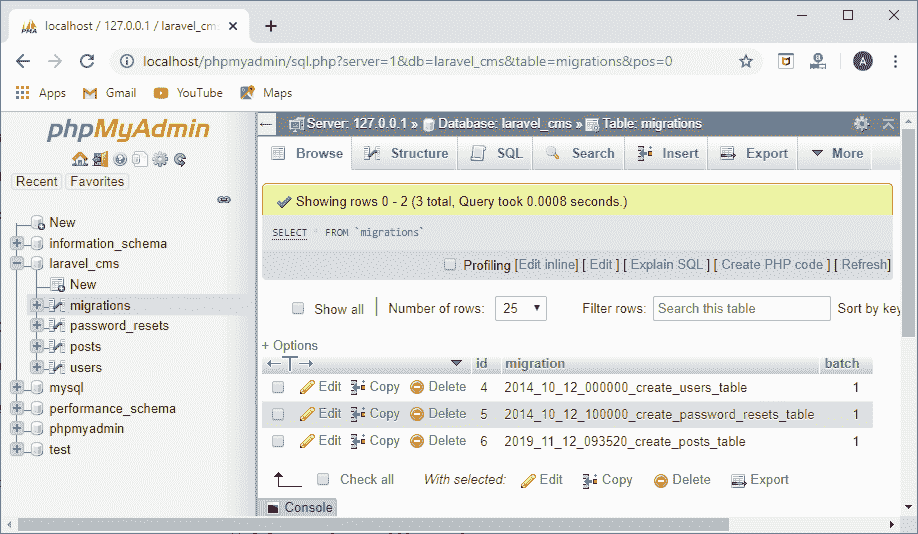

上面的输出显示迁移已经创建，并且“**发布了**表。

“**柱**表结构如下:

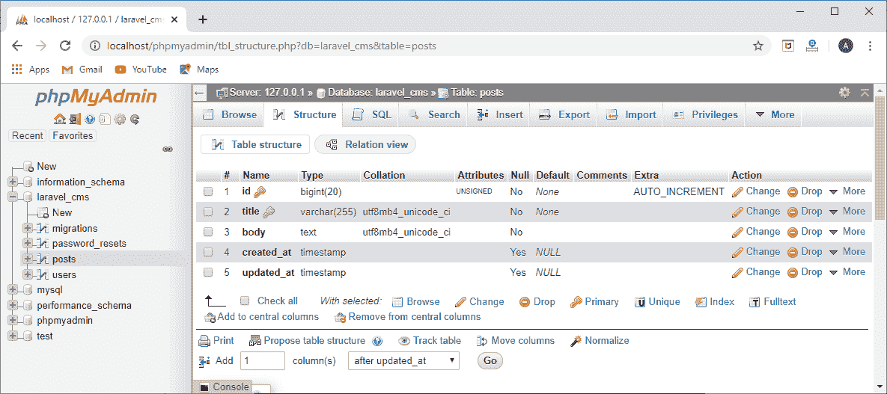

**使用迁移向现有表中添加列**

我想在已经创建的表中添加新列。我不想移回创建该表的文件，删除该表，然后重新创建该表并重新迁移它。因此，我将创建一个新的迁移文件，将新的列添加到现有的表中。

**以下是将列添加到现有表的步骤:**

*   打开 Git bash 窗口，输入下面给出的命令:
    **PHP artisan make:migration add _ column _ admin _ is _ to _ table-table =“post”其中 add _ column _ admin _ is _ to _ table**是迁移文件的名称，table =“post”是告诉 laravel 我们正在使用 post 表的标志。

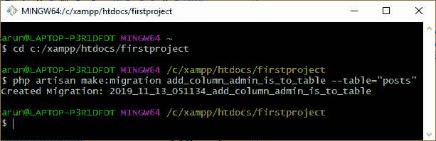

*   迁移文件创建在**xampp/htdocs/first project/database/migrations 目录中，其中 firstproject** 是 laravel 项目的名称。

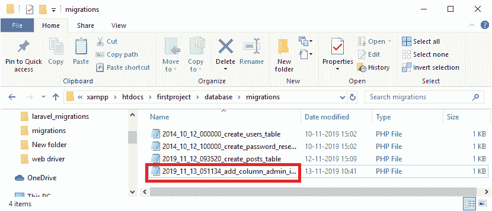

*   打开迁移文件，新创建的迁移文件的结构如下所示:

```php
<?php
use Illuminate\Support\Facades\Schema;
use Illuminate\Database\Schema\Blueprint;
use Illuminate\Database\Migrations\Migration;
class AddColumnAdminIsToTable extends Migration
{
    /**
     * Run the migrations.
     *
     * @return void
     */
    public function up()
    {
        Schema::table('posts', function (Blueprint $table) {
            //
        });
    }

    /**
     * Reverse the migrations.
     *
     * @return void
     */
    public function down()
    {
        Schema::table('posts', function (Blueprint $table) {
            //
        });
    }
}

```

*   我们在 **up()** 方法中添加以下代码:

```php
  public function up()
    {
        Schema::table('posts', function (Blueprint $table) {
            $table->integer('is_admin')->unsigned();
        });
    }

```

上面的代码显示我们正在向帖子表中添加新的列，即**是 _admin** 。

*   在 Git bash 窗口中输入 migrate 命令，即 **php artisan migrate** 。

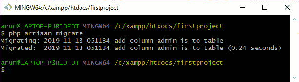

*   打开 **phpMyAdmin** 查看“**帖子**表的结构。

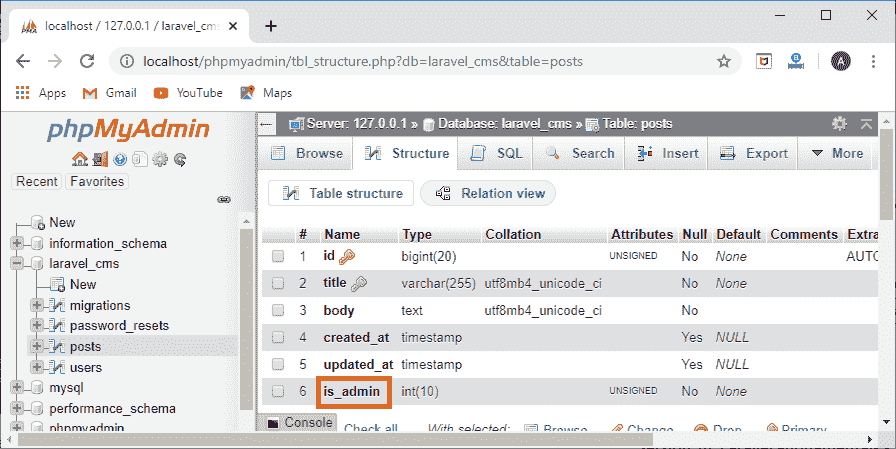

在上面的输出中，我们观察到创建了新的列，即**是 _admin** ，整数的类型是无符号的。无符号整数表示此列不包含任何负数。

*   如果我们想对此列进行一些修改，那么首先，我们需要回滚迁移。命令是**PHP artisan migrate:roll back**。

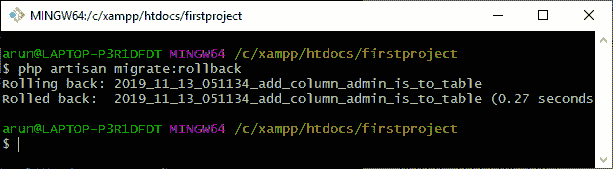

*   当我们回滚迁移时,“posts”结构的结构将如下所示:

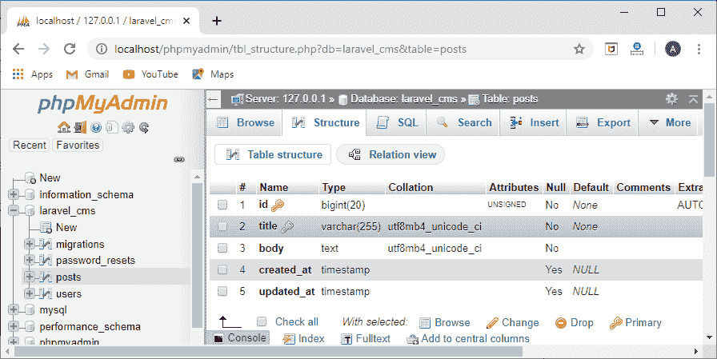

上面的输出显示**是 _admin** 列已经从表中删除。

*   假设我想为 **is_admin** 列提供默认值，那么可以按如下方式完成:

```php
public function up()
    {
        Schema::table('posts', function (Blueprint $table) {
            $table->integer('is_admin')->default('0');
        });
    }

```

*   要将默认值为 0 的 **is_admin** 列再次添加到帖子表中，请运行 migrate 命令。

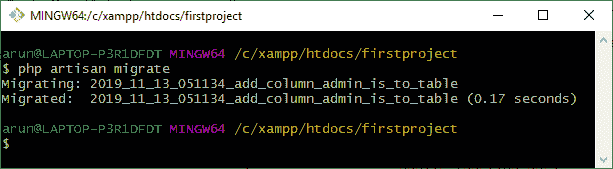

*   打开 **phpMyAdmin** 。

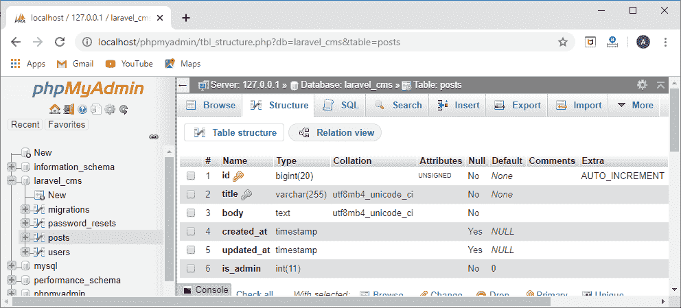

上面的输出显示**是 _admin** 列被添加到帖子表中，默认值为 0。

* * *