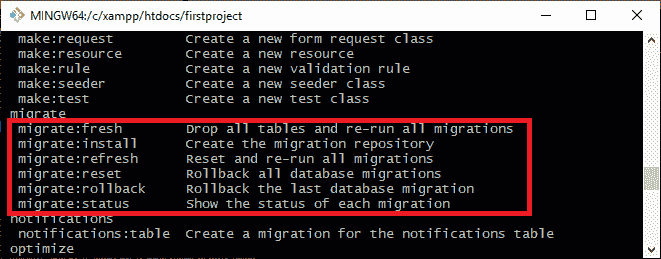
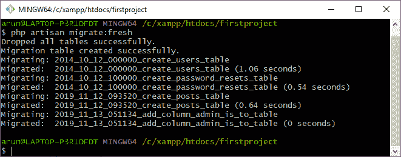
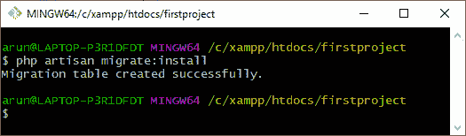
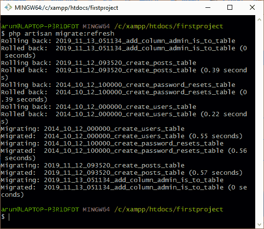
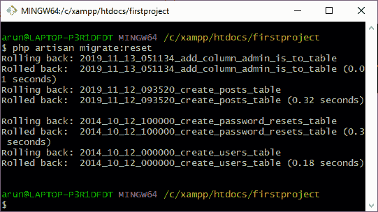
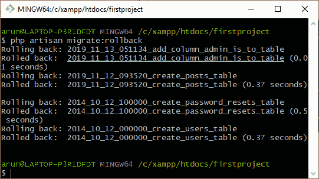
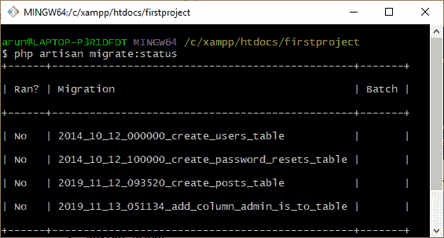

# Laravel 迁移命令

> 原文：<https://www.javatpoint.com/laravel-migration-commands>

在本主题中，我们将了解迁移命令。要查看迁移命令，打开 Git bash 窗口，输入命令“ **php artisan list** ”。该命令列出了 Laravel 中所有可用的命令。

在上面的输出中，突出显示的区域是所有迁移命令的列表。Laravel 中有六个迁移命令:

*   **迁移:新鲜**
*   **迁移:安装**
*   **迁移:刷新**
*   **迁移:重置**
*   **迁移:回滚**
*   **迁移:状态**

## 迁移命令

**迁移:新鲜**

**migrate:fresh** 命令用于从数据库中删除所有表，然后重新运行所有迁移。

**迁移语法:新鲜命令:**

**php 工匠迁移:新鲜**

上面的输出显示**新鲜的**命令删除所有的表，然后重新迁移。

**迁移:安装**

**迁移:安装**命令在数据库中创建迁移表。

**迁移语法:安装命令:**

**php 工匠迁移:安装**

上面的输出显示了**安装**命令创建了新的迁移表。

**迁移:刷新**

**迁移:刷新**命令用于回滚所有迁移，然后重新运行迁移。基本上，它用于重新创建整个数据库。

**迁移语法:刷新命令:**

**php 工匠迁移:刷新**

上面的输出显示了**刷新**命令回滚所有迁移，然后重新迁移所有迁移。

**迁移:重置**

**迁移:重置**命令用于回滚所有迁移，即删除您在数据库中创建的所有表。

**迁移语法:重置命令:**

**php 工匠迁移:重置**

以上输出显示**重置**命令回滚所有迁移。

**迁移:回滚**

**迁移:回滚**用于回滚上次数据库迁移。

**迁移:状态**

**迁移:状态**命令用于显示每次迁移的状态。

**迁移语法:状态命令:**

**php 工匠迁移:状态**

* * *