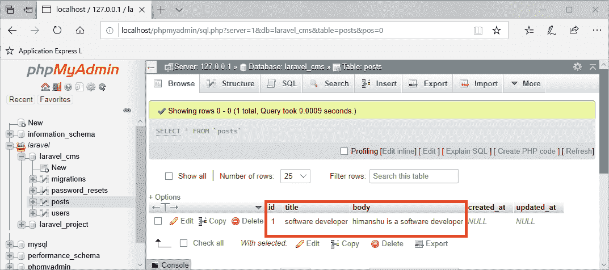
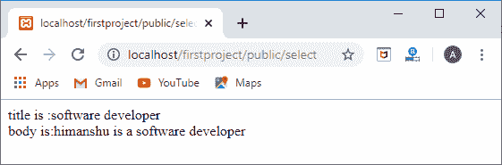
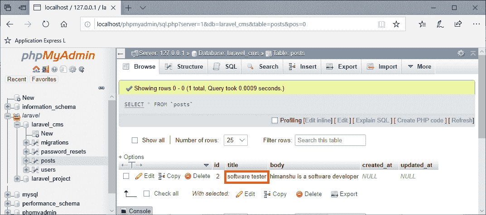
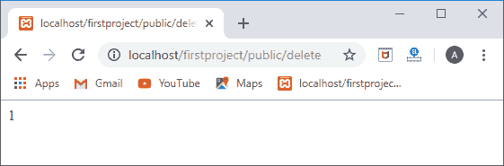
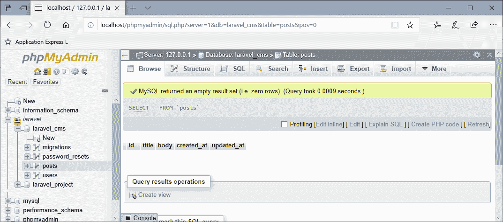

# Laravel 数据库

> 原文：<https://www.javatpoint.com/laravel-database>

在本主题中，我们将学习如何使用数据库并在应用程序中运行查询。使用数据库有许多方法，第一种方法是在应用程序中使用原始 sql 查询，第二种方法是使用也提供与数据库交互的雄辩模型。

在本主题中，我们将了解**原始 sql 查询**，通过这些查询我们可以插入、检索、更新和删除数据。

## 插入数据

现在，我们将数据插入数据库。首先，我们在**web.php**文件中创建路线。

```php

Route::get('/insert', function () {
DB::insert('insert into posts(title,body) values(?,?)',['software developer','himanshu is a software developer']);
});

```

在上面的代码中，' **/insert** '是将数据插入数据库的 url。在函数闭包中，**数据库**是实现 **insert()** 函数的类。insert()函数包含两个参数，即第一个参数是包含列名的 insert 命令，第二个参数表示包含列值的数组。

**输出**

当我们运行 URL“*”http://localhost/first project/public/insert*时，数据被插入到数据库中。



在上面的输出中，突出显示的区域显示数据已成功插入数据库。

## 读取数据

现在，我们将看看如何从数据库中检索数据。让我们首先在**web.php**文件中创建路线。

```php
Route::get('/select',function(){
$results=DB::select('select * from posts where id=?',[1]);
foreach($results as $posts)
{
echo "title is :".$posts->title;
echo "<br>";
echo "body is:".$posts->body;
}
});

```

在上面的代码中，' **/select** '是从数据库中检索数据的 url。数据库是实现 select()方法的类，select()方法包含两个参数。第一个参数是 select 命令，第二个参数是表示 id 值的数组。

**输出**

当我们运行 URL“*http://localhost/first project/public/select*时，输出将是:



## 更新数据

现在，我们将更新数据库中的数据。让我们首先在**web.php**文件中创建路线。

```php

Route::get('/update', function(){
$updated=DB::update('update posts set title="software tester" where id=?',[1]);
return $updated;
});

```

在上面的代码中，' **/update** '是更新数据库中数据的 url。数据库是实现 update()方法的类，该方法包含两个参数。第一个参数包含更新命令，第二个参数是代表 **id** 值的数组。它用 id 等于 1 的“软件测试人员”更新标题。让我们看看上面代码的输出:


以上输出显示“**/更新**”返回值 1；这意味着数据更新成功。



在上面的输出中，突出显示的区域显示标题从软件开发人员变为**软件测试人员**。

## 删除数据

现在，我们将看到如何从数据库中删除数据。让我们首先在**web.php**文件中创建路线。

```php

Route::get('/delete',function(){
$deleted=DB::delete('delete from posts where id=?',[2]);
return $deleted;
});

```



以上输出显示' **/delete** ' url 返回值 1；这意味着该记录已被成功删除。



我们知道在 posts 表中只有一条 id=2 的记录可用。上面的输出显示 id =2 的记录被删除。

* * *