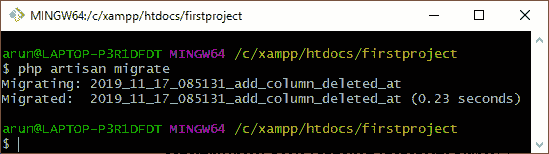
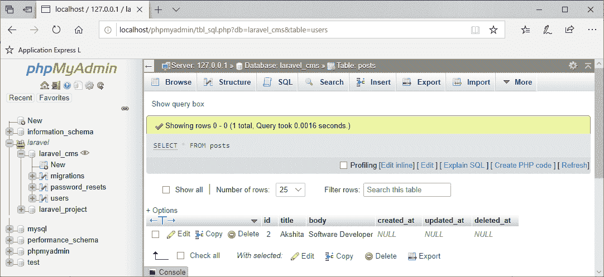

# 拉弗尔雄辩

> 原文：<https://www.javatpoint.com/laravel-eloquent>

在本主题中，我们将学习允许与数据库交互的雄辩模型。每个数据库表都有相应的模型来提供与数据库的交互。该模型允许您查询表中的数据。

模型在**应用程序**目录中创建。也可以将模型放在任何地方，可以根据 **composer.json** 文件自动加载。

我们可以使用以下命令来创建模型:

**php 匠作:模型帖**

我们还可以通过使用数据库迁移来生成模型:

**php 工匠制作:模型后期**

或者

**php 工匠制作:模型迁移后**

## 创建模型的步骤

*   当我们在 Git bash 窗口中输入上述命令时:


上面的窗口显示名为“ **Post** 的模型已经创建成功。

*   模型(Post)是在 **app** 目录中创建的。


## 模型的结构

我们上面创建的模型类的结构如下所示:

```php
<?php

namespace App;

use Illuminate\Database\Eloquent\Model;

class Post extends Model
{
    //
}

```

上面的代码显示了 Post 类扩展了**照明\数据库\雄辩\模型**。

## 表名

在 laravel 雄辩中，我们不需要为 Post 模型指定要使用的表名。除非我们明确指定表的名称，否则类的复数名称将被视为表名。例如，在上面的代码中，类的名称是 Post，它在 Post 表上工作。您也可以使用下面代码中显示的模型类的$table 属性来指定自定义表:

```php
<?php
namespace App;
use Illuminate\Database\Eloquent\Model;

class Post extends Model
{
    /**
     * The table associated with the model.
     *
     * @var string
     */
    protected $table = ?posts';
}

```

在上面的代码中，$table 属性指定 Post 类正在使用 Post 表。

## 主键

雄辩模型认为每个表都有一个名为“ **id** 的主键。我们可以通过为 **$primarykey** 属性提供不同的名称来覆盖这个约定。

```php
<?php

namespace App;

use Illuminate\Database\Eloquent\Model;

class Flight extends Model
{
    /**
     * The primary key associated with the table.
     *
     * @var string
     */
    protected $primaryKey = 'post_id';
}

```

默认情况下，在雄辩中，主键是一个自动递增的整数值。如果我们想给主键提供非递增值，那么我们必须将$ incrementing 属性设置为“false”。

**public $递增= false**

如果我们想给主键提供非整数值，那么我们必须给 **$keyType** 属性提供不同的值。

**受保护的$ keyType = ' string**

在上图中，我们将字符串类型赋给主键。

## 阅读日期

现在，我们将看看如何从数据库中检索数据。让我们通过一个例子来理解。

*   首先，我们需要在模型类中添加这两个属性。

**Post.php**

```php

namespace App;
use Illuminate\Database\Eloquent\Model;
class Post extends Model
{
    //
protected $table='posts';
protected $primaryKey='id';
}

```

*   我们添加了用于从数据库中检索数据的路由。

**web.php**

```php
<?php
use App\Post;
Route::get('/read',function(){
$posts=Post::all();
foreach($posts as $post)
{
  echo $post->body;
  echo ?<br>?;
}
});

```

在上面的代码中，我们使用 **all()** 方法从数据库中检索所有记录，然后我们应用 **foreach** 循环来检索数据库中所有可用行的主体名称，如下所示。

在下面的截图中，我们可以看到**帖子**表中有两条记录。


**输出**

当我们运行 URL**localhost/first project/public/read**时，输出将是:


如果我们想从数据库中检索特定的记录，那么我们使用 **find()** 方法。

```php
Route::get('/find',function(){
$posts=Post::find(2);
return $posts->title;
});

```

**输出**

运行 url，**localhost/first project/public/find**查看上述代码的输出。


## 读取带约束的数据

*   要检索单个行，我们使用如下所示的 **first()** 方法:

```php
Route::get('/find',function(){
$posts=Post::where('id',2)->first();
return $posts;
});

```

**输出**


*   如果我们不需要检索整行，那么我们可以使用 **value()** 方法直接检索一列的值。

```php
Route::get('/find',function(){
$posts=Post::where('id',1)->value('title');
return $posts;
});

```

**输出**


## 插入数据

现在，我们将看到如何在数据库中插入数据。让我们看看下面给出的一个例子:

```php
Route::get('/insert',function(){
$post=new Post;
$post->title='Nishka';
$post->body='QA Analyst';
$post->save();
});

```

**输出**

在网络浏览器中运行网址**localhost/first project/public/insert**。执行 url 后，打开 phpmyadmin。


上面的输出显示数据已经成功插入。

## 使用 save()方法更新数据

我们还可以使用 save()方法更新记录。让我们通过一个例子来理解。

```php
Route::get('/basicupdate',function(){
$post=Post::find(2);
$post->title='Haseena';
$post->body='Graphic Designer';
$post->save();
});

```

**输出**


上面的屏幕显示了数据库表，它在执行上述代码之前。

当我们执行上面的代码时，数据得到更新，如下图所示。


## 批量分配

为了提供质量分配，我们需要使用 **create()** 方法，并在模型类中提供**$ filable**属性。

**我们通过一个例子来了解一下。**

*   首先，创建路线，我们在闭包函数中添加了 create()方法。create()方法基本上是添加一条新记录，并且通过其参数提供值。首先，创建路线，我们在闭包函数中添加了 create()方法。create()方法基本上是添加一条新记录，并且通过其参数提供值。

```php
Route::get('/create',function(){
Post::create(['title'=>'Harshita','body'=>'Technical Content Writer']);
});

```

*   为了提供批量分配，我们需要在模型类中添加**$ filable**属性，如下代码所示。

```php
<?php
namespace App;
use Illuminate\Database\Eloquent\Model;
class Post extends Model
{
    //
protected $table='posts';
protected $primaryKey='id';
protected $fillable=
[
'title',
'body'
];
}

```

**输出**

运行 url，**localhost/first project/public/create**运行上述代码。


现在，看看数据库。


上面突出显示的区域显示新记录已成功创建。

## 用雄辩更新数据

现在，我们将看到如何使用雄辩来更新数据。让我们通过一个例子来理解。

*   首先，创建路线。

```php
Route::get('/update',function(){
Post::where('id',1)->update(['title'=>'Charu','body'=>'technical Content Writer']);
});

```

在上面的代码中，我们使用了模型类的 update()方法。我们正在更新 id 等于 1 的记录。

**输出**


## 删除数据

现在，我们将看到如何使用雄辩删除数据。我们直接实现雄辩模型类中可用的 **delete()** 方法。

**删除数据的方式不同。**

*   第一种方法是使用 find()和 delete()方法。

```php
Route::get('/delete',function(){
$post=Post::find(1);
$post->delete();
});

```

**输出**


*   第二种方法是使用**破坏()**方法。

```php

Route::get('/destroy',function(){
Post::destroy(2);
});

```

**输出**


如果我们想毁掉不止一排，

```php

Route::get('/destroy',function(){
Post::destroy([3,4]);
});

```

上述代码正在销毁 id 为 3 和 4 的记录。

**输出**


*   **第三种方式是使用查询。**

```php
Route::get('/delete1',function(){
Post::where('id',5)->delete();
});

```

**输出**


## 软删除/丢弃

还有另一种删除记录的方法是软删除。当模型被软删除时，这意味着记录实际上没有从数据库中删除。在软删除中，记录不会被永久删除；它们被存放在垃圾桶里。

**我们通过一个软删除的例子来了解一下。**

*   首先，我们需要将 **deleted_at** 属性设置为模型类。

```php
<?php
namespace App;
use Illuminate\Database\Eloquent\Model;
use Illuminate\Database\Eloquent\SoftDeletes;
class Post extends Model
{
 use SoftDeletes;
protected $table='posts';
protected $primaryKey='id';
protected $dates=['deleted_at'];
}

```

*   现在，进行迁移，在帖子表的列添加一个 **deleted_at。**


*   由于我们已经在创建了名为**add _ column _ deleted _ 的迁移，其结构如下:**

```php
<?php

use Illuminate\Support\Facades\Schema;
use Illuminate\Database\Schema\Blueprint;
use Illuminate\Database\Migrations\Migration;

class AddColumnDeletedAt extends Migration
{
    /**
     * Run the migrations.
     *
     * @return void
     */
    public function up()
    {
        Schema::table('posts', function (Blueprint $table) {
            $table->softDeletes();
        });
    }

    /**
     * Reverse the migrations.
     *
     * @return void
     */
    public function down()
    {
        Schema::table('posts', function (Blueprint $table) {
            $table->dropColumn('deleted_at');
        });
    }
}

```

laravel 包含名为 **softDeletes()** 的辅助方法，我们已经在上面的代码中使用过了。softDeletes()方法用于创建列。

*   现在，运行命令 **php artisan migrate** 。



*   最后，在 web.php 文件中添加路由以运行软删除。

```php
Route::get('/softdelete',function(){
Post::find(1)->delete();
});

```

在上面的代码中，我们软删除了 id 为“1”的记录。

**输出**


在上图中， **deleted_at** 列显示了该记录被软删除的时间。如果该列包含空值，则意味着该记录没有被软删除。

## 检索已删除/废弃的数据

要检索删除的数据，我们使用**with Tashed()**方法。让我们通过一个例子来理解这一点。

```php
Route::get('/readsofdelete',function(){
$post=Post::withTrashed()->where('id',1)->get();
return $post;
});

```

在上面，我们正在检索被丢弃或软删除的记录。

**输出**


## 恢复已删除/已丢弃的数据

在前一个主题中，我们看到了如何从软删除模型中检索数据。现在，我们将看到如何将数据从废纸篓空间恢复到原始位置。让我们通过一个例子来理解这一点。

```php
Route::get('/restore',function(){
Post::withTrashed()->where('id',1)->restore();
});

```

在上面的代码中，我们使用 **restore()** 函数来恢复被丢弃的数据。

**输出**


上面的屏幕显示 deleted_at 列的值为空，这意味着记录被恢复到数据库中。

## 永久删除记录

有时我们需要永久删除数据。要永久删除软删除的模型，我们使用 **forceDelete()** 方法。让我们通过一个例子来理解这一点。

```php
Route::get('/forcedelete',function(){
Post::onlyTrashed()->forceDelete();
});

```

在上面的代码中，我们删除了被丢弃的数据。

在执行上述代码之前，垃圾记录的 id 等于 1，如下图所示。


当我们运行上述代码时，被丢弃的记录将被删除，该表如下所示:



* * *