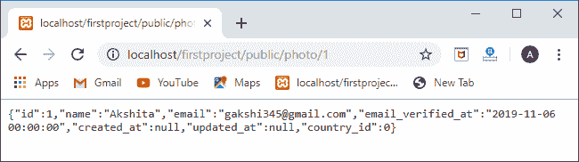

# 拉弗尔关系

> 原文：<https://www.javatpoint.com/laravel-relationship>

雄辩的关系是 Laravel 的一个非常重要的特性，它允许你以一种非常简单的格式来关联表格。

## 一对一的关系

一对一关系提供了不同表的列之间的一对一关系。例如，每个用户都与一个帖子或多个帖子相关联，但是在这种关系中，我们将检索一个用户的单个帖子。要定义关系，首先需要在 User 模型中定义 **post()** 方法。在 post()方法中，我们需要实现返回结果的 **hasOne()** 方法。

让我们通过一个例子来理解一对一的关系。

*   首先，我们在名为**的现有表中添加新列(user_id)发布**。这里，user_id 是外键。


*   使用下面给出的命令在数据库中迁移上述更改:
    **php artisan migrate** 。
*   迁移后**帖子**表的结构如下截图所示:


上图截图显示 **user_id** 列添加成功。

*   打开**User.php**文件，在**User.php**文件中添加以下代码。

```php
public function post()
{
  return $this->hasOne('App\Post');
}

```

在上面的代码中，我们实现了 **hasOne()** 方法，该方法包含单个参数，即相关模型的名称。默认情况下，Post 会将 user_id 视为外键。 **post()** 方法搜索 post 表，因为我们已经提到了名称空间“ **App/Post** ”，并查找列 **user_id** 。我们可以通过提供外键作为第二个参数来覆盖这个约定。它可以重写为:

**返回$this- > hasOne('App\Post '，foreign_key)**

*   现在，我们将在**web.php**文件中添加路线。

```php
<?php
use App\User;
Route::get('/user',function()
{
  return User::find(1)->post;
}
);

```

上面的代码是找到一个 id 号为 1 的用户，然后实现帖子，找到 **user_id** 等于 1 的用户的帖子。

**输出**


## 反比关系

逆关系是指一对一关系的逆关系。在上面，我们已经检索了属于特定用户的帖子。现在，我们根据帖子检索用户信息。让我们通过一个例子来理解这一点。

*   首先，我们在**web.php**文件中创建路线。

```php
<?php
use App\Post;
Route::get('/post/user',function()
{
 return Post::find(1)->user->name;
});

```

*   打开我们之前创建的**Post.php**文件(模型)。

```php
<?php
namespace App;
use Illuminate\Database\Eloquent\Model;
use Illuminate\Database\Eloquent\SoftDeletes;
class Post extends Model
{
 use SoftDeletes;
protected $table='posts';
protected $primaryKey='id';
protected $fillable=
[
'title',
'body'
];
protected $dates=['deleted_at'];
public function user()
{
  return $this->belongsTo('App\User');
}

}

```

**输出**


## 一对多关系

Laravel 还提供了一对多的关系。

*   首先，我们定义找出单个用户所有帖子的路线。

```php
Route::get('/posts',function(){
$user=User::find(1);
foreach($user->posts as $post){
echo $post->title."<br>";
}
});

```

*   在 **User.php(model)** 文件中添加以下代码。

```php
public function posts()
{
    return $this->hasMany('App\Post','user_id');
}

```

**输出**


## 多对多关系

多对多关系比一对一关系和一对多关系更复杂。为了定义多对多关系，我们需要创建一个数据透视表。数据透视表基本上是一个连接两个表的查找表。例如，一个用户可能有不同的角色，这些角色可以由其他用户共享，就像许多用户可以有角色“ **Admin** ”。为了定义用户和角色之间的关系，我们需要创建三个表:用户、角色和 role_user。在我们的数据库中，已经创建了用户表；我们需要创建两个表，即角色表和数据透视表(roles_user)。

*   首先，我们创建**角色**模型。我们使用以下命令创建模型:
    **php 工匠制作:模型角色-m**


上面的屏幕显示已经创建了角色表。在**数据库/迁移**目录中创建了 **create_roles_table.php** 。该文件的结构如下:

```php
<?php
 use Illuminate\Support\Facades\Schema;
 use Illuminate\Database\Schema\Blueprint;
use Illuminate\Database\Migrations\Migration;
class CreateRolesTable extends Migration
{
    /**
     * Run the migrations.
     *
     * @return void
     */
    public function up()
    {
        Schema::create('roles', function (Blueprint $table) {
            $table->bigIncrements('id');
            $table->string('name');
            $table->timestamps();
        });
    }

    /**
     * Reverse the migrations.
     *
     * @return void
     */
    public function down()
    {
        Schema::dropIfExists('roles');
    }
}

```

在上面的代码中，我们添加了名为“name”的新列。“名称”列定义了用户角色的名称。

*   现在，我们有两个表，角色表和用户表。为了关联这两个表，我们需要创建数据透视表， **roles_user** 表。


上图显示**角色 _ 用户**表已经创建。create_roles_user_table 的结构如下所示:

```php
<?php
use Illuminate\Support\Facades\Schema;
use Illuminate\Database\Schema\Blueprint;
use Illuminate\Database\Migrations\Migration;
class CreateRolesUserTable extends Migration
{
    /**
     * Run the migrations.
     *
     * @return void
     */
    public function up()
    {
        Schema::create('roles_user', function (Blueprint $table) {
            $table->bigIncrements('id');
            $table->integer('user_id');
            $table->integer('role_id');
            $table->timestamps();
        });
    }

    /**
     * Reverse the migrations.
     *
     * @return void
     */
    public function down()
    {
        Schema::dropIfExists('roles_user');
    }
}

```

在上面的代码中，我们添加了两个新的列，user_id 和 role_id。

*   使用下面给出的命令迁移上述所有更改:
    **php artisan migrate**


*   下面的屏幕显示了所有三个表，即角色、角色用户和创建的用户。


角色表中的可用数据:


用户表中的可用数据:


roles_user 表中的可用数据:


*   现在，我们定义路线。

**web.php**

```php
Route::get('/roles/{id}',function($id){
$user=User::find($id);
foreach($user->role as $role)
{
   return $role->name;
}
});

```

*   我们在**User.php**文件中添加了以下代码，它将两个表联系起来。

```php
public function role()
{
   return $this->belongsToMany('App\Role','roles_user');
} 

```

在上面的代码中， **belongsToMany()** 方法包含两个参数， **App\Role** ，这是使用 Role 模型的命名空间，【roles_user】是关联两个表的透视表的名称。belongsToMany()方法也可以写成:

**belongsToMany(' App \角色'，' roles_user '，' user_id '，' Role _ id ')；**

上面一行包含另外两个参数，user_id 和 role_id。user_id 是 users 表的外键，role_id 是 roles 表的外键。

**输出**


## 访问中间/数据透视表

在多对多关系中，我们创建数据透视表或中间表。现在，我们将看到如何检索这个数据透视表。

```php
<?php
Use App\User;
Route::get('/pivot',function(){
$user=User::find(1);
foreach($user->role as $role)
{
   return $role->pivot;
}
});

```

在上面的模型中，我们正在检索 id 等于 1 的用户。然后，使用 **foreach** 循环，我们检索角色模型并在透视属性中分配。


如果我们想从数据透视表中检索特定的列，

```php
public function role()
{
return $this->belongsToMany('App\Role','roles_user')->withPivot('created_at');
} 

```

**web.php**

```php
Route::get('/pivot',function(){
$user=User::find(1);
foreach($user->role as $role)
{
   return $role->pivot->created_at;
}
});

```

**输出**


## 有很多经历

“有许多通过”关系提供了一种访问远处或中间关系的便捷方式。例如，我们有三个表，用户表、帖子表和国家表。现在，我们想通过用户模型找到属于那个国家的帖子。

让我们通过一个例子来理解。

*   数据库中没有国家/地区表。我们首先创建带有数据库迁移的国家模型。


*   在国家/地区表中添加“**名称**”列。

```php
<?php
use Illuminate\Support\Facades\Schema;
use Illuminate\Database\Schema\Blueprint;
use Illuminate\Database\Migrations\Migration;
class CreateCountriesTable extends Migration
{
    /**
     * Run the migrations.
     *
     * @return void
     */
    public function up()
    {
            Schema::create('countries', function (Blueprint $table) {
            $table->bigIncrements('id');
            $table->string('name');
            $table->timestamps();
        });
    }
/**
     * Reverse the migrations.
     *
     * @return void
     */
    public function down()
    {
        Schema::dropIfExists('countries');
    }
}

```

*   使用下面给出的命令迁移上述更改:
    **php artisan migrate**
*   现在，我们在 users 表中添加了新列“country_id”。使用下面给出的命令:
    **php 匠使:迁移 add _ new _ column _ id-table = user；**
*   执行上述命令后，在数据库/迁移目录中创建了 **add_new_column_column_id** 文件。

```php
<?php
use Illuminate\Support\Facades\Schema;
use Illuminate\Database\Schema\Blueprint;
use Illuminate\Database\Migrations\Migration;
class AddNewColumnColumnId extends Migration
{
    /**
     * Run the migrations.
     *
     * @return void
     */
    public function up()
    {
        Schema::table('users', function (Blueprint $table) {
            $table->integer('country_id')->unsigned;
        });
    }
 /**
     * Reverse the migrations.
     *
     * @return void
     */
    public function down()
    {
        Schema::table('users', function (Blueprint $table) {
            $table->dropColumn('country_id');
        });
    }
}

```

在上面的代码中，我们在 users 表中添加了一个新列。

要迁移数据库中的上述更改，

**php 工匠迁移**

*   打开 **country.php(model)** 文件。我们将使用国家模型提取特定国家的职位。
    T3】country.php

```php
<?php
namespace App;
use Illuminate\Database\Eloquent\Model;
class country extends Model
{
 public function posts(){   
 return $this->hasManyThrough('App\Post','App\User','country_id','user_id');
}
}

```

*   现在，我们添加拉出特定国家的帖子的路线。

```php
Route::get('/user/country',function()
{

   $country=country::find(1);
   foreach($country->posts as $post)
   {
     return $post->title;
   }
});

```

**输出**


## 多态关系

**一对多(多态)**

多态关系类似于一对多关系。当单个模型属于多个模型类型时，单个关联被称为一对一多态关系。例如，如果我们有三个表，帖子、用户和照片表，其中照片表表示与用户和帖子表的多态关系。

**我们通过一个例子来理解这种关系。**

*   在前面的主题中，我们已经创建了用户和帖子表。现在，我们创建一个照片表。


打开在迁移文件夹中创建的 **create_photos_table.php** 文件。

```php
<?php
use Illuminate\Support\Facades\Schema;
use Illuminate\Database\Schema\Blueprint;
use Illuminate\Database\Migrations\Migration;
class CreatePhotosTable extends Migration
{
    /**
     * Run the migrations.
     *
     * @return void
     */
    public function up()
    {
        Schema::create('photos', function (Blueprint $table) {
            $table->bigIncrements('id');
            $table->string('path');
            $table->integer('imageable_id');
            $table->string('imageable_type');
            $table->timestamps();
        });
    }

    /**
     * Reverse the migrations.
     *
     * @return void
     */
    public function down()
    {
        Schema::dropIfExists('photos');
    }
}

```

在上面的代码中，我们添加了三列，路径，**可成像 _id** ，和**可成像 _ 类型**。路径决定了图像的路径，**可成像 _id** 是用户或帖子的 id 值，可成像 _type 是模型的类名。

*   我们将从我们之前创建的帖子表中删除 **user_id** 列。
*   看看数据库表。

**帖子表中的可用数据**


**用户表中的可用数据:**


**照片表中可用数据:**


*   打开**照片**模型文件。

```php
<?php
namespace App;
use Illuminate\Database\Eloquent\Model;
class photo extends Model
{
//
public function imageable()
{
 return $this->morphTo();
}}

```

*   在用户模型文件中添加以下代码。

```php
public function photos()
{
  return $this->morphMany('App\Photo','imageable');
}

```

*   在 Post 模型文件中添加以下代码。

```php
public function photos()
{
  return $this->morphMany('App\Photo','imageable');}

```

*   现在，我们将为用户和帖子创建路由。

```php
// Route for the users.
Route::get('/user/photo',function(){
$user=User::find(1);
foreach($user->photos as $photo)
{
   return $photo;
}
});

// Route defined for the posts.
Route::get('/post/photo',function(){
$post=Post::find(1);
foreach($post->photos as $photo)
{
   return $photo;
}

});

```

**输出**


**一对多(多态)关系的逆**

在本主题中，我们将执行一对多多态关系的反向操作。到现在，我们找到了用户和帖子的图片，现在我们找到了图片的所有者。

**我们通过一个例子来了解一下。**

我们需要在 web.php 文件中创建路线。

```php
 Route::get('/photo/{id}', function($id)
{
   $photo=Photo::findOrFail($id);
   return $photo->imageable;
});

```

在上面的代码中， **Photo::findOrFail($id)** 方法确定给定的 **id** 的照片是否存在。如果存在，它将通过声明返回图像的详细信息，' **$photo- >可成像**。

**输出**



上面的输出显示了图像的细节。

**多对多多态关系**

在多对多多态关系中，目标模型由不同模型之间共享的唯一记录组成。例如，标签表共享视频和帖子表之间的多态关系。标签表由表、视频和帖子表共享的唯一标签列表组成。

**我们通过一个例子来了解一下。**

*   首先，我们用名为**音频、标签、**和**标签化**的数据库迁移创建模型。


*   创建模型后，我们将编辑它们的迁移文件。

打开名为“ **create_audio_table** 的音频表的迁移文件。

```php
<?php
use Illuminate\Support\Facades\Schema;
use Illuminate\Database\Schema\Blueprint;
use Illuminate\Database\Migrations\Migration;
class CreateAudioTable extends Migration
{
    /**
     * Run the migrations.
     *
     * @return void
     */
    public function up()
    {
        Schema::create('audio', function (Blueprint $table) {
            $table->bigIncrements('id');
            $table->string('name');
            $table->timestamps();
        });
    }

    /**
     * Reverse the migrations.
     *
     * @return void
     */
    public function down()
    {
        Schema::dropIfExists('audio');
    }
}

```

在上面的代码中，我们已经使用命令 **$table- >字符串(' name ')在音频表中创建了名称列；**。

打开名为“ **create_tag_table** 的 Tag 模型的迁移文件。

```php
<?php
use Illuminate\Support\Facades\Schema;
use Illuminate\Database\Schema\Blueprint;
use Illuminate\Database\Migrations\Migration;
class CreateTagsTable extends Migration
{
    /**
     * Run the migrations.
     *
     * @return void
     */
    public function up()
    {
        Schema::create('tags', function (Blueprint $table) {
            $table->bigIncrements('id');
            $table->string('name');
            $table->timestamps();
        });
    }

    /**
     * Reverse the migrations.
     *
     * @return void
     */
    public function down()
    {
        Schema::dropIfExists('tags');
    }
}

```

在上面的代码中，我们使用命令 **$table- >字符串(' name ')在 tags 表中创建了 name 列；**。

打开名为“ **create_taggables_table** 的**可标记**模型的迁移文件。

```php
<?php
use Illuminate\Support\Facades\Schema;
use Illuminate\Database\Schema\Blueprint;
use Illuminate\Database\Migrations\Migration;
class CreateTaggablesTable extends Migration
{
    /**
     * Run the migrations.
     *
     * @return void
     */
    public function up()
    {
        Schema::create('taggables', function (Blueprint $table) {
            $table->bigIncrements('id');
            $table->integer('tag_id');
            $table->integer('taggable_id');
            $table->string('taggable_type');
            $table->timestamps();
        });
    }

    /**
     * Reverse the migrations.
     *
     * @return void
     */
    public function down()
    {
        Schema::dropIfExists('taggables');
    }}

```

在上面的代码中，我们在 **taggables** 表中增加了三个新的列，即 tag_id、taggable_id 和 taggable_type。tag_id 表示标记表的 id，taggable id 表示模型表的 id，taggable type 表示类的名称。

*   要迁移上述更改，我们使用下面给出的命令:
    **php artisan migrate**
*   查看数据库表:

**音频表中可用的数据:**


**员额表中的可用数据:**


**标签表中的可用数据:**


**塔格布尔斯表中的可用数据:**


*   现在我们在模型上定义关系。

音频. php

```php
<?php
namespace App;
use Illuminate\Database\Eloquent\Model;
class Audio extends Model
{
  // get all the tags from the audio. 
  public function tags()
  {
    return $this->morphToMany('App\Tag','taggable');
  }
}

```

**Post.php**

```php
namespace App;
use App\Photo;
use Illuminate\Database\Eloquent\Model;
use Illuminate\Database\Eloquent\SoftDeletes;
class Post extends Model
{
// get all the tags from this post.
public function tags()
{
  return $this->morphToMany('App\Tag','taggable');
}
}

```

*   现在我们定义路线。

```php
use App\Post;
use App\Audio;
// Route for getting the tags from the Post model.
Route::get('/post/tags',function()
{
  $post=Post::find(1); 
  foreach($post->tags as $tag)
  {
    return $tag->name;
  }});
//Route for getting the tags from the Audio model.
Route::get('/audio/tags',function()
{
  $audio=Audio::find(1); 
  foreach($audio->tags as $tag)
  {
    return $tag->name;
  }});

```

**输出**

**进入岗位路线时，输出为:**


**当访问音频的路由时，输出将是:**


**多对多(多态)关系的逆**

在多对多多态关系中，我们找到了属于帖子和音频模型的标签。但是，在多对多(多态)的反向关系中，我们将找出属于特定标签的所有帖子和音频。

让我们通过一个例子来理解。

*   首先，我们在标签模型中定义方法。

**标记. php**

```php
<?php
namespace App;
use Illuminate\Database\Eloquent\Model;
class Tag extends Model
{
   // get all the posts from the tag. 
   public function posts()
    {
      return $this->morphedByMany('App\Post','taggable'); 
    }
// get all the audios from the tag.
public function audios()
    {
      return $this->morphedByMany('App\Audio','taggable'); 
    }
}

```

在上面的代码中，我们定义了两种方法，**post()**和 **audios()** 。在 post()方法中，我们正在检索属于指定标签的所有帖子。在 audios()方法中，我们正在检索属于指定标签的所有音频。

*   现在，我们定义路线。

```php
use App\Tag;
// Route for getting all the posts of a tag.
Route::get('/tag/post/{id}',function($id){
$tag=Tag::find($id);
foreach($tag->posts as $post)
{
   return $post->title;
}
});
// Route for getting all the audios of a tag.
Route::get('/tag/audio/{id}',function($id){
$tag=Tag::find($id);
foreach($tag->audios as $audio)
{
   return $audio->name;
}
});

```

**输出**


* * *