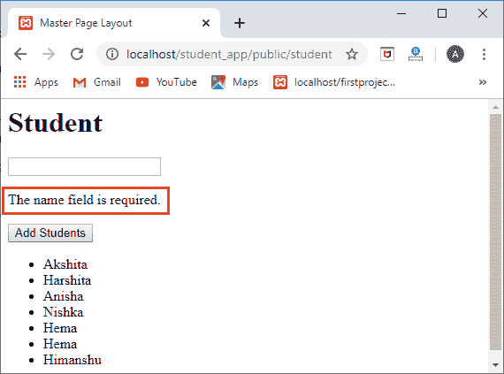

# 拉威尔验证公司

> 原文:[https://www.javatpoint.com/laravel-validation](https://www.javatpoint.com/laravel-validation)

验证是检查输入数据的过程。默认情况下，laravel 提供了使用 ValidatesRequests 特性来验证所有传入 Http 请求的基本控制器类。

让我们通过一个例子来理解验证。

我们将创建一个添加学生姓名的应用程序。

*   首先，我们创建新的 laravel 项目，在其中执行验证。在命令行工具中输入下面给出的命令

**composer create-project laravel/laravel = 5.8 student _ app-prefere-dist；**


以上输出显示 **xampp/htdocs** 目录中 **student_app** 项目已经创建成功。

*   创建项目后，我们将首先创建一个带有数据库迁移的模型。


*   上面的语句在应用程序文件夹中创建了一个模型“学生”，在迁移文件夹中创建了一个模型“学生表”。“create_students_table.php”文件的结构如下:

```php
<?php
use Illuminate\Support\Facades\Schema;
use Illuminate\Database\Schema\Blueprint;
use Illuminate\Database\Migrations\Migration;
class CreateStudentsTable extends Migration
{
    /**
     * Run the migrations.
     *
     * @return void
     */
    public function up()
    {
        Schema::create('students', function (Blueprint $table) {
            $table->bigIncrements('id');
            $table->string('name');
            $table->timestamps();
        });
    }

    /**
     * Reverse the migrations.
     *
     * @return void
     */
    public function down()
    {
        Schema::dropIfExists('students');
    }
}

```

上面的代码创建了一个包含四列(id、名称、created_at、updated_at)的“学生”表。

**用户表中可用数据:**

**用户表**


*   使用下面给出的命令在数据库中迁移上述更改:

**php 匠迁移；**


*   现在，我们创建一个控制器来处理所有的数据库操作。


*   创建控制器后，我们将创建控制器所有方法的路线。要创建路线，我们需要在**web.php**文件中编写以下代码:

**Route::resource('student '，' student controller ')；**


*   这一步我们将定义 **StudentController** 类的 **index()** 方法， **index()** 方法的代码如下:

```php

public function index()
{
$student=Student::all();
return view('index',compact('student'));
}

```

*   现在，我们创建应用程序的视图页面(**index.blade.php**)。

**index.blade.php**

```php
@extends('layout.master')
@section('content')
<h1> Student </h1>
<form action=="{{ route('student.store') }}"  method="Post">
@csrf
<div><input type="text" name="name"></div>
<br/>
<div><input type="button" value="Add Students"> </div>
</form>
<ul>
@foreach($student as $students)
<li>{{$students->name}}</li>
 @endforeach
<ul>
@endsection

```

**上述代码的输出如下所示:**


我们知道 StudentController 的 **index()** 方法的 URI 是“/student”，所以当我们点击 URL“**localhost/student _ app/public/student**时，它会调用 **index()** 方法。 **index()** 方法返回**index.blade.php**文件的视图，如上图截图所示。

*   当我们在上面截图中显示的文本框中输入数据时，它应该保存在数据库中。为了实现这一点，store()函数的代码如下所示:

```php
public function store(Request $request)
    {
        $data=$request->validate([   //  validating the name field.
        'name'=>'required']);
        $student=new Student;
        $student->name=$request->get('name');
        $student->save();
    }

```

**输出**


当我们点击“**添加学生**”按钮，然后我们刷新页面，输出会是:


从上面的截图中我们可以看到，学生列表中增加了“**喜马拉雅书**，这意味着“**添加学生**按钮工作正常。

有时出现不输入任何数据，按下“**添加学生**”按钮的情况；这需要验证。我们在**商店()**方法中添加了验证代码，用于验证“**名称**字段，但是我们没有显示任何错误消息。为了显示错误信息，laravel 提供了显示错误信息的**错误变量**。它可以用作:

```php
{{$errors->first('name')}}

```

在**index.blade.php**增加上面一行后，**index.blade.php**文件的代码如下:

**index.blade.php**

```php
@extends('layout.master')
@section('content')
<h1> Student </h1>
<form action="{{ route('student.store') }}" method="Post">
@csrf
<div><input type="text" name="name"></div>
<br/>
<div>{{$errors->first('name')}}</div>
<br/>
<div><button type="submit">Add Students </div>
</form>
<ul>
@foreach($student as $students)
<li>{{$students->name}}</li>
 @endforeach
<ul>
@endsection

```

**输出**



我们还可以限制文本框字段中的字符。如果我们想在名称字段中输入至少 5 个字符，那么我们可以在验证函数中使用 **min** 字段。

```php
public function store(Request $request)
    {
        $data=$request->validate([
        'name'=>'required|min:5']);
        $student=new Student;
        $student->name=$request->get('name');
        $student->save();
    }

```

**输出**


* * *