# 拉弗尔会议

> 原文:[https://www.javatpoint.com/laravel-sessions](https://www.javatpoint.com/laravel-sessions)

Laravel 会话是一种跨多个用户请求存储用户信息的方式。它跟踪所有访问应用程序的用户。

**我们通过一个例子来理解会话。**

*   首先，我们创建一个应用会话属性的表单。

**form.blade.php**

```php
<Html>
<Head>
<title> File Upload </title>
</Head>
<Body>
<form method="Post" action="{{route('forms.store')}}">
@csrf
<div><label for="Name">Name</label>
<input type="text" name="username"> </div><br/>
<div><button type="submit">Submit </button></div>
</form>
</body>

```

*   现在，我们在**FormController.php**文件中定义 store()函数。

```php
public function store(Request $request)
{
  print_r($request->input('username'));
 }

```

*   最后，我们在**web.php**定义路线。

```php

Route::get('/session',function()
{
  return view('form');
});

```

**输出**

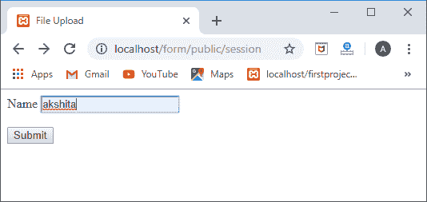

当我们点击**提交**按钮时，出现如下所示的屏幕:

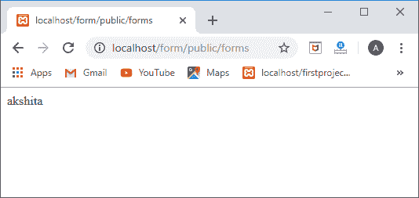

## 将数据存储在会话中

要在会话中存储用户名，我们使用如下所示的会话 put()方法:

**$ request->session()->put(' user '，$ request->input(' username ')；**

要检索会话，我们使用会话的 get()方法，如下所示:

**echo $ request->session()->get(' user ')；**

```php
public function store(Request $request)
{
$request->session()->put('user', $request->input('username'));
echo $request->session()->get('user'); 
 }

```

**输出**

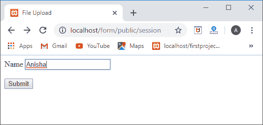
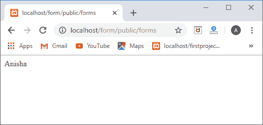

## 全局会话助手

我们还可以使用全局会话函数来存储和检索会话中的值。当会话函数用单个参数传递时，它返回键值。如果会话通过键/值对数组传递，则值存储在会话中。

**//从会话密钥中检索数据。**

$ data = session(' key ')；

**//为会话密钥提供默认值。**

$data=session('key '，' default ')；

**//将该值存储在会话密钥中。**

会话([' key ' = > ' value '])；

**我们通过一个例子来了解一下。**

**模具控制器. php**

```php
public function store(Request $request) {
session(['user'=>$request->input('username')]);
$data=session('user');
echo $data;
    }

```

**输出**

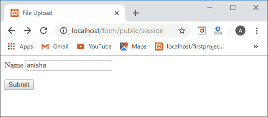
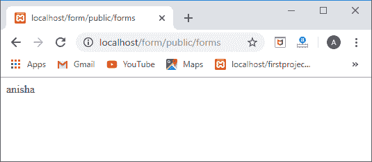

## 正在检索所有会话数据

如果我们想要检索所有的会话数据，那么我们可以使用如下所示的 **all()** 方法:

**$ session _ data = $ request->session()->all()；**

**我们通过一个例子来了解一下:**

**模具控制器. php**

```php
public function store(Request $request) {
session(['user1'=>'anushka']);
session(['user2'=>'anvi']);
return $request->session()->all();
  }

```

现在，我们在**web.php**文件中定义路线。

**路由::get('/show '，'[【邮件保护】](/cdn-cgi/l/email-protection)')；**

**输出**

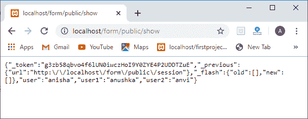

## 删除会话

现在，我们将看到如何从会话中删除数据。我们可以使用遗忘()方法删除会话。

**我们通过一个例子来了解一下。**

**模具控制器. php**

```php
We can also delete the session by using delete() method.
{
session(['user1'=>'anushka']);
session(['user2'=>'anvi']);
$request->session()->forget('user1');
return $request->session()->all();
    }

```

**输出**

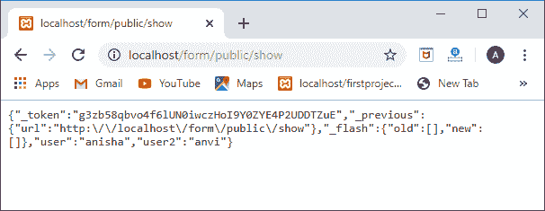

在上面的截图中，我们可以看到 user1 没有显示，所以这意味着 user1 已经从会话中删除了。

**要从会话中移除所有数据，我们将使用 flush()方法。**

**$ request->session()->flush()；**

**我们通过一个例子来理解 flush()方法。**

```php
public function store(Request $request)
{
session(['user1'=>'anushka']);
session(['user2'=>'anvi']);
$request->session()->flush();
return $request->session()->all();
 }

```

**输出**

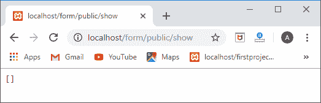

在上面的截图中，我们观察到所有的数据已经从会话中移除，并且它返回一个空数组。

## 闪烁数据

当我们希望在当前请求的会话中存储数据时，闪存数据非常有用，因为闪存数据将在下一个请求中删除。

**我们通过一个例子来理解闪烁数据。**

```php
public function store(Request $request)
{
 session()->flash('post', 'post has been updated');
return $request->session()->get('post');
 }

```

**输出**

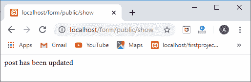

当我们从代码中删除 flash()函数时，代码将如下所示:

```php
public function store(Request $request)
 {
    return $request->session()->get('post');
}

```

当我们刷新页面两次后，在第二次刷新时，会话数据将被删除。

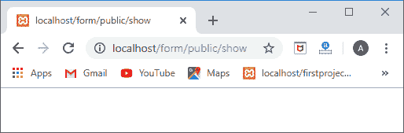

#### 注意:
如果要为几个请求保留闪存数据，那么我们使用 reflash()方法。
会话()->reflash()；
如果要为几个请求保留具体数据，那么我们使用 keep()方法。
$ request->session()->keep(' message ')；

* * *