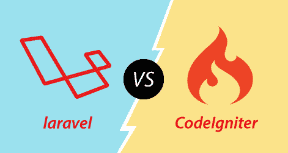

# Laravel vs CodeIgniter

> 原文:[https://www.javatpoint.com/laravel-vs-codeigniter](https://www.javatpoint.com/laravel-vs-codeigniter)

## 什么是 Laravel？

Laravel 是由 **Taylor Otwell** 开发的**免费开源** php web 框架，用于构建基于模型-视图控制器(MVC)的 web 应用。开发 Laravel 的主要目的是为 CodeIgniter 框架提供一个替代方案，CodeIgniter 框架不提供对身份验证和授权的内置支持。

## 什么是 CodeIgniter？

CodeIgniter 是一个开源的 php web 框架，用于快速开发 web 应用程序。CodeIgniter 对短期项目有用，但对长期项目没有用。如今，Laravel 框架比 CodeIgniter 更受欢迎，因为它的性能、功能和可用性。开发人员根据项目的需要比较不同 php 框架的性能、功能和可用性。

**我们来了解一下 Laravel 和 CodeIgniter 的区别。**

*   **对 php 7 的支持**
    PHP 7 是一种服务器端编程语言，包含了一定的新特性和增强功能，这些特性增强了 web 应用的性能，降低了内存消耗。这两个框架，即 Laravel 和 CodeIgniter，都支持 php 的 7 个版本，但是开发人员在 CodeIgniter 框架中开发和测试 php 7 的应用程序时面临这个问题。
*   **内置模块**
    大多数情况下，开发人员更喜欢将复杂的功能划分成更小的模块，以加快开发过程。Laravel 包含内置的模块化特性，它通过一个捆绑包将项目分成更小的模块，这些模块可以在多个项目中重用。CodeIgniter 框架没有内置模块化特性，因此 CodeIgniter 开发人员需要在模块化扩展的帮助下创建模块。
*   **对数据库的支持**
    两个框架，即 Laravel 和 CodeIgniter，都支持一系列数据库，如 MySQL、PostgreSQL、微软 BI 和 MongoDB。但是，CodeIgniter 支持一些额外的数据库，如 Oracle、微软 SQL Server、IBM DB2、orientdb 和 JDBC。因此，我们可以说 CodeIgniter 比 Laravel 支持更多的数据库。
*   **雄辩的 ORM**
    Laravel 包含雄辩的 ORM 的特征。对象关系映射器用于更有效地与不同的数据库交互。CodeIgniter 不支持雄辩的 ORM。Laravel 使用了允许用户通过单一模型与数据库交互的雄辩 ORM。这个单一模型允许用户在单个表上执行各种任务，例如插入新记录、删除记录或更新记录。
*   **刀片模板引擎**
    Laravel 有一个内置的刀片模板引擎，允许开发人员通过操作视图来提高应用程序的性能。但是，CodeIgniter 没有内置的模板引擎。Laravel 框架与刀片模板引擎集成在一起，以执行常见任务并提高 web 应用程序的性能。
*   **Rest API 开发**
    Laravel 包含 **Rest API 控制器**，帮助 Laravel 开发人员构建 Rest API。在 Laravel 中，我们只需要在 Rest API 控制器中将 **$restful** 属性设置为 true，即可构建自定义 Rest API，而无需编写额外的代码。但是，CodeIgniter 没有简化定制 Rest API 开发的特定功能。开发人员需要编写额外的代码来开发定制的 Rest 应用编程接口。
*   **路由**
    两个框架中可用的路由选项工作方式相似。但是 Laravel 提供的路由功能以更有效的方式定义了路由。在 Laravel 中，所有的路由都可以在一个文件中定义。这条路线只有一个 URI 和一个终点。
*   **HTTPs 支持**
    大多数情况下，web 开发人员使用 http 协议安全地发送和接收敏感信息。Laravel 允许开发人员创建自定义的 http 路由。Laravel 通过在 URL 前自动添加*https://协议*来保证数据传输的安全。CodeIgniter 不提供 http 支持。在 CodeIgniter 的情况下，开发人员需要使用 URL 助手来确保数据传输的安全性。
*   **身份验证**
    Laravel 提供了身份验证类，使得开发人员可以轻松地在 web 应用程序中实现身份验证和授权。但是 CodeIgniter 没有内置的身份验证功能，因此开发人员需要编写自定义的 CodeIgniter 扩展来提供身份验证。
*   **单元测试**
    Laravel 自带内置测试工具，即 **PHPUnit** 。PHPUnit 是一个广泛使用的单元测试工具。但是，CodeIgniter 没有内置的测试工具。在 CodeIgniter 中，我们需要添加额外的测试工具，通过执行单元测试来评估软件的质量。
*   **社区支持**
    这两个框架，即 **Laravel 和【CodeIgniter，都是免费的开源 php web 框架。这两个框架都有一个大型社区，但是 Laravel 社区的成员比 CodeIgniter 框架的成员更活跃。开发人员可以在 Laravel 中开发应用程序时获得即时在线帮助。因此，php 开发人员选择 Laravel 框架是因为 Laravel 中提供了这些附加功能。**

* * *