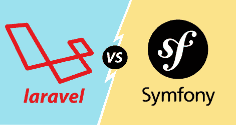

# 拉拉维尔 vs.交响曲

> 原文：<https://www.javatpoint.com/laravel-vs-symfony>

Laravel 和 Symfony 都是跨平台的 php 框架，它们加快了 web 应用程序的开发。

**我们来了解一下 Laravel 和 Symfony 的区别。**

*   **编程语言**
    Symfony 是一个用“普通 php”编写的框架。这里，公共 php 意味着框架是用通用代码编写的。每种编程语言都有一些基本的结构，使它们比其他语言更独特、更好。php 编程语言有一些 Laravel 定期使用的神奇方法和特性，所以 Laravel 中的代码变得更短，更容易理解，也改变了应用程序的行为。
*   **数据库访问**
    两个框架，即 Laravel 和 Symfony，都以不同的方式访问数据库。Symfony 使用 Doctrine，而 Laravel 使用 length 访问数据库。在教义中，迁移是自动产生的；我们需要定义模型和模型中的字段。在 Laravel 中，数据可以更容易地访问，但是我们需要一些关于 SQL 的知识。Laravel 最大的优势是对可能性的覆盖。当教义中出现函数返回一个错误的情况时，但是在拉弗尔的情况下，雄辩是基于“**接受一切**”。在 Laravel 中，无效数据也被解析并转化为可预测的 SQL。
*   **模板引擎**
    Laravel 和 Symfony 使用的模板引擎不同。Laravel 使用刀锋，Symfony 使用细枝。刀刃比树枝好。使用 Blade 的优势在于代码的可重用性。假设您创建了一个要在控制器和模板中使用的函数，那么我们需要在 Twig 中定义这个函数两次。原因是模板不能使用 php 函数，控制器不使用模板。但是，在 Blade 中，函数可以直接使用，这意味着我们在控制器中定义的任何内容也可以在模板中使用。
*   **可扩展性和模块化**
    Symfony 提供了可重用的组件，提供了更好的模块化。这两个框架，即 Laravel 和 Symfony 都是基于 MVC 架构的。Symfony 对于复杂和大型项目更有用，因为代码是以适当的方式组织的。
*   **认证**
    Laravel 因为包含内置的认证系统，所以认证非常简单，而 Symfony 有自定义的认证系统，不像 Laravel 那样简化。
*   **数据库支持**
    Laravel 支持 SQLite、MySQL、PostgreSQL、Redis、微软 BI、MongoDB 等数据库，而 Symfony 支持微软 BI、MySQL、NoSQL、PostgreSQL、CouchDB、DynamoDB、MongoDB、MemcacheDB、GraphDB Membase、GemFire、Oracle 等数据库。
*   **表单和验证器**
    在 Laravel 中，验证可以通过两种方式完成，即验证可以在表单中完成，也可以通过请求的手动验证来完成。在 Symfony 中，我们可以验证一个模型。在 Symfony 中，用多种方式验证同一个对象是非常困难的，但是在 Laravel 中，可以用不同的形式添加相同的验证逻辑，在这些形式中，对象要么被创建，要么被修改。定制的验证可以在 Laravel 和 Symfony 中使用。如果我们想使用 Laravel 中不存在的验证规则，那么在 Laravel 中，我们可以**使用 After Validation Hook** 。在 Symfony 中，我们需要创建一个新的验证器。
*   **缓存和性能**
    这两个框架都在缓存视图，但是 **Symfony** 默认缓存数据。Laravel 在不使用缓存的情况下比 Symfony 工作得更快，所以我们从来没有感觉到在 Laravel 中使用缓存。因此，我们得出结论，Laravel 的性能优于 **Symfony** ，并且 Laravel 不需要像 Symfony 那样多的缓存。
*   **调试和开发工具**
    调试对于一个应用程序来说非常重要。有了良好的 IDE 支持，还需要调试和分析工具来发现应用程序中的问题。当我们谈到 IDE 时，Symfony 提供了比 Laravel 更好的支持。Laravel 的 IDE 支持非常少。Laravel 包含一个高级面板，而 Symfony 包含一个非常简单的面板。Symfony 显示了所有问题和所有高级分析细节，而 Laravel 显示了一些基本问题和一些基本分析细节。
*   **依赖注入**
    应用程序有很多相互依赖的服务和组件。我们使用 ServiceContainer，它是一个 php 对象，存储所有关于依赖关系的信息。Laravel 自动检测所有的依赖项，而在 Symfony 中，我们使用“自动连线”，可以通过在依赖项配置中添加**自动连线:true** 来打开。
*   **ORM(对象关系映射)**
    Laravel 和 Symfony 两个框架都有 ORM 特性。ORM 需要将代码中对象的记录映射到数据库。为了实现这一点，我们需要创建一个与数据库交互的模型。
    Laravel 使用雄辩，Symfony 使用教义与您的数据库交互。与教义相比，雄辩更容易使用，也更友好。

* * *