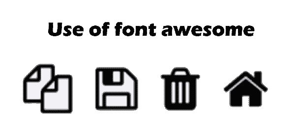

# 在 Laravel 中安装和使用字体棒图标

> 原文:[https://www . javatpoint . com/install-and-use-font-awesome-icons-in-laravel](https://www.javatpoint.com/install-and-use-font-awesome-icons-in-laravel)

在这一节中，我们将使用 Laravel 来安装令人敬畏的字体。我们将讨论一个简单的例子来理解字体在 laravel 中的使用。在下面的例子中，我们将安装 font-awesome laravel 7。

现在，了解使用 laravel mix 安装字体棒极了的图标的逐步过程。字体 awesome 可以通过两种方式安装在 laravel 中，我们通过两个例子来解释。在第一个例子中，我们将使用 npm 命令和 laravel 混合。在第二个例子中，我们将使用 cdn js。字体棒极了的图标可以在 6、7 和 8 等[和](https://www.javatpoint.com/laravel)版本中轻松使用。安装图标的分步过程如下:

**例 1:使用 Namp** 安装

首先，将安装最新版本的 laravel。为此，将运行以下命令。

```php

composer create-project --prefer-dist laravel/laravel blog

```

现在我们将使用我们的 laravel 应用程序并安装 npm。为此，将使用以下命令。使用这个命令，mode_module 的文件夹将在我们的根目录中创建，它将存储所有 npm 模块。

```php

npm install

```

现在，我们将使用下面的 npm 命令并安装 font-awesome 库:

```php

npm install font-awesome --save

```

成功安装该库后，我们将使用 app.scss 文件，并在其上导入字体 awesome [CSS](https://www.javatpoint.com/css-tutorial) 。我们可以使用以下命令导入它:

**资源/sass/app.scss**

```php

@import "node_modules/font-awesome/scss/font-awesome.scss";

```

现在一切都安装好了。所以我们可以运行 npm dev 命令。我们将使用以下命令来运行它:

```php

npm run dev

```

在下面的代码中，我们在刀片文件中使用生成的 app.css 文件:

**资源/视图/欢迎使用. blade.php**

```php
<!DOCTYPE html>
<html>
<head>
    <title> Use of font awesome </title>
    <link type="text/css" rel="stylesheet" href="{{ mix('css/app.css') }}">
    <style type="text/css">
        i{
            font-size: 50px !important;
            padding: 10px;
        }
    </style>
</head>
<body>

<h1> Use of font awesome </h1>

<i class="fa fa-copy"></i>
<i class="fa fa-save"></i>
<i class="fa fa-trash"></i>
<i class="fa fa-home"></i>

</body>
</html>

```

现在我们上面的应用程序已经可以运行了，可以在主页上看到。运行此应用程序后，我们将获得以下布局。

**例 2:使用 CDNJS** 安装

现在我们将使用 cdn js 文件添加字体棒极了的图标。添加它的代码描述如下:

**资源/视图/欢迎使用. blade.php**

```php
<!DOCTYPE html>
<html>
<head>
    <title> Use of font awesome </title>
    <link rel="stylesheet" href="https://cdnjs.cloudflare.com/ajax/libs/font-awesome/5.12.0-2/css/fontawesome.min.css" />
    <link rel="stylesheet" href="https://cdnjs.cloudflare.com/ajax/libs/font-awesome/5.12.0-2/css/all.min.css" />
    <style type="text/css">
        i{
            font-size: 50px !important;
            padding: 10px;
        }
    </style>
</head>
<body>

<h1> Use of font awesome </h1>

<i class="fa fa-copy"></i>
<i class="fa fa-save"></i>
<i class="fa fa-trash"></i>
<i class="fa fa-home"></i>

</body>
</html>

```

执行以上任何一个示例后，我们将获得以下输出:



* * *