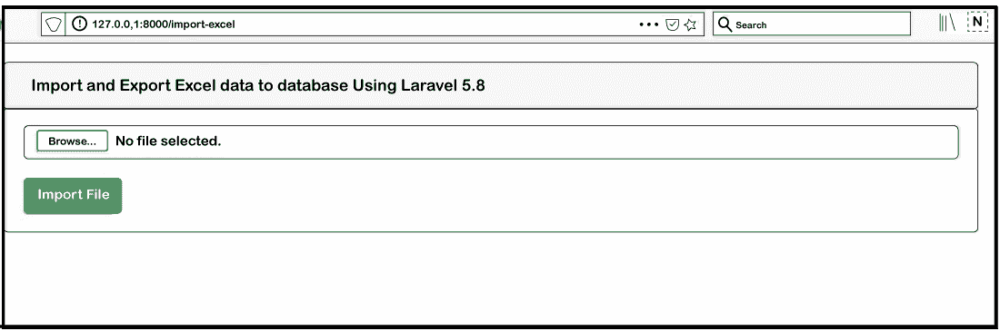
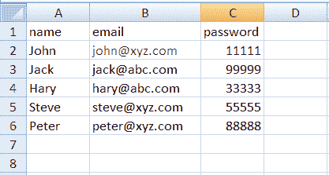
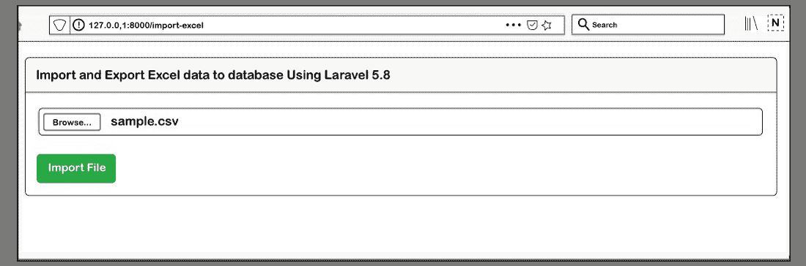
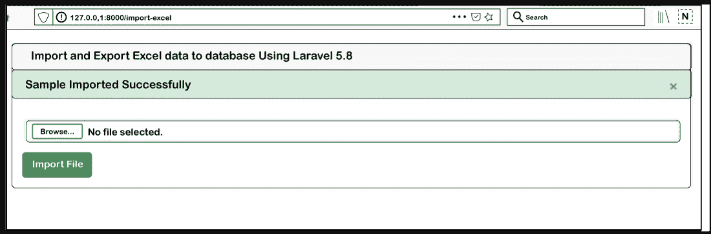

# 在 Laravel 5.8 中导入和导出 CSV 文件

> 原文:[https://www . javatpoint . com/import-export-CSV-file-in-laravel-5-8](https://www.javatpoint.com/import-and-export-csv-file-in-laravel-5-8)

在本节中，我们将使用 Laravel 5.8 来导入和导出 CSV 文件。创建管理项目时，主要要求是从数据库中导出-导入 CSV 或 excel 文件。我们将在 [Laravel](https://www.javatpoint.com/laravel) 5.8 的应用中使用 maatwebsite/excel 版本 3 导入、导出 excel 文件或 CSV 文件。

为了执行导入和导出任务，我们将使用 maatwebsite/excel composer 包。maatwebsite/excel 使用数据库模型，因此可以提供一种简单的导出和导入方式。通过使用 excel 或 maatwebsite 更新版本 3，我们可以轻松地从数据库导出或导入所需的数据。在我们的部分中，我们提供了执行导出和导入的分步过程，描述如下:

**第一步:**

这一步，我们将**安装 Laravel 5.8 应用程序**。为此，我们将使用以下命令。因此，我们将在系统中打开 CMD 或终端，然后运行以下命令:

```php

composer create-project --prefer-dist laravel/laravel blog

```

**第二步:**

第二步，我们去**安装 Maatwebsite 包**。为此，我们将使用 Composer 包管理器。为此，我们将打开终端并运行以下命令:

```php

composer require maatwebsite/excel

```

现在我们将打开名为 config/app.php 的文件。然后我们将添加别名和服务提供商。

**配置/应用程序.php**

```php
'providers' => [
	....
	Maatwebsite\Excel\ExcelServiceProvider::class,
],
'aliases' => [
	....
	'Excel' => Maatwebsite\Excel\Facades\Excel::class,
],

```

**第三步:**

第三步，我们要去**创建伪记录**。为了做到这一点，我们需要一个“用户”表，其中将包含一些虚拟记录。之后，我们可以轻松地做进出口。Laravel 为我们提供了一些默认迁移。要进行导入和导出，我们需要迁移。因此，我们将使用以下命令运行迁移:

```php

php artisan migrate

```

现在我们需要添加一些伪记录。因此，我们将运行下面的命令，并将一些记录添加到用户文件中。

```php
php artisan tinker
factory(App\User::class, 20)->create();

```

**第四步:**

第四步，我们要去**添加路由器**。为此，我们将创建一个导出和导入文件的路径。所以我们将打开名为“routes/web.php”的文件。之后，我们将添加以下路线:

**路线/web.php**

```php
Route::get('export', 'MyController@export')->name('export');
Route::get('importExportView', 'MyController@importExportView');
Route::post('import', 'MyController@import')->name('import');

```

**第五步:**

第五步，我们要去**创建一个导入类。**为了做到这一点，我们将使用 maatwebsite 3 版本，用于构建导入类。我们将使用控制器来使用它。当我们使用这种方法创建一个新的导入类时，我们会意识到这是一个很好的导入类创建方法。为此，我们将运行以下代码:

```php

php artisan make:import UsersImport --model=User

```

现在我们打开名为 app/Import/UsersImport.php 的文件，我们将在该字段中进行一些更改，如下所述:

**app/Imports/usersimport . PHP**

```php
<?php

namespace App\Imports;

use App\User;
use Maatwebsite\Excel\Concerns\ToModel;
use Maatwebsite\Excel\Concerns\WithHeadingRow;

class UsersImport implements ToModel, WithHeadingRow
{
    /**
    * @param array $row
    *
    * It will return \Illuminate\Database\Eloquent\Model|null
    */
    public function model(array $row)
    {
        return new User([
            'name'     => $row['name'],
            'email'    => $row['email'], 
            'password' => \Hash::make($row['password']),
        ]);
    }
}

```

**第六步:**

第六步，我们要去**创建导出类。**为了做到这一点，我们将使用 maatwebsite 3 版本，用于构建导出类。我们将使用控制器来使用它。当我们使用这种方法创建一个新的导出类时，我们会意识到这是一个很好的导出类创建方法。为此，我们将运行以下代码:

```php

php artisan make:export UsersExport --model=User

```

现在我们打开名为 app/Export/UsersExport.php 的文件，我们将对该文件进行一些更改，如下所述:

**app/Exports/user sexport . PHP**

```php
<?php

namespace App\Exports;

use App\User;
use Maatwebsite\Excel\Concerns\FromCollection;

class UsersExport implements FromCollection
{
    /**
    * It will return \Illuminate\Support\Collection
    */
    public function collection()
    {
        return User::all();
    }
}

```

**第七步:**

第七步，我们要去**创建控制器**。我们将使用路径“app/Http/Controllers/MyController . PHP”创建一个新的控制器作为 my controller。该控制器可以方便地管理导入导出请求的视图和导入导出的返回响应。为此，我们将在控制器文件中添加以下内容，描述如下:

**app/Http/controller/my controller . PHP**

```php
<?php

namespace App\Http\Controllers;

use Illuminate\Http\Request;
use App\Exports\UsersExport;
use App\Imports\UsersImport;
use Maatwebsite\Excel\Facades\Excel;

class MyController extends Controller
{
    /**
    * It will return \Illuminate\Support\Collection
    */
    public function importExportView()
    {
       return view('import');
    }

    /**
    * It will return \Illuminate\Support\Collection
    */
    public function export() 
    {
        return Excel::download(new UsersExport, 'users.xlsx');
    }

    /**
    * It will return \Illuminate\Support\Collection
    */
    public function import() 
    {
        Excel::import(new UsersImport,request()->file('file'));

        return back();
    }
}

```

**第八步:**

第八步是最后一步，用于**创建刀片文件**。为此，我们将创建 import.blade.php 进行布局。为此，我们将编写一些代码，描述如下:

**资源/视图/导入. blade.php**

```php
<!DOCTYPE html>
<html>
<head>
    <title> Import and Export Excel data to database Using Laravel 5.8 </title>
    <link rel="stylesheet" href="https://cdnjs.cloudflare.com/ajax/libs/twitter-bootstrap/4.1.3/css/bootstrap.min.css" />
</head>
<body>

<div class="container">
    <div class="card bg-light mt-3">
        <div class="card-header">
            Import and Export Excel data to database Using Laravel 5.8
        </div>
        <div class="card-body">
            <form action="{{ route('import') }}" method="POST" enctype="multipart/form-data">
                @csrf
                <input type="file" name="file" class="form-control">
                <br>
                <button class="btn btn-success">Import User Data</button>
                <a class="btn btn-warning" href="{{ route('export') }}">Export User Data</a>
            </form>
        </div>
    </div>
</div>

</body>
</html>

```

使用上面的代码，我们可以轻松地将所需的数据导出并导入到 Laravel 5.8 中的 CSV 文件中。为了运行上面的代码，我们需要启动 Laravel 5.8 的服务器。为此，我们将打开终端或命令提示符，并运行以下命令:

```php

php artisan serve

```

使用上面的命令，我们能够启动 Laravel 服务器。它将为我们提供 Laravel 应用程序的基本网址。我们将打开我们的浏览器，并编写以下网址来测试导入和导出数据的操作。

```php

http://127.0.0.1:8000/import-excel

```

输入上述 url 后，我们将看到以下输出:



现在我们必须选择 excel 文件，以便上传。在选择文件之前，我们必须创建一个 excel 文件，如下所示:



现在我们将选择示例. csv 文件，如下所示:



现在，我们将单击导入文件选项。



在上图中，我们可以看到我们的示例文件已成功导入。

* * *