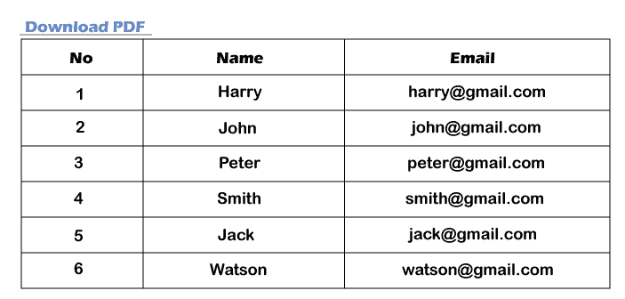

# 从 html 视图文件生成 PDF，并在 Laravel 中使用 dompdf 下载

> 原文：<https://www.javatpoint.com/generate-pdf-from-html-view-file-and-download-using-dompdf-in-laravel>

在这一节中，我们将学习使用 html 视图文件，这样我们就可以生成 PDF。假设我们正在做一个大型的企业资源规划级 laravel 项目。在这种情况下，我们需要使用一个数据库表来为所需的数据生成一个 PDF 文件。我们将提供一个非常简单的分步过程来生成 pdf 文件并下载。

现在我们将使用 laravel-dompdf 包创建一个 pdf 文件。使用这个包，我们还可以下载该功能。在下面的示例中，我们将创建一个名为“items”的表。我们将使用项目表的数据以表格形式下载它的 pdf 文件。如果我们愿意，我们可以通过在视图文件上写 CSS 来生成一个更好的 pdf 文件。最后，我们将生成一个 pdf 并通过一些步骤下载，如下所示。为此，我们应该有一个新鲜的工作项目 [Laravel](https://www.javatpoint.com/laravel) 5 或 Laravel 5.3 等。

**第一步:**

这一步，我们来做**安装**。我们将首先打开我们的终端或命令提示符，并运行以下命令:

```php

composer require barryvdh/laravel-dompdf

```

现在我们将打开名为 config/app.php 的文件。然后我们将添加别名和服务提供商。

```php
'providers' => [
	....
	Barryvdh\DomPDF\ServiceProvider::class,
],
'aliases' => [
	....
	'PDF' => Barryvdh\DomPDF\Facade::class,
],

```

**第二步:**

在这一步中，我们将**添加路线**。我们将创建路线，以便生成视图。所以我们将打开名为“app/Http/routers.php”的文件。之后，我们将添加以下路线:

```php
Route::get('pdfview',array('as'=>'pdfview','uses'=>'ItemController@pdfview'));

```

**第三步:**

在这一步中，我们将**创建控制器**。为此，我们将使用 app/Http/controller/ItemController . PHP 路径添加一个新的控制器作为 item controller。如果我们想要执行这个，我们需要一个包含一些数据的项目表。当我们想要生成一个 pdf 文件并管理表格数据时，这个控制器会很有用。因此，我们将使用控制器文件，并将以下代码放入其中:

**app/Http/controller/item controller . PHP**

```php
namespace App\Http\Controllers;

use App\Http\Requests;
use Illuminate\Http\Request;
use DB;
use PDF;

class ItemController extends Controller
{

    /**
     * It will display application dashboard.
     *
     * It will return \Illuminate\Http\Response
     */
    public function pdfview(Request $request)
    {
        $items = DB::table("items")->get();
        view()->share('items',$items);

        if($request->has('download')){
            $pdf = PDF::loadView('pdfview');
            return $pdf->download('pdfview.pdf');
        }

        return view('pdfview');
    }
}

```

**第四步:**

在这一步中，我们将**创建视图文件**。我们将使用名为“pdfview.blade.php”的视图文件来创建视图和 pdf 文件。因此，我们将在创建的 pdfview 文件中添加以下代码。

**资源/视图/pdfview.blade.php**

```php
<style type="text/css">
	table td, table th{
		border:1px solid black;
	}
</style>
<div class="container">

	<br/>
	<a href="{{ route('pdfview',['download'=>'pdf']) }}">Download PDF</a>

	<table>
		<tr>
			<th>No</th>
			<th>Name</th>
			<th>Email</th>
		</tr>
		@foreach ($items as $key => $item)
		<tr>
			<td>{{ ++$key }}</td>
			<td>{{ $item->name }}</td>
			<td>{{ $item->email }}</td>
		</tr>
		@endforeach
	</table>
</div>

```

使用上面的代码，我们能够将项目文件转换成 pdf 文件，也能够下载该文件。为了运行上述代码，我们需要启动 Laravel 5 或 Laravel 5.3 的服务器。为此，我们将打开终端或命令提示符，并运行以下命令:

```php

php artisan serve

```

使用上面的命令，我们能够启动 Laravel 服务器。它将为我们提供 Laravel 应用程序的基本网址。我们将打开我们的浏览器并编写下面的 url 来测试上面的代码。

```php

http://127.0.0.1:8000/pdfview

```

输入上述网址后，我们将看到以下输出:



* * *