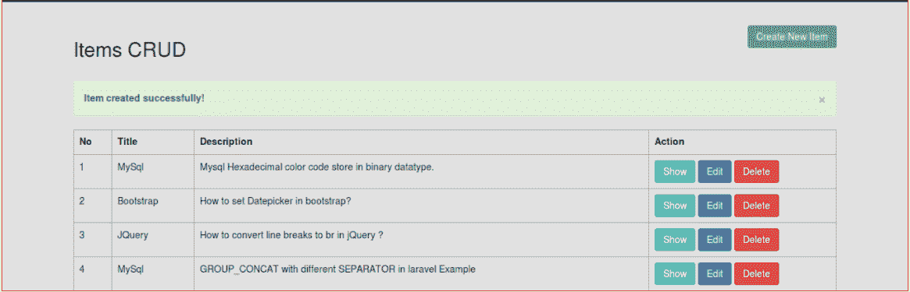
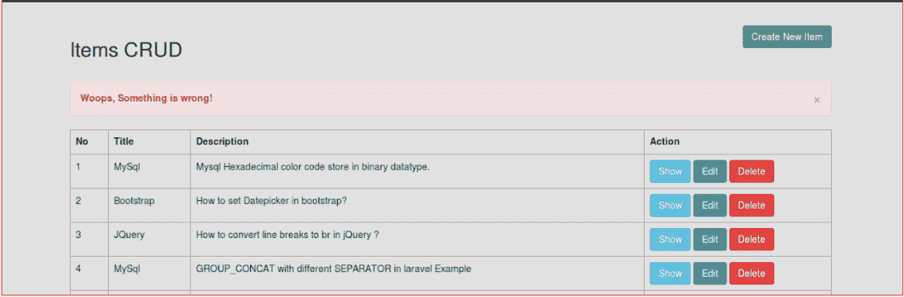
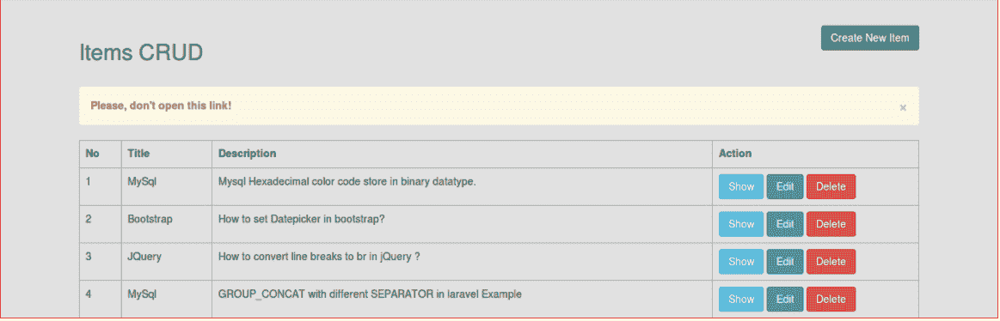
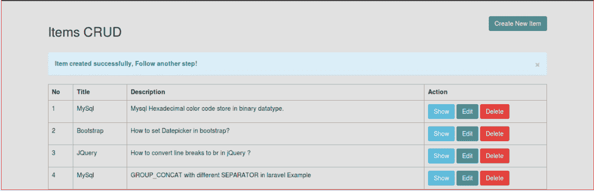
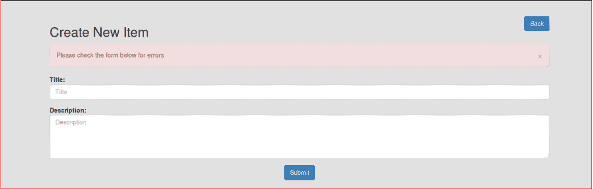

# 用 Laravel 5.7 实现 Flash 消息

> 原文：<https://www.javatpoint.com/implement-flash-message-with-laravel-5-point-7>

在这一节中，我们将使用 Laravel 5.7，这样我们就可以使用自定义的引导警告闪存消息。在我们给定的示例中，我们将使用 controller 方法通过警报消息进行重定向，然后我们将使用 blade 文件来打印 flash 消息。我们的 bootstrap Laravel 5.7 项目将显示一些消息，如**警报警告、警报危险、警报信息、警报成功**等。我们可以轻松地执行它，而无需使用任何作曲家包。因此，在我们的示例中，我们将不使用任何包。

如果我们使用 laravel 5.7 应用程序，它将需要 flash 消息，因为 flash 消息用于提供带有完整进度、警告和错误等详细信息的警报。flash 消息可以通过多种方式提供，如使用信息消息、错误消息、成功消息和警告消息进行重定向。在我们的例子中，我们将通过使用[引导](https://www.javatpoint.com/bootstrap-tutorial)闪烁警报布局来进行良好的布局。在 [laravel](https://www.javatpoint.com/laravel) 应用中，我们可以通过一步一步的过程来整合 flash 消息，如下所示:

**第一步:**

在这一步中，我们将进入**为闪存消息**创建全局刀片文件。为此，将创建**flash-message.blade.php**，这是一个新的刀片文件。我们将使用该文件编写引导警报代码，并检查哪些消息会到来。为此，我们将添加一些警报，描述如下:

1.  成功
2.  错误
3.  警告
4.  信息
5.  合法性错误

所以我们将创建 flash.message.blade.php 文件。之后，我们将使用以下代码添加到文件中:

**资源/视图/flash-message.blade.php:**

```php
@if ($message = Session::get('success'))
<div class="alert alert-success alert-block">
	<button type="button" class="close" data-dismiss="alert">?</button>	
        <strong>{{ $message }}</strong>
</div>
@endif

@if ($message = Session::get('error'))
<div class="alert alert-danger alert-block">
	<button type="button" class="close" data-dismiss="alert">?</button>	
        <strong>{{ $message }}</strong>
</div>
@endif

@if ($message = Session::get('warning'))
<div class="alert alert-warning alert-block">
	<button type="button" class="close" data-dismiss="alert">?</button>	
	<strong>{{ $message }}</strong>
</div>
@endif

@if ($message = Session::get('info'))
<div class="alert alert-info alert-block">
	<button type="button" class="close" data-dismiss="alert">?</button>	
	<strong>{{ $message }}</strong>
</div>
@endif

@if ($errors->any())
<div class="alert alert-danger">
	<button type="button" class="close" data-dismiss="alert">?</button>	
	Please check the form below for errors
</div>
@endif

```

**第二步:**

第二步，我们将**在主题**中包含 Flash 消息。为此，我们将使用我们的主题默认文件，然后在其中包含 flash-message.blade.php 文件，如以下代码所示:

**资源/视图/布局/app.blade.php**

```php
<!DOCTYPE html>
<html lang="en">
<head>
    <meta charset="utf-8">
    <meta http-equiv="X-UA-Compatible" content="IE=edge">
    <meta name="viewport" content="width=device-width, initial-scale=1">
    <!-- Styles -->
    <link href="/css/app.c11q	ss" rel="stylesheet">
</head>
<body>

    <div id="app">
        @include('flash-message')

        @yield('content')
    </div>

    <!-- Scripts -->
    <script src="/js/app.js"></script>
</body>
</html>

```

**第三步:**

第三步，我们将**使用带重定向的 flash 消息**。在这里，我们将一个接一个地重定向，并在每次重定向时提供一条消息。重定向消息可以分为多种类型。

**1。成功消息重定向**

如果我们在 Laravel 的项目需要重定向 url、重定向路由或重定向回，我们可以在成功 flash 消息的帮助下轻松做到这一点。为了成功做到这一点，我们必须使用控制器，描述如下:

```php
public function create(Request $request)
{
	$this->validate($request,[
        'title' => 'required',
        'details' => 'required'
        ]);

	$items = Item::create($request->all());

	return back()->with('success','Item created successfully!');
}

```

我们上面的代码已经可以运行了。当我们运行此代码时，我们将获得成功闪存消息的如下输出:



**2。带错误信息的重定向**

如果我们在 laravel 的项目需要重定向 url、重定向路由或重定向回，我们可以在错误 flash 消息的帮助下轻松完成。为了成功做到这一点，我们必须使用控制器，描述如下:

```php
public function create(Request $request)
{
    return redirect()->route('home')
        ->with('error','Woops, Something is wrong!');
}

```

我们上面的代码已经可以运行了。当我们运行此代码时，我们将获得如下错误 flash 消息输出:



**3。带警告信息的重定向**

如果我们在 Laravel 的项目需要重定向 url、重定向路由或重定向回，我们可以在警告消息的帮助下轻松完成。为了成功做到这一点，我们必须使用控制器，描述如下:

```php
public function create(Request $request)
{
    return redirect()->route('home')
            ->with('warning','Please don't Open this link);
}

```

我们上面的代码已经可以运行了。当我们运行这段代码时，我们将获得如下警告闪烁消息的输出:



**4。通过信息消息**重定向

如果我们在 Laravel 的项目需要重定向 url、重定向路由或重定向回，我们可以在 info flash 消息的帮助下轻松做到这一点。为了成功做到这一点，我们必须使用控制器，描述如下:

```php
public function create(Request $request)
{
    $this->validate($request,[
        'title' => 'required',
        'details' => 'required'
        ]);

    $items = Item::create($request->all());

    return back()->with('info','Item created successfully, Follow another step!');
}

```

我们上面的代码已经可以运行了。当我们运行这段代码时，我们将得到下面这样的 info flash 消息输出:



**5。验证错误**

如果我们想在 laravel 5 中使用验证，我们将自动重定向回错误。之后，还会生成一条错误闪烁消息。

```php
public function create(Request $request)
{
    $this->validate($request,[
        'title' => 'required',
        'details' => 'required'
        ]);

    .....
}

```

我们上面的代码已经可以运行了。当我们运行此代码时，我们将获得如下错误 flash 消息输出:



通过在我们的 laravel 5 应用程序中使用上述方式，我们可以轻松实现 flash 消息。

* * *