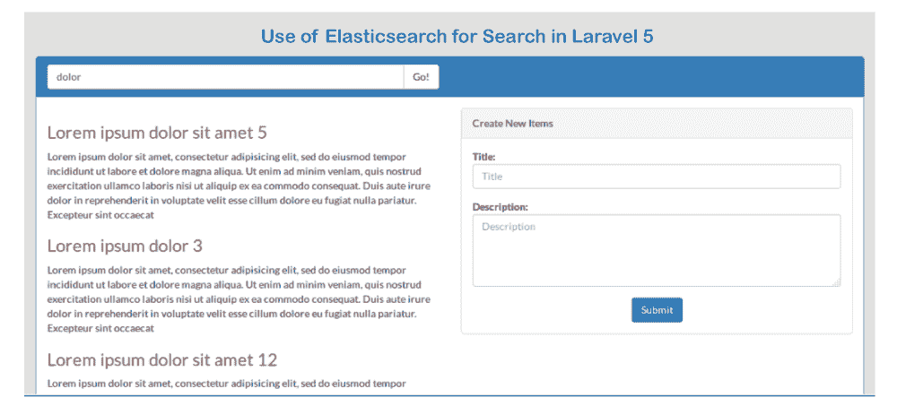

# 在 Laravel 5 中从头开始使用弹性搜索

> 原文：<https://www.javatpoint.com/use-elasticsearch-from-scratch-in-laravel-5>

在本节中，我们将从头开始学习 elasticsearch 的使用。我们将为此使用 [laravel](https://www.javatpoint.com/laravel) 。假设我们用 Laravel 做一个电子商务网站。在这种情况下，我们的网站需要搜索引擎选项。在这里，我们网站的最佳搜索引擎将是 elasticsearch。使用弹性搜索，我们得到了全文搜索引擎，这是分布式和多租户能力。这个搜索引擎将包含 [JSON](https://www.javatpoint.com/json-tutorial) 文档和 HTTP 网页界面。在给定的示例中，我们将从头开始提供一个完整的示例。为了从头开始使用[弹性搜索](https://www.javatpoint.com/elasticsearch)，我们必须遵循一些步骤，描述如下:

**第一步:**

在这一步中，我们将**安装弹性搜索**。为了安装它，我们将使用本地机器。我们可以通过以下链接轻松地将其安装到我们的系统中:

[**弹性搜索文档**](https://www.elastic.co/)

如果我们的操作系统是 ubuntu，我们不能从上面的链接下载。我们必须使用以下链接来下载它:

[**如何在本地系统中配置弹性搜索**](http://itsolutionstuff.com/post/how-to-confige-elasticsearch-in-our-local-systemexample.html)

**第二步:**

这一步，我们要去**安装软件包**。在下面的例子中，我们将使用弹性搜索应用编程接口。这就是为什么我们需要安装弹力组件包或弹力组件。为此，我们将使用 composer.json 文件，并在该文件中添加以下行。使用以下内容，我们将像这样更新作曲家:

```php

"elasticquent/elasticquent": "dev-master"

```

当我们完成安装 elastic quent 包或 elastic quent 时，我们将使用我们的 config/app.php 文件。在这个文件中，我们将添加提供者和别名的路径。为此，我们将使用该文件，并将以下代码放入该文件，如下所示:

**配置/应用程序.php：**

```php
return [
	......
	'provides' => [
		......
		......,
		Elasticquent\ElasticquentServiceProvider::class,
	],
	'aliases' => [
		......
		......,
		'Es' => Elasticquent\ElasticquentElasticsearchFacade::class,
	],
]

```

现在需要 Elasticsearch 来生成配置文件。为此，我们将打开命令提示符或终端，运行如下命令:

```php

php artisan vendor:publish --provider="Elasticquent\ElasticquentServiceProvider"

```

**第三步:**

第三步，我们将进入**创建项目表和模型**。我们将使用 Laravel 5 [PHP](https://www.javatpoint.com/php-tutorial) artisan 的命令，这样我们就可以为项目表创建迁移。为此，我们将激发命令，描述如下:

```php

php artisan make:migration create_items_table

```

当我们完成运行上述命令时，我们将在数据库/迁移路径中看到一个文件。现在，我们将使用迁移文件创建一个 items 表，并将以下代码添加到该文件中，如下所示:

```php
use Illuminate\Database\Schema\Blueprint;
use Illuminate\Database\Migrations\Migration;

class CreateItemsTable extends Migration
{
 public function up()
    {
        Schema::create('items', function (Blueprint $table) {
            $table->increments('id');
            $table->string('title');
            $table->text('description');
            $table->timestamps();
        });
    }

    public function down()
    {
        Schema::drop("items");
    }
}

```

当我们成功创建“项目”表时，我们将创建一个项目模型。为此，我们将使用 app/Item.php 路径。我们将如下所示向该文件中添加以下代码:

**app/Item.php:**

```php

namespace App;
use Illuminate\Database\Eloquent\Model;
use Elasticquent\ElasticquentTrait;

class Item extends Model
{
    use ElasticquentTrait;

    public $fillable = ['title','description'];

}

```

**第四步:**

在这一步中，我们将进入**创建路线和控制器**。我们将使用我们的路由文件，并在其中添加一些路由。为此，我们将复制以下路由，然后将该路由添加到我们的文件中，如下所示:

**app/Http/routes.php:**

```php

Route::get('ItemSearch', 'ItemSearchController@index');
Route::post('ItemSearchCreate', 'ItemSearchController@create');

```

现在我们需要创建一个新的控制器。为此，我们将使用 app/Http/controller/ItemSearchController . PHP 路径，并将控制器设置为 itemsearchcontroller。使用这个控制器，我们可以这样管理所有的弹性搜索:

**app/Http/controller/itemsearchcontroller . PHP:**

```php
namespace App\Http\Controllers;
use Illuminate\Http\Request;
use App\Http\Requests;
use App\Item;

class ItemSearchController extends Controller
{
    /**
     * It will Display the resource list.
     *
     * @return \Illuminate\Http\Response
     */
    public function index(Request $request)
    {
    	if($request->has('search')){
    		$items = Item::search($request->input('search'))->toArray();
    	}
        return view('ItemSearch',compact('items'));
    }

    /**
     * It will Display the resource list.
     *
     * @return \Illuminate\Http\Response
     */
    public function create(Request $request)
    {
    	$this->validate($request, [
	    	'title' => 'required',
            'description' => 'required',
        ]);

        $item = Item::create($request->all());
        $item->addToIndex();

        return redirect()->back();
    }
}

```

**第五步:**

在这一步中，我们将创建视图。为此，我们将创建一个名为 ItemSearch.blade.php 的文件。使用这个字段，我们能够管理搜索功能列表。现在，我们将在该文件中添加以下代码:

**ItemSearch.blade.php:**

```php
@extends('layouts.app')
@section('content')
<div class="row">
    <div class="col-md-8 col-md-offset-2">
        <h1 class="text-primary" style="text-align: center;"> Use of Elasticsearch for Search in Laravel 5 </h1>
    </div>
</div>

<div class="container">
	<div class="panel panel-primary">
	  <div class="panel-heading">
	  	<div class="row">
		  <div class="col-lg-6">
		    {!! Form::open(array('method'=>'get','class'=>'')) !!}
		    <div class="input-group">

		      <input name="search" value="{{ old('search') }}" type="text" class="form-control" placeholder="Search for...">
		      <span class="input-group-btn">
		        <button class="btn btn-default" type="submit">Go!</button>
		      </span>

		    </div><!-- /input-group -->
		    {!! Form::close() !!}
		  </div><!-- /.col-lg-6 -->
		</div><!-- /.row -->
	  </div>
	  <div class="panel-body">

	    	<div class="row">
		  		<div class="col-lg-6">
			    	@if(!empty($items))
			    		@foreach($items as $key => $value)
			    			<h3 class="text-danger">{{ $value['title'] }}</h3>
			    			<p>{{ $value['description'] }}</p>
			    		@endforeach
			    	@endif
		  		</div>
		  		<div class="col-lg-6">
		  			<div class="panel panel-default">
	  					<div class="panel-heading">
	  						Create New Items
	  					</div>
	  					<div class="panel-body">

	  						@if (count($errors) > 0)
								<div class="alert alert-danger">
									<strong>Whoops!</strong> There were some problems with your input.<br><br>
									<ul>
										@foreach ($errors->all() as $error)
											<li>{{ $error }}</li>
										@endforeach
									</ul>
								</div>
							@endif

	  						{!! Form::open(array('url' => 'ItemSearchCreate','autocomplete'=>'off')) !!}
	  							<div class="row">
			                        <div class="col-xs-12 col-sm-12 col-md-12">
			                            <div class="form-group">
			                                <strong>Title:</strong>
			                                {!! Form::text('title', null, array('placeholder' => 'Title','class' => 'form-control')) !!}
			                            </div>
			                        </div>
			                        <div class="col-xs-12 col-sm-12 col-md-12">
			                            <div class="form-group">
			                                <strong>Description:</strong>
			                                {!! Form::textarea('description', null, array('placeholder' => 'Description','class' => 'form-control','style'=>'height:100px')) !!}
			                            </div>
			                        </div>
			                    </div>

			                    <div class="text-center">
			                    	<button type="submit" class="btn btn-primary">Submit</button>
			                    </div>

	  						{!! Form::close() !!}

	  					</div>
	  				</div>
		  		</div>
		  	</div>

	  </div>
	</div>
</div>
@endsection

```

现在我们上面的代码可以运行了。当我们运行它时，将生成以下输出:



* * *