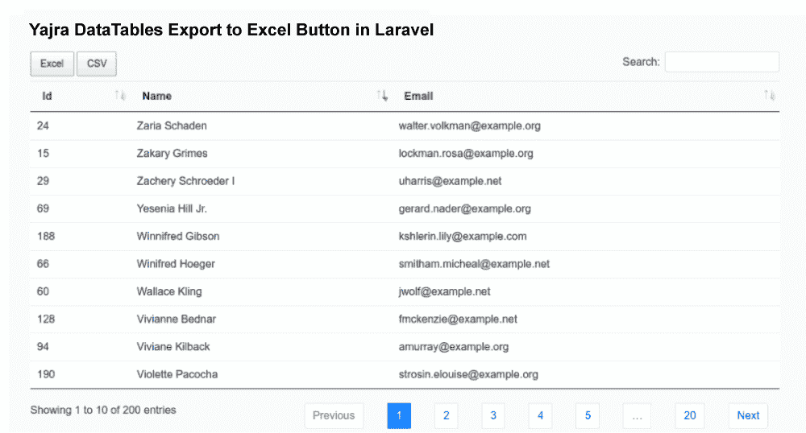

# Laravel Yajra 数据表导出到 Excel CSV 按钮

> 原文：<https://www.javatpoint.com/laravel-yajra-datatables-export-to-excel-csv-button>

在本节中，我们将了解 Yajra Datatables 导出到 excel CSV 按钮。我们将使用 Laravel 来做到这一点。我们可以在 Laravel 版本 6、7 和 8 中创建。在示例中，我们将看到使用 Laravel Yajra 数据表添加 CSV Excel 按钮的过程。我们可以通过使用 yajra/laravel-datatables-buttons 包来添加导出按钮。我们将使用数据表导出按钮。我们的表数据可以很容易地导出到 CSV 文件或 XLSX 文件中。为了从数据表中导出 CSV Excel 的文件，我们将在 Laravel 应用程序中使用以下分步过程。

**第一步:**

第一步，我们将**安装 Laravel** 。如果我们的系统中没有 Laravel 设置，我们需要为本例安装全新的 Laravel 版本 7。我们可以使用下面的命令来获取 Laravel:

```php

composer create-project --prefer-dist laravel/laravel blog

```

**第二步:**

第二步，我们将**安装 Yajra 数据表**。我们将安装 Yajra Datatable composer 的包。使用这个包，我们可以获得 datatable 和 yajra/laravel-datatables-button，它们是导出按钮。我们将使用以下命令来安装它:

```php

composer require yajra/laravel-datatables-oracle
composer require yajra/laravel-datatables-buttons

```

当我们完成 Yajra datatable 的安装时，我们需要设置别名和提供程序。

**配置/应用程序.php：**

```php
.....
'providers' => [
	....
	Yajra\DataTables\DataTablesServiceProvider::class,
	Yajra\DataTables\ButtonsServiceProvider::class,
]
'aliases' => [
	....
	'DataTables' => Yajra\DataTables\Facades\DataTables::class,
]
.....

```

之后，我们需要执行文件配置。因此，我们将使用下面的命令来获取文件:

```php

php artisan vendor:publish --tag=datatables-buttons

```

**第三步:**

在这一步中，我们将去**添加伪记录**。我们将使用 tinker factory，这样我们就可以创建虚拟用户。创建虚拟记录的命令如下:

```php
php artisan tinker
factory(App\User::class, 200)->create();

```

**第四步:**

在这一步中，我们将进入**创建数据表类**。我们将使用 Yajra Datatable 的命令，以便创建用户数据表类，如下所述:

```php

php artisan datatables:make Users

```

执行上述命令后，将为数据表创建新的类文件。在这个文件中，我们将添加按钮、列和许多其他东西，如下所示:

**app/DataTables/user sdatable . PHP:**

```php
<?php

namespace App\DataTables;

use App\User;
use Yajra\DataTables\Html\Button;
use Yajra\DataTables\Html\Column;
use Yajra\DataTables\Html\Editor\Editor;
use Yajra\DataTables\Html\Editor\Fields;
use Yajra\DataTables\Services\DataTable;

class UsersDataTable extends DataTable
{
    /**
     * It is used to Build a class of DataTable.
     *
     * @param mixed $query Results from query() method.
     * @return \Yajra\DataTables\DataTableAbstract
     */
    public function dataTable($query)
    {
        return datatables()
            ->eloquent($query);
    }

    /**
     * It is used to get query sources of dataTable.
     *
     * @param \App\User $model
     * @return \Illuminate\Database\Eloquent\Builder
     */
    public function query(User $model)
    {
        return $model->newQuery();
    }

    /**
     * If you want to use html builder, it is the optional method.
     *
     * @return \Yajra\DataTables\Html\Builder
     */
    public function html()
    {
        return $this->builder()
                    ->setTableId('users-table')
                    ->columns($this->getColumns())
                    ->minifiedAjax()
                    ->orderBy(1)
                    ->parameters([
                        'dom'          => 'Bfrtip',
                        'buttons'      => ['excel', 'csv'],
                    ]);
    }

    /**
     * It is used to get columns.
     *
     * @return array
     */
    protected function getColumns()
    {
        return [
            Column::make('id'),
            Column::make('name'),
            Column::make('email'),
        ];
    }

    /**
     * It is used to get the filename for export.
     *
     * @return string
     */
    protected function filename()
    {
        return 'Users_' . date('YmdHis');
    }
}

```

**第五步:**

第五步，我们将**添加路线**。我们将为数据表布局文件创建这个。利用这条路线，我们可以获得数据。为此，我们将使用名为 routes/web.php 的文件，然后我们将放入下面的路由:

**路线/web.php:**

```php

Route::get('users', 'UserController@index');

```

**第六步:**

在这一步中，我们将去**创建控制器**。我们将创建用户控制器作为新的控制器。使用这个控制器，我们可以管理布局，获取数据请求和返回响应。现在，我们将使用控制器文件，并向其中添加以下内容:

**app/Http/controller/user controller . PHP:**

```php
<?php

namespace App\Http\Controllers;

use Illuminate\Http\Request;
use App\DataTables\UsersDataTable;

class UserController extends Controller
{
    /**
     * It is used to display a listing of the resource.
     *
     * @return \Illuminate\Http\Response
     */
    public function index(UsersDataTable $dataTable)
    {
        return $dataTable->render('users');
    }
}

```

**第七步:**

这是最后一步。在第七步中，我们将**创建视图**。为了创建布局，我们将使用 users.blade.php 文件。这个文件将有助于编写设计代码。我们将把下面的代码添加到该文件中:

**资源/视图/用户. blade.php:**

```php
<!DOCTYPE html>
<html>
<head>
    <title> Yajra Datatables Export to Excel Button in Laravel </title>
    <meta name="csrf-token" content="{{ csrf_token() }}">
    <link rel="stylesheet" href="https://cdnjs.cloudflare.com/ajax/libs/twitter-bootstrap/4.1.3/css/bootstrap.min.css" />
    <link href="https://cdn.datatables.net/1.10.16/css/jquery.dataTables.min.css" rel="stylesheet">
    <link href="https://cdn.datatables.net/1.10.19/css/dataTables.bootstrap4.min.css" rel="stylesheet">
    <script src="https://ajax.googleapis.com/ajax/libs/jquery/1.9.1/jquery.js"></script>  
    <script src="https://cdnjs.cloudflare.com/ajax/libs/jquery-validate/1.19.0/jquery.validate.js"></script>
    <script src="https://cdn.datatables.net/1.10.16/js/jquery.dataTables.min.js"></script>
    <script src="https://stackpath.bootstrapcdn.com/bootstrap/4.1.3/js/bootstrap.min.js"></script>
    <script src="https://cdn.datatables.net/1.10.19/js/dataTables.bootstrap4.min.js"></script>
    <script src="https://cdn.datatables.net/buttons/1.0.3/js/dataTables.buttons.min.js"></script>
    <link rel="stylesheet" href="https://cdn.datatables.net/buttons/1.0.3/css/buttons.dataTables.min.css">
    <script src="/vendor/datatables/buttons.server-side.js"></script>
</head>
<body>

<div class="container">
    <h1> Yajra Datatables Export to Excel Button in Laravel </h1>

    {!! $dataTable->table() !!}
</div>

</body>

{!! $dataTable->scripts() !!}

</html>

```

现在，我们上面的代码可以运行了。为了快速运行上述代码，我们将使用以下命令:

```php

php artisan serve

```

现在我们可以使用浏览器打开下面的网址:

```php

http://localhost:8000/myproducts

```

打开后，我们可以看到以下输出:



* * *