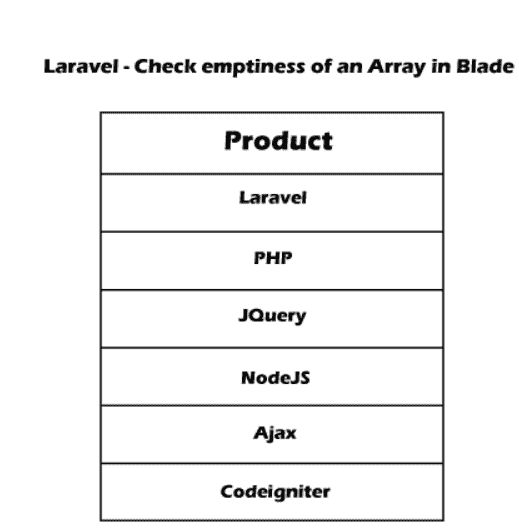

# 使用 Laravel 检查刀片中的阵列是否为空

> 原文:[https://www . javatpoint . com/check-if-array-in-blade-use-laravel](https://www.javatpoint.com/check-if-array-is-empty-in-blade-using-laravel)

在本节中，我们将了解刀片式服务器中的阵列是否为空。我们将使用拉弗尔刀锋来做到这一点。我们可以在不同版本的 Laravel 应用程序中执行它，比如 Laravel 6、7 和 8。

在下面的例子中，我们将看到不同的函数来检查刀片中的数组是否为空。有时，意外输出或软件崩溃是由空数组引起的。如果我们想避免这种情况，我们必须事先检查刀片中给定或定义的阵列是否为空。为了检查刀片中的数组是否为空， [Laravel](https://www.javatpoint.com/laravel) 提供了各种功能，我们将在下面的示例中使用它们。

**例 1:**

在下面的例子中，我们将使用**@前级**和**@空**来检查 Laravel 中的数组。通过使用 foreach 循环，我们可以轻松地迭代集合的元素。但是在我们的示例中，我们将使用 forelse blade 模板，而不是在 if 语句中使用 foreach 循环。当我们使用 foreach 或 forlese 执行程序时，两者将生成相同的结果，但是我们可以轻松地读取 forlese 循环，并且与 foreach 循环相比，它包含的代码量更少。

**控制器代码:**

```php

public function index()
{
    $products = Product::get();
    return view('home',compact('products'));
}

```

**刀片代码:**

```php
<div class="card-header">
    <h5> Laravel - Check emptiness of an Array in Blade </h5>
</div>
<div class="card-body">
    @forelse ($products as $product)
        <p class="bg-danger text-white p-1">product</p>
    @empty
        <p class="bg-danger text-white p-1">no product</p>
    @endforelse
</div>

```

**例 2:**

在下面的例子中，我们将使用 **@empty** 来检查 Laravel 中的数组。当我们使用空集合时，它将需要一个额外的 if 语句。这是必要的，因为我们需要向用户提供有效的消息。

**控制器代码:**

```php

public function index()
{
    $products = [];
    return view('home',compact('products'));
}

```

**刀片代码:**

```php
<div class="card-header">
    <h5> Laravel - Check emptiness of an Array in Blade </h5>
</div>
<div class="card-body">
    @empty($products)
        <p class="bg-danger text-white p-1">product</p>
    @else
        <p class="bg-danger text-white p-1">no product</p>
    @endempty
</div>

```

**例 3:**

在下面的例子中，我们将使用 **@if empty()** 来检查 Laravel 中的数组。

**控制器代码:**

```php

public function index()
{
    $products = [];
    return view('home',compact('products'));
}

```

**刀片代码:**

```php
<div class="card-header">
    <h5> Laravel - Check emptiness of an Array in Blade </h5>
</div>
<div class="card-body">
    @if(empty($products))
        <p class="bg-danger text-white p-1">product</p>
    @else
        <p class="bg-danger text-white p-1">no product</p>
    @endif
</div>

```

**例 4:**

在下面的例子中，我们将使用 **@if count()** 来检查 Laravel 中的数组。

**控制器代码:**

```php

public function index()
{
    $products = Product::get();;
    return view('home',compact('products'));
}

```

**刀片代码:**

```php
<div class="card-header">
    <h5> Laravel - Check emptiness of an Array in Blade </h5>
</div>
<div class="card-body">
    @if($products->count() > 0)
        <p class="bg-danger text-white p-1">product</p>
    @else
        <p class="bg-danger text-white p-1">no product</p>
    @endif
</div>

```

现在我们上面的代码可以运行了。当我们运行它时，将生成以下输出:



* * *