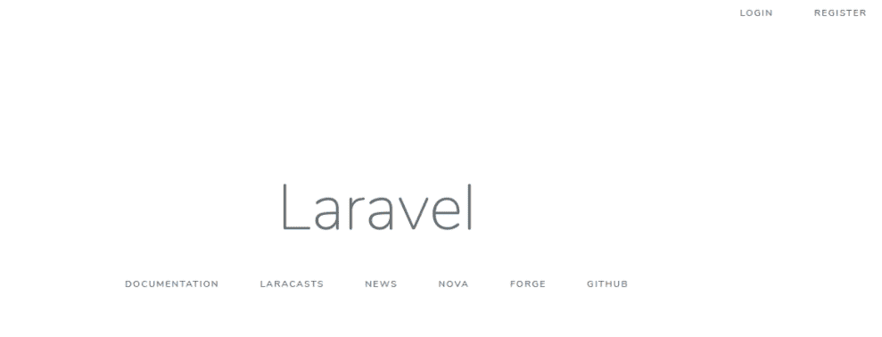
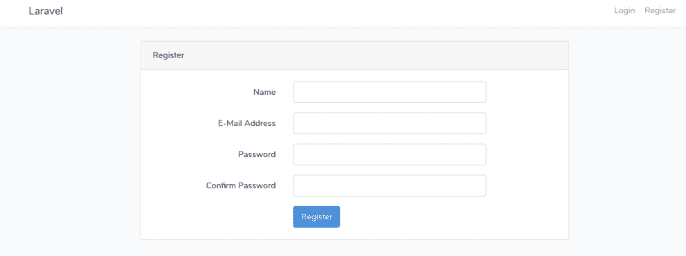
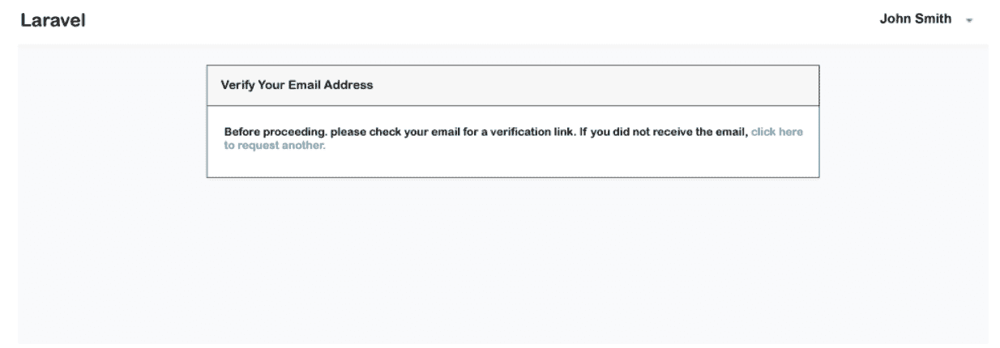
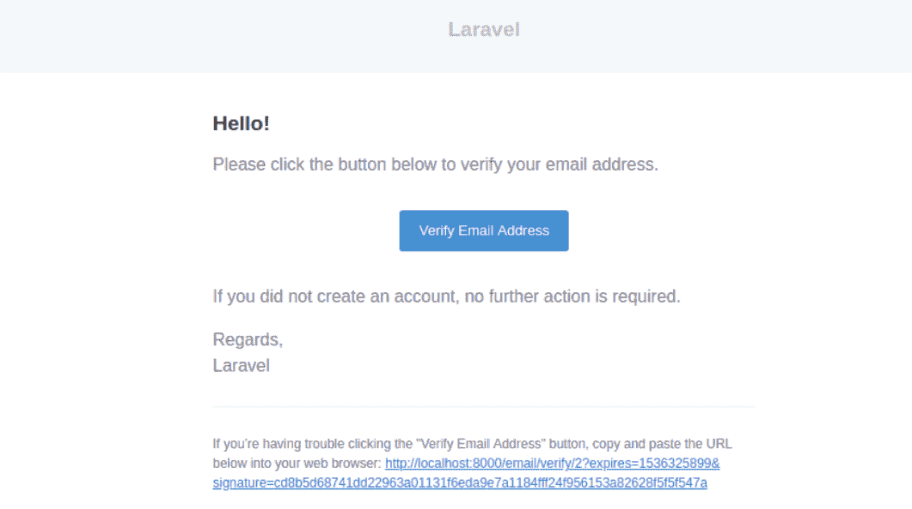
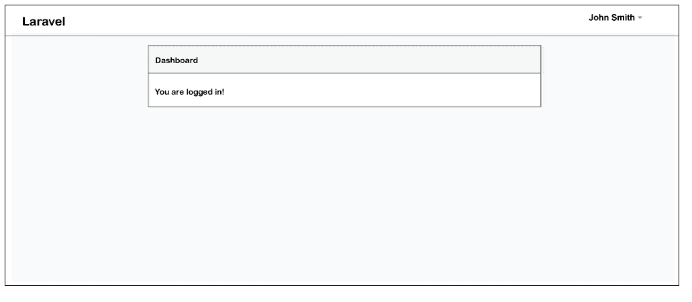

# Laravel 5.8 电子邮件验证示例

> 原文：<https://www.javatpoint.com/laravel-5-8-email-verification-example>

在本节中，我们将学习 Laravel 5.8 中的电子邮件验证。我们将看到注册用户的电子邮件验证设置。当新用户想要登录 Laravel 5.8 时，他们应该首先验证自己的电子邮件地址。为了验证 Laravel 中的电子邮件地址，将向注册的电子邮件地址发送激活码。

在旧版本的 [Laravel](https://www.javatpoint.com/laravel) 中，我们需要手动进行邮件验证的过程，但是 Laravel 5.8 版本给了我们一个内置的邮件验证设置。在这个版本中，当新用户完成了对其电子邮件地址的验证后，他们将继续操作。为此，我们必须使用邮件配置、路由和中间件进行一些基本设置。执行电子邮件验证的基本步骤描述如下:

**第一步:**

这一步，我们要去**安装 Laravel 5.8** 。为此，我们将下载最新的新鲜 Laravel 5.8 版本。我们将通过打开命令提示符或终端来运行以下命令。

```php

composer create-project --prefer-dist laravel/laravel blog

```

**第二步:**

这一步，我们要做**数据库配置**。为此，我们将使用。env 文件，并将数据库配置的详细信息添加到其中。所以我们将创建用户名、密码等。像这样:

**。env:**

```php

DB_CONNECTION=mysql
DB_HOST=127.0.0.1
DB_PORT=3306
DB_DATABASE=laravel572
DB_USERNAME=root
DB_PASSWORD=root

```

当我们完成数据库配置的添加后，我们将使用下面的命令运行 Laravel 的默认迁移，如下所示:

```php

php artisan migrate

```

**第三步:**

这一步，我们要做**邮件配置**。为此，我们将使用。env 文件。当用户完成用户注册后，我们将发送电子邮件。我们需要添加 SMTP 的详细信息来发送电子邮件，如下所示:

**。env:**

```php

MAIL_DRIVER=smtp
MAIL_HOST=smtp.gmail.com
MAIL_PORT=587
MAIL_USERNAME=johnsmith@gmail.com
MAIL_PASSWORD=smith
MAIL_ENCRYPTION=tls

```

**第四步:**

在这一步中，我们将**创建授权**。忘记密码、注册和登录可以通过使用 Laravel 快速创建路线。我们将使用 auth 命令来创建这些，如下所述:

```php

php artisan make:auth

```

**第五步:**

在这一步中，我们将进行**电子邮件** **验证设置**。我们将使用用户模型来实现电子邮件验证类。我们还将通过使用中间件来提供保护。所以我们将一个接一个地更新如下所示的文件。

**app/User.php** **:**

```php
<?php

namespace App;

use Illuminate\Notifications\Notifiable;
use Illuminate\Contracts\Auth\MustVerifyEmail;
use Illuminate\Foundation\Auth\User as Authenticatable;

class User extends Authenticatable implements MustVerifyEmail
{
    use Notifiable;

    /**
     * The attributes that are mass assignable.
     *
     * @var array
     */
    protected $fillable = [
        'name', 'email', 'password',
    ];

    /**
     * The attributes that should be hidden for arrays.
     *
     * @var array
     */
    protected $hidden = [
        'password', 'remember_token',
    ];
}

```

**路线/web.php:**

```php
Route::get('/', function () {
    return view('welcome');
});

Auth::routes(['verify' => true]);

Route::get('/home', 'HomeController@index')->name('home');

```

**app/Http/controller/Homecontroller . PHP**

```php
<?php

namespace App\Http\Controllers;

use Illuminate\Http\Request;

class HomeController extends Controller
{
    /**
     * It will create a new controller instance.
     *
     * @It will return void
     */
    public function __construct()
    {
        $this->middleware(['auth','verified']);
    }

    /**
     * It will display the application dashboard.
     *
     * @It will return \Illuminate\Http\Response
     */
    public function index()
    {
        return view('home');
    }
}

```

现在我们上面的代码可以运行了。为了运行上述代码，我们将使用以下命令:

```php

php artisan serve

```

当我们运行此命令时，将生成以下输出:



**注册:**



**邮件提醒:**



**邮件:**



**成功:**



* * *