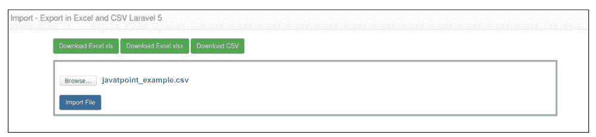

# 使用 Laravel 5 中的 Maatwebsite 导入导出到 Excel 和 CSV

> 原文：<https://www.javatpoint.com/import-export-to-excel-and-csv-using-maatwebsite-in-laravel-5>

在本节中，我们将使用 Maatwebsite，这样我们就可以导入导出到 CSV 和 Excel。我们将使用 Laravel 5 来实现这一点。我们将使用数据库来存储导入的 CSV 或 Excel 文件。通过使用 Maatwebsite，我们可以从数据库的表格中下载或导出 CSV 或 Excel 文件。

我们可以通过使用 Maatwebsite 的包轻松获得数据。按数据分组也很有用，我们可以创建多个工作表。在下面的例子中，我们已经描述了项目表数据。我们可以使用 CSV、XLS 和 XLSV 格式下载，也可以使用 CSV、XLS 和 XLSX 的文件导入数据。在我们的 Laravel 5 项目中，我们可以按照分步过程实现导出和导入功能，如下所述:

**第一步:**

这一步，我们来做**安装**。我们将使用名为 composer.json 的文件，然后根据我们的 [Laravel](https://www.javatpoint.com/laravel) 版本，使用所需的包并在其中放入以下行。

**幼虫 5**

```php

"maatwebsite/excel": "~2.1.0"

```

**幼虫 4**

```php

"maatwebsite/excel": "~1.3"

```

现在，我们将运行以下命令:

```php

Composer update 

```

现在我们将使用名为 config/app.php 的文件，然后我们将向其中添加 aliase 和服务提供商:

```php
'providers' => [
	....
	'Maatwebsite\Excel\ExcelServiceProvider',
],
'aliases' => [
	....
	'Excel' => 'Maatwebsite\Excel\Facades\Excel',
],

```

**配置**

如果像这样使用 Laravel 5，我们将使用下面的命令:

```php

php artisan vendor:publish

```

如果像这样使用 Laravel 4，我们将使用下面的命令:

```php

php artisan config:publish maatwebsite/excel

```

为了创建一个配置文件，这个命令将非常有用。该文件将在 excel 包中使用。

**第二步:**

第二步，我们将进入**创建表格和模型**。我们将使用项目表来创建迁移。我们将使用 Laravel 5 的 php artisan 命令来创建它，描述如下:

```php

php artisan make:migration create_items_table

```

当我们成功执行上述命令时，我们将使用**数据库/迁移** **路径来获取一个文件。**现在我们将使用我们的迁移文件，并在其中添加以下代码来创建如下的项目表:

```php
use Illuminate\Database\Schema\Blueprint;
use Illuminate\Database\Migrations\Migration;
class CreateItemsTable extends Migration
{
   public function up()
   {
       Schema::create('items', function (Blueprint $table) {
           $table->increments('id');
           $table->string('title');
           $table->text('description');
           $table->timestamps();
       });
   }
   public function down()
   {
       Schema::drop("items");
   }
}

```

当我们成功创建这个“项目”表时，我们需要创建一个项目模型。为此，我们将使用 app/Item.php 路径，然后将以下代码添加到其中:

**app/item.php:**

```php

namespace App;
use Illuminate\Database\Eloquent\Model;
class Item extends Model
{
   public $fillable = ['title','description'];
}

```

**第三步:**

在这一步中，我们将进入**创建路线**。我们将为导入导出文件创建这个。为此，我们将使用名为 app/Http/routes.php 的文件，然后我们将把下面的路由:

```php

Route::get('importExport', 'MaatwebsiteDemoController@importExport');
Route::get('downloadExcel/{type}', 'MaatwebsiteDemoController@downloadExcel');
Route::post('importExcel', 'MaatwebsiteDemoController@importExcel');

```

**第四步:**

在这个文件中，我们将去**创建控制器**。我们将创建**作为新的控制器。我们将使用 app/Http/controller/maatwebsitedemocrator . PHP 路径来创建这个控制器。所有导入导出请求、导入导出、返回响应和下载 Excel 都可以由该控制器管理。现在，我们将使用控制器文件，并向其中添加以下内容:**

**app/Http/Controllers/maatwebsitedemocrator . PHP:**

```php

use Input;
use App\Item;
use DB;
use Excel;
class MaatwebsiteDemoController extends Controller
{
	public function importExport()
	{
		return view('importExport');
	}
	public function downloadExcel($type)
	{
		$data = Item::get()->toArray();
		return Excel::create(?javatpoint?_example', function($excel) use ($data) {
			$excel->sheet('mySheet', function($sheet) use ($data)
	        {
				$sheet->fromArray($data);
	        });
		})->download($type);
	}
	public function importExcel()
	{
		if(Input::hasFile('import_file')){
			$path = Input::file('import_file')->getRealPath();
			$data = Excel::load($path, function($reader) {
			})->get();
			if(!empty($data) && $data->count()){
				foreach ($data as $key => $value) {
					$insert[] = ['title' => $value->title, 'description' => $value->description];
				}
				if(!empty($insert)){
					DB::table('items')->insert($insert);
					dd('Insert Record successfully.');
				}
			}
		}
		return back();
	}
}

```

**第五步:**

在这一步中，我们将进入**创建视图**。我们将通过创建名为 importExport.blade.php 的文件来创建布局。这个文件将有助于编写设计代码。我们将把下面的代码添加到该文件中:

**importExport.blade.php:**

```php
<html lang="en">
<head>
	<title>Import - Export Laravel 5</title>
	<link rel="stylesheet" href="https://maxcdn.bootstrapcdn.com/bootstrap/3.3.6/css/bootstrap.min.css" >
</head>
<body>
	<nav class="navbar navbar-default">
		<div class="container-fluid">
			<div class="navbar-header">
				<a class="navbar-brand" href="#"> Laravel 5 - Import and Export CSV and Excel </a>
			</div>
		</div>
	</nav>
	<div class="container">
		<a href="{{ URL::to('downloadExcel/xls') }}"><button class="btn btn-success">Download Excel xls</button></a>
		<a href="{{ URL::to('downloadExcel/xlsx') }}"><button class="btn btn-success">Download Excel xlsx</button></a>
		<a href="{{ URL::to('downloadExcel/csv') }}"><button class="btn btn-success">Download CSV</button></a>
		<form style="border: 4px solid #a1a1a1;margin-top: 15px;padding: 10px;" action="{{ URL::to('importExcel') }}" class="form-horizontal" method="post" enctype="multipart/form-data">
			<input type="file" name="import_file" />
			<button class="btn btn-primary">Import File</button>
		</form>
	</div>
</body>
</html>

```

现在我们上面的脚本可以运行了。为了快速运行上述脚本，我们将使用我们的浏览器。当我们打开浏览器时，我们会看到如下预览:



**导入文件:**


* * *