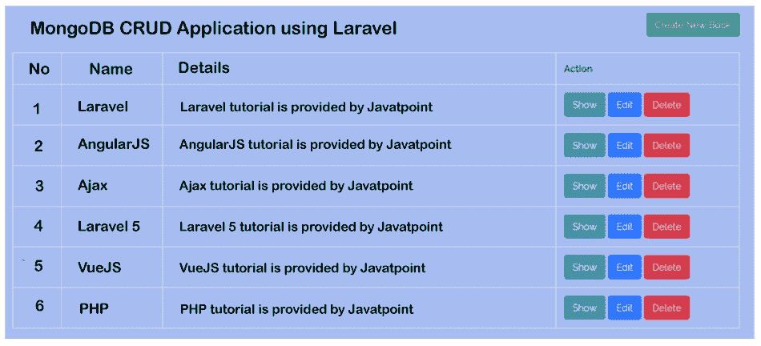

# Laravel 中的 MongoDB CRUD

> 原文：<https://www.javatpoint.com/mongodb-crud-in-laravel>

在本节中，我们将学习如何执行 CRUD 操作。我们将使用 Laravel 和 MongoDB 数据库来实现这一点。我们通常使用 MongoDB 存储数据，因为它占用的内存更少。在今天的市场上，Laravel 是一项非常著名的技术。在本例中，我们将使用 Laravel 5.6 应用程序执行 [MongoDB](https://www.javatpoint.com/mongodb-tutorial) CRUD 操作。我们可以使用各种版本的 [Laravel](https://www.javatpoint.com/laravel) 应用程序，例如 Laravel 5、6、7 和 8。在我们的 Laravel 应用程序中，我们将创建书籍，创建，更新，删除和查看。

为了创建 CRUD(创建、更新、读取和删除)，我们将使用 composer 包“jenssegers/laravel-mongodb”。我们可以用这个方法来使用模型的雄辩的方法，比如 whereNull，Where，collection，oderBy，take，distinct，all，first，whereBetween，get，orWhere skip 等。

在下面的例子中，我们将使用“books”集合创建名为 MongoDB 的数据库。之后，我们将使用 env 文件来配置 MongoDB 数据库的细节。然后我们将使用 Laravel 5.6 应用程序来创建 CRUD 模块。创建 CRUD 的分步过程描述如下:

**第一步:**

在这一步中，我们将创建一个 MongoDB 数据库。在我们的例子中，我们需要创建我们的图书收藏和 MongoDB 数据库。当我们成功安装 MongoDB 数据库时，我们将使用我们的命令提示符，连接到 MongoDB。对于连接，我们将创建一个数据库，然后创建集合。之后，我们将使用如下命令插入书籍:

```php
mongo
> use hddatabaseep 
> db.books.insert( { "name": "laravel", "detail": "test" } )

```

**第二步:**

在这一步中，我们将安装 Laravel 5.6 项目。为此，我们将使用 Laravel 5.6 应用程序的新版本。下面的命令对此很有用。要运行以下命令，我们将使用我们的终端，描述如下:

```php

composer create-project --prefer-dist laravel/laravel blog

```

**第三步:**

在这一步中，我们将执行 MongoDB 数据库配置。在我们的 Laravel 5.6 应用程序中，我们将设置数据库的名称、用户名和密码来执行 CRUD 操作。为此，我们将打开。env 文件，然后我们将添加所有详细信息，描述如下:

**。env**

```php

MONGO_DB_HOST=127.0.0.1
MONGO_DB_PORT=27017
MONGO_DB_DATABASE=hddatabase
MONGO_DB_USERNAME=
MONGO_DB_PASSWORD=

```

之后，我们将使用 database.php 配置文件并添加阵列的详细信息，如下所述:

**config/database.php**

```php
<?php

return [

    ....
    'connections' => [

        ......

        'mongodb' => [
            'driver'   => 'mongodb',
            'host'     => env('MONGO_DB_HOST', 'localhost'),
            'port'     => env('MONGO_DB_PORT', 27017),
            'database' => env('MONGO_DB_DATABASE'),
            'username' => env('MONGO_DB_USERNAME'),
            'password' => env('MONGO_DB_PASSWORD'),
            'options'  => []
        ],

    ]

]

```

**第四步:**

在这一步中，我们将安装 laravel-mongodb 包。在下面的示例中，我们将使用 Composer 包管理器进行安装。为此，我们将使用命令提示符并运行如下命令:

```php

composer require jenssegers/mongodb

```

当我们成功安装上述软件包时，我们将使用 app.php 配置文件，以便添加服务提供商，如下所述:

**配置/应用程序.php**

```php
<?php

return [
	....
	'providers' => [
		....
		Jenssegers\Mongodb\MongodbServiceProvider::class,
	]
	.....
]

```

**第五步:**

在这一步中，我们将创建一个图书模型。在我们的应用程序中，我们将通过使用 Book 模型来提供与 Laravel 雄辩者的连接。创建图书模型的代码描述如下:

**app/Book.php**

```php
<?php

namespace App;

use Jenssegers\Mongodb\Eloquent\Model as Eloquent;

class Book extends Eloquent
{
	protected $connection = 'mongodb';
	protected $collection = 'books';

    /**
     * The attributes which are mass assigned will be used.
     *
     * It will return @var array
     */
    protected $fillable = [
        'name', 'detail'
    ];
}

```

**第六步:**

在这一步中，我们将添加资源路线。我们将为《CRUD 应用程序》一书这样做。我们将通过使用名为“routes/web.php”的文件来添加我们的路由，如下所示:

**路线/web.php**

```php

Route::resource('books','BookController');

```

**第七步:**

在这一步中，我们将创建图书控制器。我们将创建 BookController 作为新的控制器。使用这个控制器，我们可以创建资源控制器。创建它的代码描述如下:

```php

php artisan make:controller BookController --resource --model=Book

```

当我们成功执行这个命令时，我们将在“app/Http/controller/book controller . PHP”路径中获得一个新文件。为此，我们将在该控制器中默认创建 7 个方法，如下所示:

*   索引()
*   编辑()
*   商店()
*   销毁()
*   创建()
*   更新()
*   显示()

为此，我们将使用一个名为 BookController.php 的文件，然后将以下代码放入其中:

**app/Http/controller/book controller . PHP**

```php
<?php

namespace App\Http\Controllers;

use App\Book;
use Illuminate\Http\Request;

class BookController extends Controller
{
    /**
     * It is used to show a resource list.
     *
     * It is used to @return \Illuminate\Http\Response
     */
    public function index()
    {
        $books = Book::all();
        return view('books.index',compact('books'))
            ->with('i', (request()->input('page', 1) - 1) * 5);
    }

    /**
     * It is used to create a new resource by displaying the form.
     *
     * It is used to @return \Illuminate\Http\Response
     */
    public function create()
    {
        return view('books.create');
    }

    /**
     * It uses storage to store the above-created resource.
     *
     * @param  \Illuminate\Http\Request  $request
     * It is used to @return \Illuminate\Http\Response
     */
    public function store(Request $request)
    {
        request()->validate([
            'name' => 'required',
            'detail' => 'required',
        ]);

        Book::create($request->all());

        return redirect()->route('books.index')
                        ->with('success','Book created successfully.');
    }

    /**
     * The specified resource will be shown by it.
     *
     * @param  \App\Book  $book
     * It is used to @return \Illuminate\Http\Response
     */
    public function show(Book $book)
    {
        return view('books.show',compact('book'));
    }

    /**
     * It is used to edit the specified resource by displaying the form.
     *
     * @param  \App\Book  $book
     * It is used to @return \Illuminate\Http\Response
     */
    public function edit(Book $book)
    {
        return view('books.edit',compact('book'));
    }

    /**
     * It uses storage to update the specified resource.
     *
     * @param  \Illuminate\Http\Request  $request
     * @param  \App\Book  $book
     * It is used to @return \Illuminate\Http\Response
     */
    public function update(Request $request, Book $book)
    {
         request()->validate([
            'name' => 'required',
            'detail' => 'required',
        ]);

        $book->update($request->all());

        return redirect()->route('books.index')
                        ->with('success','Book updated successfully');
    }
    /**
     * It uses storage and removes the specified resource from it.
     *
     * @param  \App\Book  $book
     * It is used to @return \Illuminate\Http\Response
     */
    public function destroy(Book $book)
    {
        $book->delete();

        return redirect()->route('books.index')
                        ->with('success','Book deleted successfully');
    }
}

```

**第八步:**

在这一步中，我们将创建刀片文件。为此，我们将首先创建布局文件。之后，我们将创建一个新的“图书”文件夹。然后，我们将为 CRUD 操作创建刀片文件。我们最终创建的刀片文件描述如下:

*   blade.php
*   blade.php
*   blade.php
*   blade.php
*   blade.php
*   blade.php

为此，我们将通过创建下面的文件来添加以下代码。

**资源/视图/书籍/版面. blade.php**

```php
<!DOCTYPE html>
<html>
<head>
	<title> MongoDB CRUD Application using Laravel</title>
	<link href="https://cdnjs.cloudflare.com/ajax/libs/twitter-bootstrap/4.0.0-alpha/css/bootstrap.css" rel="stylesheet">
</head>
<body>

<div class="container">
    @yield('content')
</div>

</body>
</html>

```

**资源/视图/书籍/索引. blade.php**

```php
@extends('books.layout')

@section('content')
    <div class="row">
        <div class="col-lg-12 margin-tb">
            <div class="pull-left">
                <h2>Books</h2>
            </div>
            <div class="pull-right">
                <a class="btn btn-success" href="{{ route('books.create') }}"> Create New Book</a>
            </div>
        </div>
    </div>

    @if ($message = Session::get('success'))
        <div class="alert alert-success">
            <p>{{ $message }}</p>
        </div>
    @endif

    <table class="table table-bordered">
        <tr>
            <th>No</th>
            <th>Name</th>
            <th>Details</th>
            <th width="280px">Action</th>
        </tr>
	    @foreach ($books as $book)
	    <tr>
	        <td>{{ ++$i }}</td>
	        <td>{{ $book->name }}</td>
	        <td>{{ $book->detail }}</td>
	        <td>
                <form action="{{ route('books.destroy',$book->id) }}" method="POST">
                    <a class="btn btn-info" href="{{ route('books.show',$book->id) }}">Show</a>
                    <a class="btn btn-primary" href="{{ route('books.edit',$book->id) }}">Edit</a>
                    @csrf
                    @method('DELETE')
                    <button type="submit" class="btn btn-danger">Delete</button>
                </form>
	        </td>
	    </tr>
	    @endforeach
    </table>

@endsection

```

**资源/视图/书籍/show.blade.php**

```php
@extends('books.layout')

@section('content')
    <div class="row">
        <div class="col-lg-12 margin-tb">
            <div class="pull-left">
                <h2> Show Book</h2>
            </div>
            <div class="pull-right">
                <a class="btn btn-primary" href="{{ route('books.index') }}"> Back</a>
            </div>
        </div>
    </div>

    <div class="row">
        <div class="col-xs-12 col-sm-12 col-md-12">
            <div class="form-group">
                <strong>Name:</strong>
                {{ $book->name }}
            </div>
        </div>
        <div class="col-xs-12 col-sm-12 col-md-12">
            <div class="form-group">
                <strong>Details:</strong>
                {{ $book->detail }}
            </div>
        </div>
    </div>
@endsection

```

**资源/视图/书籍/create.blade.php**

```php
@extends('books.layout')

@section('content')
    <div class="row">
        <div class="col-lg-12 margin-tb">
            <div class="pull-left">
                <h2>Add New Book</h2>
            </div>
            <div class="pull-right">
                <a class="btn btn-primary" href="{{ route('books.index') }}"> Back</a>
            </div>
        </div>
    </div>

    @if ($errors->any())
        <div class="alert alert-danger">
            <strong>Whoops!</strong> Your entered input has some problem. <br><br>
            <ul>
                @foreach ($errors->all() as $error)
                    <li>{{ $error }}</li>
                @endforeach
            </ul>
        </div>
    @endif

    <form action="{{ route('books.store') }}" method="POST">
    	@csrf

         <div class="row">
		    <div class="col-xs-12 col-sm-12 col-md-12">
		        <div class="form-group">
		            <strong>Name:</strong>
		            <input type="text" name="name" class="form-control" placeholder="Name">
		        </div>
		    </div>
		    <div class="col-xs-12 col-sm-12 col-md-12">
		        <div class="form-group">
		            <strong>Detail:</strong>
		            <textarea class="form-control" style="height:150px" name="detail" placeholder="Detail"></textarea>
		        </div>
		    </div>
		    <div class="col-xs-12 col-sm-12 col-md-12 text-center">
		            <button type="submit" class="btn btn-primary">Submit</button>
		    </div>
		</div>

    </form>

@endsection

```

**资源/视图/书籍/编辑. blade.php**

```php
@extends('books.layout')

@section('content')
    <div class="row">
        <div class="col-lg-12 margin-tb">
            <div class="pull-left">
                <h2>Edit Book</h2>
            </div>
            <div class="pull-right">
                <a class="btn btn-primary" href="{{ route('books.index') }}"> Back</a>
            </div>
        </div>
    </div>

    @if ($errors->any())
        <div class="alert alert-danger">
            <strong>Whoops!</strong> Your entered input has some problem. <br><br>
            <ul>
                @foreach ($errors->all() as $error)
                    <li>{{ $error }}</li>
                @endforeach
            </ul>
        </div>
    @endif

    <form action="{{ route('books.update',$book->id) }}" method="POST">
    	@csrf
        @method('PUT')

         <div class="row">
		    <div class="col-xs-12 col-sm-12 col-md-12">
		        <div class="form-group">
		            <strong>Name:</strong>
		            <input type="text" name="name" value="{{ $book->name }}" class="form-control" placeholder="Name">
		        </div>
		    </div>
		    <div class="col-xs-12 col-sm-12 col-md-12">
		        <div class="form-group">
		            <strong>Detail:</strong>
		            <textarea class="form-control" style="height:150px" name="detail" placeholder="Detail">{{ $book->detail }}</textarea>
		        </div>
		    </div>
		    <div class="col-xs-12 col-sm-12 col-md-12 text-center">
		      <button type="submit" class="btn btn-primary">Submit</button>
		    </div>
		</div>

    </form>

@endsection

```

现在我们上面的代码可以运行了。为了快速运行上述代码，我们将使用以下命令:

```php

php artisan serve

```

现在我们可以使用浏览器打开下面的网址:

```php

http://localhost:8000/books

```

打开这个后，我们可以看到如下输出:



* * *