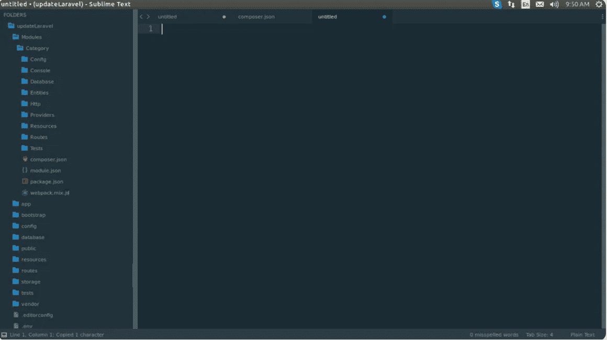

# Laravel 5.7 模块化结构应用

> 原文:[https://www . javatpoint . com/laravel-5-7-模块化结构-应用](https://www.javatpoint.com/laravel-5-7-modular-structure-application)

在本节中，我们将创建一个模块化结构应用程序。我们将使用 Laravel 5.7 来实现这一点。这里，我们将使用 nWidart/laravel-modules 的包来制作一个模块化结构的设计模式。该包用于设置命令，以便快速轻松地创建模块。使用这个，将为每个模块创建一个单独的文件夹。

我们已经看到了 Laravel 的结构，比如控制台、视图、助手、控制器、模型、提供者、迁移等等，同时我们开始研究 Laravel。但当时，我们意识到，通过模块化，我们可以让它变得更容易理解、更有用。如果这个模块是为每一个指定的商品创建的，比如项目、国家、产品、城市、州等，那将会更加神奇，因为如果我们这样做，我们可以很容易地在我们的应用程序中重用它。模块化结构的方法非常好。这就是为什么它更有用。

在我们的 [Laravel](https://www.javatpoint.com/laravel) 应用程序中，我们将使用 laravel-modules composer 包来创建一个模块化结构。在 Laravel 应用程序中，我们可以使用许多其他包来创建模块化结构，但是 laravel-modules 包用于创建“Module”目录和子目录，这非常容易理解。该文件夹列出了许多内容，描述如下:

*   实体
*   配置
*   试验
*   数据库ˌ资料库
*   路线
*   提供
*   超文本传送协议（Hyper Text Transport Protocol 的缩写）
*   安慰

当我们需要将我们的应用程序模块化时，这一部分将非常有用。为此，我们将安装服务提供商和 laravel- modules composer 包。为了安装 laravel-modules 包，如下内容将非常有用:

**设置**

在设置过程中，我们将**安装一包 laravel 模块**。以下命令将用于执行此操作:

```php

composer require nwidart/laravel-modules

```

之后我们将**发布配置文件**。以下命令将用于执行此操作:

```php

php artisan vendor:publish --provider="Nwidart\Modules\LaravelModulesServiceProvider"

```

然后我们将使用**自动加载带有添加:composer.json** 的文件。

```php

{
  "autoload": {
    "psr-4": {
      "App\\": "app/",
      "Modules\\": "Modules/"
    }
  }
}

```

之后，我们将执行如下命令:

```php

composer dump-autoload

```

现在我们可以使用 laravel-module 的包来创建一个模块。现在，我们将使用以下语法来创建新包。

创建模块语法:

```php

php artisan make:module module_name

```

创建模块示例:

```php

php artisan make:module Category

```

当我们成功运行上述代码时，我们将打开我们的应用程序文件夹，并看到新创建的模块目录和迁移。其结构描述如下:

```php

app/
bootstrap/
vendor/
Modules/
  ├── Category/
      ├── Assets/
      ├── Config/
      ├── Console/
      ├── Database/
          ├── Migrations/
          ├── Seeders/
      ├── Entities/
      ├── Http/
          ├── Controllers/
          ├── Middleware/
          ├── Requests/
      ├── Providers/
          ├── CategoryServiceProvider.php
          ├── RouteServiceProvider.php
      ├── Resources/
          ├── assets/
              ├── js/
                ├── app.js
              ├── sass/
                ├── app.scss
          ├── lang/
          ├── views/
      ├── Routes/
          ├── api.php
          ├── web.php
      ├── Repositories/
      ├── Tests/
      ├── composer.json
      ├── module.json
      ├── package.json
      ├── webpack.mix.js

```

我们可以在上面的应用程序中看到视图、模型、路线、控制器、助手、数据库和存储库。如果我们想要更多的模块，我们可以轻松地创建它们。为了运行上述代码，我们将运行以下命令:

```php

php artisan serve

```

现在，我们可以使用浏览器打开以下网址:

```php

http://localhost:8000/category

```

打开这个后，我们可以看到如下输出:



* * *