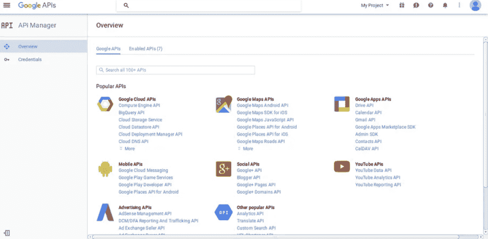

# 使用社交包的谷歌 OAuth 认证

> 原文:[https://www . javatpoint . com/laravel-Google-oauth-认证-使用-名媛-套餐](https://www.javatpoint.com/laravel-google-oauth-authentication-using-socialite-package)

在本节中，我们将了解谷歌 OAuth 身份验证。我们将使用 Laravel 和名媛包来做到这一点。社交网络正在世界各地蔓延，大量的人与它们联系在一起。今天，我们的网站需要实施社交认证，因为社交网络如推特、脸书、Github、谷歌等，与许多开发者、许多用户等相连。在我们的应用程序中，我们将看到登录和注册到谷歌帐户的过程。使用 [Laravel](https://www.javatpoint.com/laravel) ，我们可以非常轻松地注册我们的谷歌 id 并登录到谷歌账户。名媛套餐由 Laravel 5 提供，用于社交认证。为了登录和注销，步骤描述如下:

**第一步:**

这一步，我们要做**名媛包安装**。这个包是用来提供 fb api 的，它会帮助我们连接谷歌账号。为此，我们将使用命令提示符并运行以下命令:

```php

composer require laravel/socialite

```

当上述包成功安装后，我们将使用一个名为 config file 的文件，并在其中添加别名和提供程序。现在，我们将使用名为 config/app.php 的文件，然后向其中添加 aliase 和服务提供商，如下所示:

```php
'providers' => [
	....
	Laravel\Socialite\SocialiteServiceProvider::class,
],
'aliases' => [
	....
	'Socialite' => Laravel\Socialite\Facades\Socialite::class,
],

```

**第二步:**

这一步，我们要去**创建谷歌 App** 。为此，我们需要谷歌客户端的 id 和秘密。利用这些细节，我们可以获得其他用户的信息。如果没有，我们可以使用以下链接创建谷歌应用程序帐户:

[https://console . cloud . Google . com/project selector 2/API/dashboard？supportedpurview =项目](https://console.cloud.google.com/projectselector2/apis/dashboard?supportedpurview=project)

当我们点击此链接时，我们将获得以下页面:



现在我们将点击凭证。之后，我们将选择第一个选项，OAuth。然后我们将点击名为“创建新客户端标识”的按钮。之后，我们将看到以下页面:


当我们完成创建帐户的过程时，我们能够复制用户的 id 和密码。现在我们将使用配置文件，并设置一个应用程序的 id，秘密，和回叫 url。为此，我们将打开一个名为 config/services.php 的文件，然后我们将像这样设置 id 和 secret:

**config/services.php**

```php
return [
	....
	'google' => [
        'client_id' => 'app id',
        'client_secret' => 'add secret',
        'redirect' => 'http://learnl52.hd/auth/google/callback',
    ],
]

```

**第三步:**

这一步，我们要去**创建谷歌登录**。现在我们必须通过在用户表中创建迁移来添加 google_id。创建迁移的代码描述如下:

**迁移**

```php
Schema::table('users', function ($table) {
    $table->string('google_id');
});

```

当我们成功添加 google_id 列时，我们必须首先通过添加新路线登录 google。为此，我们将使用 routes.php 文件，并在其中添加如下路由代码:

**app/Http/routes.php**

```php

Route::get('google', function () {
    return view('googleAuth');
});
Route::get('auth/google', 'Auth\AuthController@redirectToGoogle');
Route::get('auth/google/callback', 'Auth\AuthController@handleGoogleCallback');

```

当我们成功添加一条路线时，我们必须添加谷歌身份验证方法。使用这种方法，我们可以处理谷歌回调的网址等。我们将使用一个名为 AuthController.php 的文件，并在其中添加如下代码:

**app/Http/controller/Auth/Auth controller . PHP**

```php
namespace App\Http\Controllers\Auth;

use App\User;
use Validator;
use App\Http\Controllers\Controller;
use Illuminate\Foundation\Auth\ThrottlesLogins;
use Illuminate\Foundation\Auth\AuthenticatesAndRegistersUsers;
use Socialite;
use Auth;
use Exception;

class AuthController extends Controller
{

    use AuthenticatesAndRegistersUsers, ThrottlesLogins;

    protected $redirectTo = '/';

    public function __construct()
    {
        $this->middleware('guest', ['except' => 'logout']);
    }

    protected function validator(array $data)
    {
        return Validator::make($data, [
            'name' => 'required|max:255',
            'email' => 'required|email|max:255|unique:users',
            'password' => 'required|confirmed|min:6',
        ]);
    }

    protected function create(array $data)
    {
        return User::create([
            'name' => $data['name'],
            'email' => $data['email'],
            'password' => bcrypt($data['password']),
        ]);
    }

    public function redirectToGoogle()
    {
        return Socialite::driver('google')->redirect();
    }

    public function handleGoogleCallback()
    {
        try {
            $user = Socialite::driver('google')->user();

            $userModel = new User;
            $createdUser = $userModel->addNew($user);
            Auth::loginUsingId($createdUser->id);
            return redirect()->route('home');
        } catch (Exception $e) {
            return redirect('auth/facebook');
        }
    }
}

```

在此之后，我们必须添加刀片视图。为此，我们将创建一个名为 googleAuth.blade.php 的新文件，然后向其中添加如下代码:

**资源/视图/googleAuth.blade.php**

```php
@extends('layouts.app')
@section('content')
<style type="text/css">
.account-box
{
    border: 2px solid rgba(153, 153, 153, 0.75);
    border-radius: 2px;
    -moz-border-radius: 2px;
    -webkit-border-radius: 2px;
    -khtml-border-radius: 2px;
    -o-border-radius: 2px;
    z-index: 3;
    font-size: 13px !important;
    font-family: "Helvetica Neue" ,Helvetica,Arial,sans-serif;
    background-color: #ffffff;
    padding: 20px;
}
.logo
{
    background-position: 0 -4px;
    margin: -5px 0 17px 80px;
    position: relative;
    text-align: center;
    width: 138px;
}
.forgotLnk
{
    margin-top: 10px;
    display: block;
}
.or-box
{
    position: relative;
    border-top: 1px solid #dfdfdf;
    padding-top: 20px;
    margin-top:20px;
}
</style>
<div class="container">
    <div class="row">
        <div class="col-md-4 col-md-offset-4">
            <div class="account-box">
                <div class="logo ">
                    
                </div>
                <form class="form-signin" action="#">
                <div class="form-group">
                    <input type="text" class="form-control" placeholder="Email" required autofocus />
                </div>
                <div class="form-group">
                    <input type="password" class="form-control" placeholder="Password" required />
                </div>
                <button class="btn btn-lg btn-block btn-primary" type="submit">
                    Sign in</button>
                </form>
                <a class="forgotLnk" href="http://www.jquery2dotnet.com">I can't access my account</a>
                <div class="or-box">
                    <div class="row">
                        <div class="col-md-12 row-block">
                            <a href="{{ url('auth/google') }}" class="btn btn-lg btn-danger btn-block">
                                <strong>Login With Google</strong>
                            </a>
                        </div>
                    </div>
                </div>
                <div class="or-box row-block">
                    <div class="row">
                        <div class="col-md-12 row-block">
                            <a href="http://www.jquery2dotnet.com" class="btn btn-primary btn-block">Create New Account</a>
                        </div>
                    </div>
                </div>
            </div>
        </div>
    </div>
</div>
@endsection

```

现在我们上面的代码可以运行了。当我们打开我们的网址时，将生成以下输出:


* * *