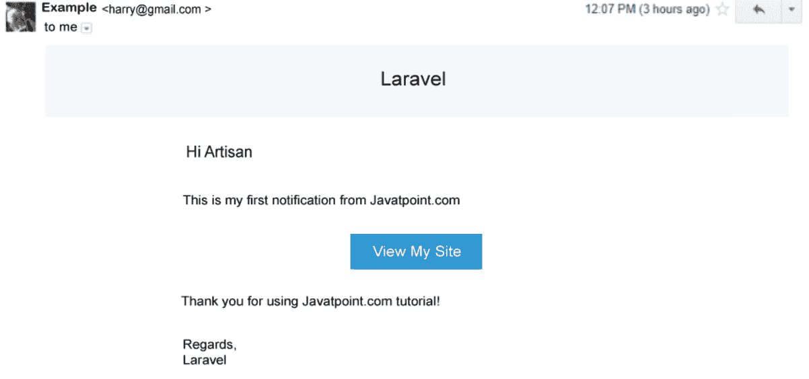

# 使用 Laravel 5.7 的新通知系统

> 原文:[https://www . javatpoint . com/new-notification-system-use-laravel-5-7](https://www.javatpoint.com/new-notification-system-using-laravel-5-7)

在本节中，我们将学习一个新的通知系统。我们将使用 Laravel 5.7 来实现这一点。我们将使用各种通知系统，如邮件、减价、懈怠、数据库、广播和短信来发送通知。这里我们将提供一个电子邮件通知系统的例子。使用新的通知系统，我们可以轻松地同时向所有用户发送通知。

我们可以使用各种东西在 Laravel 中发送通知，例如短信、邮件、slack 或数据库。使用 Laravel artisan 命令，我们可以简单地创建通知。通知的定制非常简单，比如邮件正文、邮件主题、邮件动作等。如果我们在做一个大项目，比如电子商务，那时候我们需要用 notification 把通知发给客户。可以以订单收据、付款收据、发票等形式发送通知。

在我们的 [Laravel](https://www.javatpoint.com/laravel) 应用程序中，我们将创建一个电子邮件通知，然后将它发送给特定的用户。发送后，我们将使用我们的数据库并保存它。为了创建通知，逐步过程描述如下:

**第一步:**

这一步我们要去**下载 Laravel 5.7** 。在我们的应用程序中，我们需要一个全新版本的 Laravel 5.7。所以下面的命令将被用来得到它。为此，我们将使用我们的终端并运行如下命令:

```php

composer create-project --prefer-dist laravel/laravel blog

```

**第二步:**

在这一步中，我们将进入**创建数据库表**。我们将使用 Laravel 5 artisan 创建一个名为“通知”的新数据库表。创建表的命令描述如下:

```php

php artisan notifications:table 
php artisan migrate

```

**第三步:**

在这一步中，我们将进入**创建通知**。我们将使用 Laravel 5 artisan 来创建 MyFirstNotification。为此，我们将使用命令，描述如下:

```php

php artisan make:notification MyFirstNotification

```

当我们成功执行上述命令时，将在应用程序文件夹中创建一个名为“通知”的新文件夹。现在我们将进行一些更改，描述如下:

**app/notification/myfirstnotification . PHP**

```php
<?php

namespace App\Notifications;

use Illuminate\Bus\Queueable;
use Illuminate\Notifications\Notification;
use Illuminate\Contracts\Queue\ShouldQueue;
use Illuminate\Notifications\Messages\MailMessage;

class MyFirstNotification extends Notification
{
    use Queueable;

    private $details;

    /**
     * It is used to create a new notification instance.
     *
     * @return void
     */
    public function __construct($details)
    {
        $this->details = $details;
    }

    /**
     * It is used to get delivery channels of notification.
     *
     * @param  mixed  $notifiable
     * @return array
     */
    public function via($notifiable)
    {
        return ['mail','database'];
    }

    /**
     * It is used to get notification?s mail representation.
     *
     * @param  mixed  $notifiable
     * @return \Illuminate\Notifications\Messages\MailMessage
     */
    public function toMail($notifiable)
    {
        return (new MailMessage)
                    ->greeting($this->details['greeting'])
                    ->line($this->details['body'])
                    ->action($this->details['actionText'], $this->details['actionURL'])
                    ->line($this->details['thanks']);
    }

    /**
     * It is used to get notification?s array representation.
     *
     * @param  mixed  $notifiable
     * @return array
     */
    public function toDatabase($notifiable)
    {
        return [
            'order_id' => $this->details['order_id']
        ];
    }
}

```

**第四步:**

在这一步中，我们将进入**创建路线**。我们需要向用户发送通知，这就是我们创建路由的原因。为此，我们将使用名为“routes/web.php”的文件，并将以下代码放入其中，如下所示:

**路线/web.php**

```php

Route::get('send', 'HomeController@sendNotification');

```

**第五步:**

在这一步中，我们将去**创建控制器**。因此，我们将创建一个名为 HomeController 的新控制器，用于处理路由的 generatePDF 方法。为此，我们将添加以下代码:

**app/Http/controller/Homecontroller . PHP**

```php
<?php

namespace App\Http\Controllers;

use Illuminate\Http\Request;
use App\User;
use Notification;
use App\Notifications\MyFirstNotification;

class HomeController extends Controller
{
    /**
     * It is used to create a new controller instance.
     *
     * @return void
     */
    public function __construct()
    {
        $this->middleware('auth');
    }

    /**
     * It is used to display the dashboard of application.
     *
     * @return \Illuminate\Contracts\Support\Renderable
     */
    public function index()
    {
        return view('home');
    }

    public function sendNotification()
    {
        $user = User::first();

        $details = [
            'greeting' => 'Hi Artisan',
            'body' => 'This is my first notification from Javatpoint.com',
            'thanks' => 'Thank you for using Javatpoint.com tutorial!',
            'actionText' => 'View My Site',
            'actionURL' => url('/'),
            'order_id' => 101
        ];

        Notification::send($user, new MyFirstNotification($details));

        dd('done');
    }

}

```

当我们运行上述命令时，我们能够向用户发送第一个通知。为此，我们将运行如下命令:

```php

php artisan serve 

```

现在我们可以使用浏览器打开下面的网址:

```php

http://localhost:8000/sends

```

我们还可以使用以下命令发送通知，如下所示:

```php
$user->notify(new MyFirstNotification($details));

```

发送的通知可以通过使用如下命令获得:

```php
dd($user->notifications);

```

当我们运行此命令时，将生成以下输出:



* * *