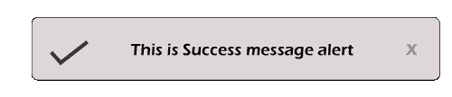

# 使用引导通知插件的警报通知

> 原文：<https://www.javatpoint.com/laravel-notification-alert-using-bootstrap-notify-plugin>

在本节中，我们将了解通知警报。我们将使用 Laravel 和 Bootstrap 通知插件来做到这一点。Notify 是一种 jQuery 或 Bootstrap 通知插件，用于在我们的 Bootstrap 网页上创建定制的现代通知弹出窗口。Bootstrap notify 是 JavaScript 弹出框的可访问替代。使用引导通知插件，我们可以将引导的标准警报变成类似通知的“咆哮”。

当我们执行一些操作时，我们总是需要收到通知警报，比如如果我们从任何网站或任何形式或任何地方删除项目，将会打开一个通知，其中会显示一条消息，如“项目已成功删除”。通知警报对于最终用户来说很重要，这样他们就可以很容易地了解正在发生的事情，并且它还为他们提供了更强的可读性。像这样，一些消息将在创建、列表、更新和其他项目操作中显示。当我们在用户面板或管理面板上工作时，这些通知警报将是强制性的。为了添加通知提醒，我们有不同版本的 Laravel，如 Laravel 5、6、7 和 8。

现在，我们可以通过添加引导通知 js 插件来显示通知警报。该插件用于提供警告消息、信息消息、错误消息、成功消息等通知。使用 Bootstrap 框架，我们能够以令人印象深刻的布局添加通知。为了显示通知，Laravel 也有很多包，但是在我们下面的应用程序中，我们将使用 Bootstrap notify js 插件，因为它具有与 Bootstrap 集成的能力。在此之后，我们能够实现引导通知来执行闪存消息。为此，我们必须遵循以下步骤:

**第一步:**

在这一步中，我们将去**创建一个新的路线**。此新路由将用于测试引导通知通知，如下所示:

**路线/web.php**

```php

Route::get('notification', 'HomeController@notification');

```

**第二步:**

这一步，我们要去**添加控制器方法**。为此，我们将创建 HomeController 作为新的控制器。之后，我们将像这样向其中添加以下代码:

**app/Http/controller/Homecontroller . PHP**

```php
<?php
namespace App\Http\Controllers;
use App\Http\Requests;
use Illuminate\Http\Request;
class HomeController extends Controller
{
	/**
     * Show the application dashboard.
     *
     * @return \Illuminate\Http\Response
     */
    public function notification()
    {
        session()->put('success','Item is successfully created.');

        return view('notification-check');
    }
}

```

**第三步:**

在这一步中，我们将进入**为布局**创建通知文件。为此，我们将创建一个名为 notification-check.blade.php 的新文件进行布局。我们将使用我们的资源目录来创建这个文件。

**资源/视图/通知-check.blade.php**

```php
<!DOCTYPE html>
<html>
<head>
    <title> Notification alert using Bootstrap Notify Plugin in Laravel </title>
    <script src="http://demo.javatpoint.com/plugin/jquery.js"></script>
    <link rel="stylesheet" href="http://demo.javatpoint.com/plugin/bootstrap-3.min.css">
</head>
<body>
@include('notification')
<div class="container">
    <div class="row">
        <div class="col-md-10 col-md-offset-1">
            <div class="panel panel-default">
                <div class="panel-heading">Dashboard</div>
                <div class="panel-body">
                    Check for notification
                </div>
            </div>
        </div>
    </div>
</div>
</body>
</html>

```

**第四步:**

在这一步中，我们将进入**显示引导通知通知**。为此，我们将创建一个名为 notification.blade.php 的文件，这将有助于显示引导通知通知。

**资源/视图/通知. blade.php**

```php

<link rel="stylesheet" type="text/css" href="https://cdnjs.cloudflare.com/ajax/libs/bootstrap-notify/0.2.0/css/bootstrap-notify.css"/>
<div class="notifications top-right"/>
<script>
  @if(Session::has('success'))
     $('.top-right').notify({
        message: { text: "{{ Session::get('success') }}" }
      }).show();
     @php
       Session::forget('success');
     @endphp
  @endif
  @if(Session::has('info'))
      $('.top-right').notify({
        message: { text: "{{ Session::get('info') }}" },
        type:'info'
      }).show();
      @php
        Session::forget('info');
      @endphp
  @endif
  @if(Session::has('warning'))
  		$('.top-right').notify({
        message: { text: "{{ Session::get('warning') }}" },
        type:'warning'
      }).show();
      @php
        Session::forget('warning');
      @endphp
  @endif
  @if(Session::has('error'))
  		$('.top-right').notify({
        message: { text: "{{ Session::get('error') }}" },
        type:'danger'
      }).show();
      @php
        Session::forget('error');
      @endphp
  @endif
</script>

```

现在我们上面的命令可以运行了。为了快速运行这段代码，我们将使用以下命令:

```php

php artisan serve 

```

现在我们可以使用浏览器打开下面的网址:

```php

http://localhost:8000/notification

```

当我们打开上面的网址时，将生成如下输出:



在上面的部分，我们提供了一个成功的通知警报。我们还可以通过使用会话变量生成警告、信息和错误通知的示例，如下所述:

**警告:**

为警告生成通知警报的命令描述如下:

```php
session()->put('warning','This is for warning.'); 

```

**信息:**

为信息生成通知警报的命令描述如下:

```php
session()->put('info','This is for info.');

```

**错误:**

为错误生成通知警报的命令描述如下:

```php
session()->put('error','This is for error.');

```

* * *