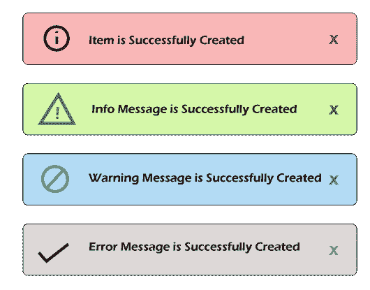

# 在 Laravel 中使用 toastr JS 插件弹出通知消息

> 原文：<https://www.javatpoint.com/notification-message-popup-using-toastr-js-plugin-in-laravel>

在本节中，我们将学习通知消息弹出窗口。我们将使用 toastr JS 插件和 Laravel 来实现这一点。Toast 是一种 JavaScript 库，用于显示非阻塞的、不引人注目的弹出框，将信息消息发送给我们的网络用户或移动用户。如果我们为 toastr 通知指定某个时间段，在该时间段之后，它将自动关闭。当我们执行一些操作时，我们总是需要获得通知警报，比如如果我们从任何网站或表单或任何地方删除项目，将会打开一个通知，其中会显示一条消息，如“项目已成功删除”。通知警报对于最终用户来说很重要，这样他们就可以很容易地了解正在发生的事情，并且它还为他们提供了更强的可读性。为了添加通知提醒，我们有不同版本的 Laravel，如 Laravel 5、6、7 和 8。

现在我们可以通过添加 toastr js 插件来显示一个通知弹出窗口。该插件用于提供警告消息、信息消息、错误消息、成功消息等通知。利用这一点，我们能够添加一个具有令人印象深刻的布局的通知。为了显示通知，Laravel 也有很多包，但是在我们下面的应用程序中，我们将使用 toastr JS 插件。为了显示通知，我们将添加 toastr jQuery 的代码。之后，我们可以使用会话来管理它。toastr JS 插件的实现和使用在下面的例子中有描述，非常容易使用。为了添加通知，我们必须遵循以下步骤:

**第一步:**

在这一步中，我们将进入**创建新路线**。这个新的路由将用于测试这样的 toastr 通知:

**app/Http/routes.php**

```php

Route::get('notification', 'HomeController@notification');

```

**第二步:**

这一步，我们要去**添加控制器方法**。我们将创建 HomeController 作为新的控制器。之后，我们将像这样向其中添加以下代码:

**app/Http/controller/Homecontroller . PHP**

```php
namespace App\Http\Controllers;
use App\Http\Requests;
use Illuminate\Http\Request;
class HomeController extends Controller
{
    public function notification()
    {
        session()->set('success','Item is successfully created.');

        return view('notification-check');
    }	
}

```

**第三步:**

在这一步中，我们将进入**为布局**创建通知文件。我们将创建 notification-check.blade.php 文件作为布局的新文件。现在我们将使用我们的资源目录来创建这个文件。

**资源/视图/通知-check.blade.php**

```php
<!DOCTYPE html>
<html>
<head>
    <title> Notification message popup using toastr JS Plugin in Laravel</title>
    <script src="http://demo.javatpoint.com/plugin/jquery.js"></script>
    <link rel="stylesheet" href="http://demo.javatpoint.com/plugin/bootstrap-3.min.css">
</head>
<body>
@include('notification')
<div class="container">
    <div class="row">
        <div class="col-md-10 col-md-offset-1">
            <div class="panel panel-default">
                <div class="panel-heading">Dashboard</div>
                <div class="panel-body">
                    Check for notification
                </div>
            </div>
        </div>
    </div>
</div>
</body>
</html>

```

**第四步:**

这一步，我们要去**显示 toastr.js 通知**。为此，我们将创建一个名为 notification.blade.php 的文件，这将有助于显示 toastr.js 通知。我们将把这个文件添加到我们的默认文件中，这样我们就不需要在任何地方编写相同的代码。为此，我们将使用 notification.blade.php 文件。因此，我们将像这样向其中添加以下代码:

**资源/视图/通知. blade.php**

```php
<script src="//cdnjs.cloudflare.com/ajax/libs/toastr.js/latest/js/toastr.js"></script>
<link rel="stylesheet" type="text/css" href="//cdnjs.cloudflare.com/ajax/libs/toastr.js/latest/css/toastr.css">
<script>
  @if(Session::has('success'))
  		toastr.success("{{ Session::get('success') }}");
  @endif
  @if(Session::has('info'))
  		toastr.info("{{ Session::get('info') }}");
  @endif
  @if(Session::has('warning'))
  		toastr.warning("{{ Session::get('warning') }}");
  @endif
  @if(Session::has('error'))
  		toastr.error("{{ Session::get('error') }}");
  @endif
</script>

```

现在我们上面的代码可以运行了。当我们运行此代码时，将根据我们的操作生成以下任何消息弹出窗口作为输出:



* * *

## Javatpoint 服务

JavaTpoint 提供了太多高质量的服务。请在【电子邮件保护】上发送邮件给我们，以获取有关特定服务的更多信息。

*   网站设计
*   网站开发
*   Java 开发
*   PHP 开发
*   博客
*   平面设计
*   标志；徽标
*   数字营销
*   页面内和页面外搜索引擎优化
*   (法)离开(our prendre conge)
*   内容开发
*   企业培训
*   课堂和在线培训
*   数据输入

## 大学校园培训

JavaTpoint 提供核心 Java、高级 Java、。Net、安卓、Hadoop、PHP、Web 技术、Python。请在【邮件保护】
发送您的要求，时间:1 周至 2 周

<sup style="font:16px arial;">Like/Subscribe us for latest updates or newsletter</sup> [](https://feeds.feedburner.com/javatpointsonoo) [](https://feedburner.google.com/fb/a/mailverify?uri=javatpointsonoo) [](https://www.facebook.com/javatpoint) [](https://twitter.com/pagejavatpoint) [](https://www.youtube.com/channel/UCUnYvQVCrJoFWZhKK3O2xLg) [](https://javatpoint.blogspot.com)

<footer class="footer1">

### 学习教程

[Learn Java](https://www.javatpoint.com/java-tutorial)[Learn Data Structures](https://www.javatpoint.com/data-structure-tutorial)[Learn C Programming](https://www.javatpoint.com/c-programming-language-tutorial)[Learn C++ Tutorial](https://www.javatpoint.com/cpp-tutorial)[Learn C# Tutorial](https://www.javatpoint.com/c-sharp-tutorial)[Learn PHP Tutorial](https://www.javatpoint.com/php-tutorial)[Learn HTML Tutorial](https://www.javatpoint.com/html-tutorial)[Learn JavaScript Tutorial](https://www.javatpoint.com/javascript-tutorial)[Learn jQuery Tutorial](https://www.javatpoint.com/jquery-tutorial)[Learn Spring Tutorial](https://www.javatpoint.com/spring-tutorial)

### 我们的网站

[Javatpoint.com](https://www.javatpoint.com)[Hindi100.com](https://www.hindi100.com)[Lyricsia.com](https://www.lyricsia.com)[Quoteperson.com](https://www.quoteperson.com)[Jobandplacement.com](https://www.jobandplacement.com)

### 我们的服务

网站开发

安卓开发

网站设计

数字营销

暑期培训

工业培训

大学校园培训

### 接触

地址:三区二楼 13 层

印度 Noida，201301

联系电话:0120-4256464，9990449935

[Contact Us](https://www.javatpoint.com/contact-us) [Subscribe Us](https://www.javatpoint.com/subscribe.jsp) [Privacy Policy](https://www.javatpoint.com/privacy-policy)[Sitemap](https://www.javatpoint.com/sitemap.xml)
[About Me](https://www.javatpoint.com/sonoo-jaiswal)</footer>

<footer class="footer2">

版权所有 2011-2021 www.javatpoint.com。保留所有权利。由 JavaTpoint 开发。

</footer>