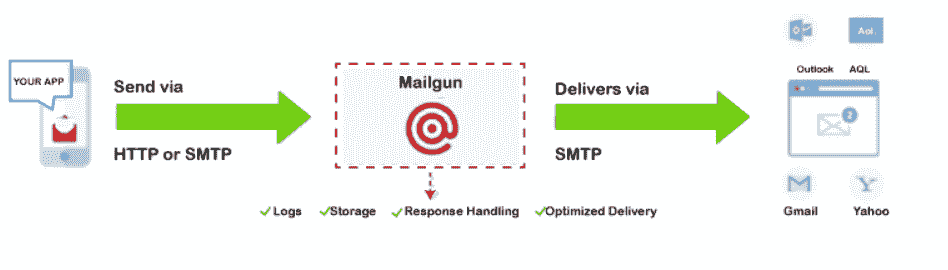
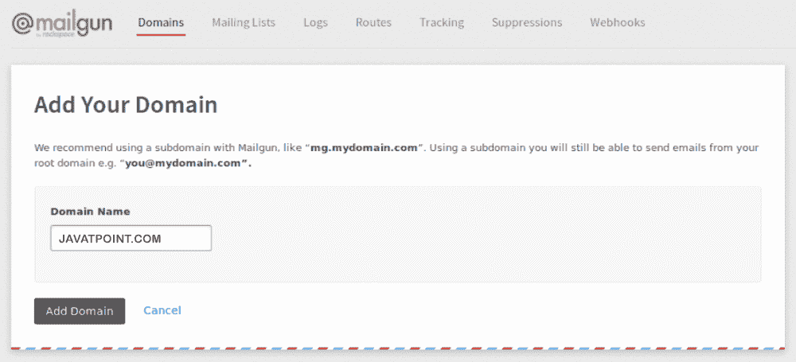
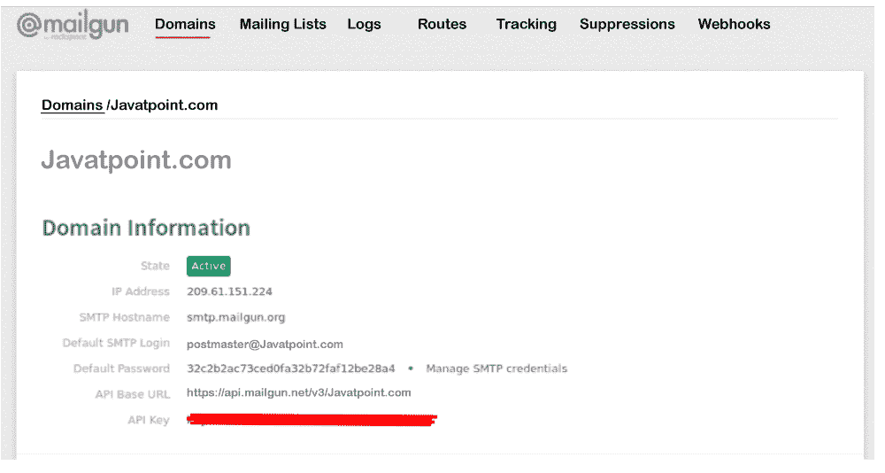
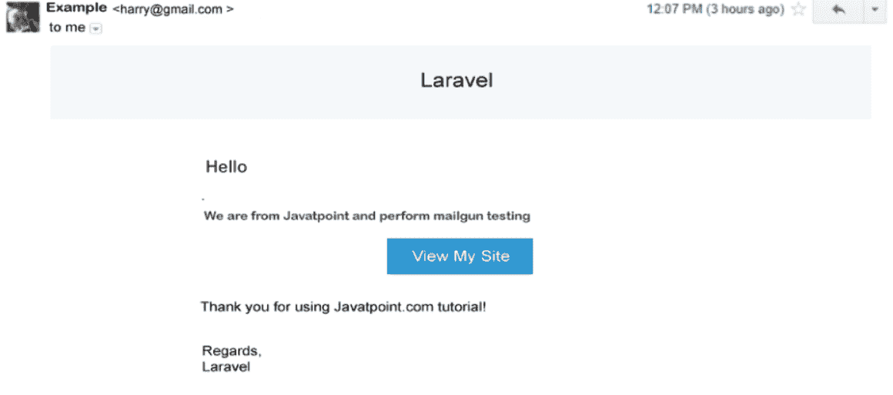

# Laravel Mailgun 安装程序

> 原文:[https://www.javatpoint.com/laravel-mailgun-setup](https://www.javatpoint.com/laravel-mailgun-setup)

在这一节中，我们将学习邮件枪设置。我们将使用 Laravel 来做到这一点。当我们开发任何应用程序时，有几次，我们要求向用户发送电子邮件。我们应该知道，没有邮件功能，90%的应用程序都无法工作。因此，了解这一功能与移动应用程序或 web 的集成对我们来说非常重要。这个应用程序将会看到电子邮件发送、Laravel 的 Mailgun 设置、Mailgun API 密钥的生成以及更多内容的集成。

Mailgun 是一种电子邮件传递服务，它为开发人员提供了一个简单的应用编程接口。使用这个应用编程接口，我们可以轻松地从他们的网站发送交易电子邮件。Laravel 的核心已经包含了 Mailgun 服务。为了从网站发送电子邮件，将使用著名的应用编程接口 Mailgun。使用 Mailgun，我们可以非常容易和快速地发送电子邮件，我们也可以跟踪该邮件。Mailgun API 有一个非常重要的特性，那就是跟踪电子邮件。使用这个应用编程接口，我们能够看到邮件的点击量和打开邮件的人数。就像一把枪，邮筒发送邮件。Mailgun 有一个非常酷的功能，就是每个月可以免费发送 1 万封邮件。Mailgun 用于通过使用其应用编程接口或使用 [SMTP](https://www.javatpoint.com/simple-mail-transfer-protocol) 服务器发送电子邮件。在我们的应用程序中，我们将使用 Mailgun API 发送电子邮件。与配置 [SMTP](https://www.javatpoint.com/smtp-full-form) 相比，该应用编程接口速度更快，可扩展性更好，并且其设置所需的工作更少。



在我们的 [Laravel](https://www.javatpoint.com/laravel) 应用程序中，我们将看到 Mailgun 的设置。这里我们将使用 Mailgun API 发送简单的邮件。如果我们使用邮件枪发送电子邮件，我们将快速收到邮件并节省装载时间。为此，我们将向其添加配置。为此，我们将添加我的 Gmail 帐户的配置。现在我们将使用一个名为。env，然后我们将像这样向其中添加以下代码:

**。env**

```php

MAIL_DRIVER=mailgun
MAIL_HOST=smtp.mailgun.org
MAIL_PORT=587
MAIL_USERNAME=javatpoint@gmail.com
MAIL_PASSWORD=adminName
MAIL_ENCRYPTION=tls

```

之后，我们将添加 mailgun api 配置秘密和域。如果我们还没有注册到我们的 mailgun 帐户，我们将使用[mailgun.com 注册](https://mailgun.com/signup)来创建一个新帐户。当我们成功完成注册后，我们将激活我们的 mailgun 帐户。现在我们点击**域**按钮，然后点击**添加新域**按钮。点击此按钮后，我们将看到如下屏幕:



当我们完全添加上述域名时，我们将看到以下屏幕。现在我们将复制应用编程接口密钥和域名，描述如下:



在此之后，我们将打开 services.php，然后将 Mailgun 配置添加到其中，如下所示:

**config/services.php**

```php
'mailgun' => array(
    'domain' => 'javatpoint.com',
    'secret' => 'key-11796c09e58-056a9e975c96dd334da0dd',
),

```

现在我们必须通过发送邮件来测试它。因此，我们将首先通过创建如下测试路线来发送电子邮件:

**app/Http/routes.php**

```php

Route::get('mail', 'HomeController@mail');

```

之后，我们将使用一个名为 HomeController.php 的文件，并在其中添加邮件功能，如下所示:

**app/Http/controller/Homecontroller . PHP**

```php
public function mail()
{
    $user = User::find(1)->toArray();
    Mail::send('emails.mailEvent', $user, function($message) use ($user) {
        $message->to($user->email);
        $message->subject('Mailgun Testing');
    });
    dd('Mail is Successfully Send');
}

```

最后，我们将通过创建电子邮件模板文件来发送电子邮件。现在，我们将使用我们的电子邮件文件夹，创建一个名为 mailEvent.blade.php 的电子邮件模板文件，如下所示:

**资源/视图/电子邮件/mailEvent.blade.php**

```php

We are from Javatpoint and perform mailgun testing.

```

Laravel 中的电子邮件模板如下所示:



* * *