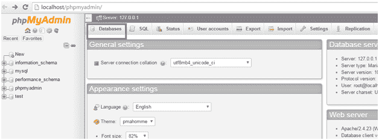
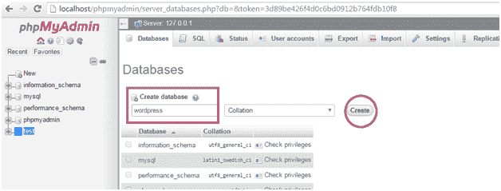
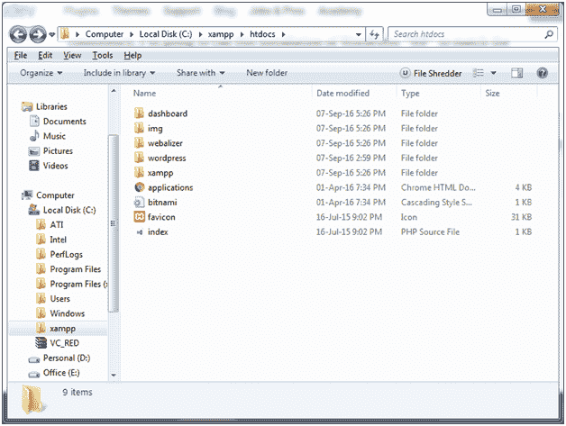
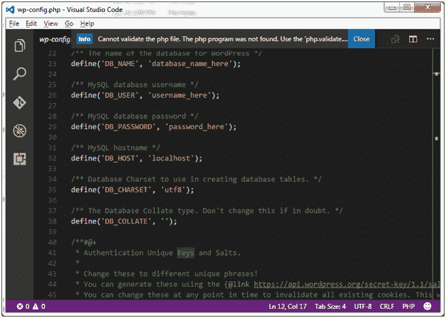
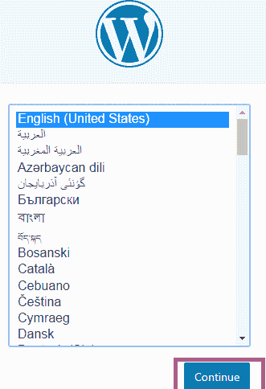
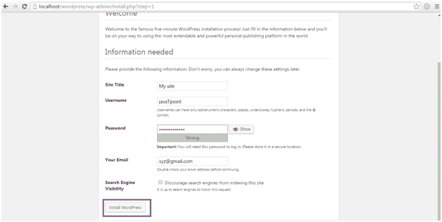
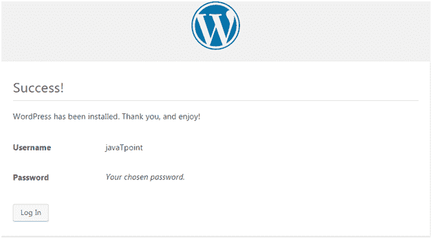

# 在本地服务器上安装 wordpress

> 原文：<https://www.javatpoint.com/installing-wordpress-on-local-server>

WordPress 可以使用本地服务器安装，如 XAMPP、WAP 等。我们？我假设您的系统已经安装了本地服务器。

我们的系统中安装了 XAMPP 服务器。现在，我们？我将看到 WordPress 的安装。

* * *

## 创建数据库

从 XAMPP 服务器控制面板打开 **phpmyadmin** 。

在这里，您可以在顶部看到选项**数据库。**选择。

看上面的快照，点击上面的**数据库**创建一个数据库。你将被引导到下一个窗口。

看看上面的快照，你必须创建一个数据库来连接你的 WordPress。你可以给它起任何名字。在这里，我们将其命名为 **wordpress。**写出数据库名称，点击**创建。**

* * *

## 下载并安装 WordPress

首先你要从你系统中的官方 WordPress 网站**www.wordpress.org**下载最新版本的 WordPress。

WordPress 将以压缩格式下载。这个 WordPress 压缩文件夹必须放在 XAMPP 文件夹**中**

在这里解压 WordPress 文件夹，给它起任何名字。在这里，我们将其命名为 wordpress。

打开创建的 wordpress 文件夹。在文件夹中，找到**文件 wp-config-sample.php**文件，并将其重命名为**wp-config.php**文件。向下滚动文件，直到第 23 行，如下图所示。

这些行定义了数据库的登录凭据。

*   用您的数据库名称替换“database_name_here”。在我们的例子中，它是“wordpress”。
*   将“username _here”替换为您的“root”。
*   “password_here”字段将保持空白。
*   保存并关闭文件。

现在，打开浏览器，进入**http://localhost/WordPress/**

这里，wordpress 是解压后的 WordPress 文件的文件夹名。

看上面的快照，选择你的语言，点击**继续**按钮。

你将被引导到下一页。

查看上面的快照，您必须填写上面字段中的所有详细信息，然后单击安装按钮。

仅此而已，你已经安装了 WordPress。

如果以上过程都做对了，那么你呢？将成功登录 WordPress，如上面的快照所示。