# 使用微软网络矩阵安装

> 原文:[https://www . javatpoint . com/installing-WordPress-use-ms-web matrix](https://www.javatpoint.com/installing-wordpress-using-ms-webmatrix)

Webmatrix 是 Windows 推出的一款免费的轻量级软件工具，可以下载不同的应用程序。该软件仅适用于窗口用户。从网络矩阵下载 WordPress 非常容易。你可以很容易地使用网络矩阵在 WordPress 上创建一个网站。

* * *

## 安装 WordPress 的步骤

*   下载并安装网络矩阵
*   打开已安装的网络矩阵
*   打开应用程序库
*   选择网络应用程序
*   选择数据库
*   选择密码和管理员名称
*   开始安装
*   安装完成
*   第一次运行站点
*   输入信息

* * *

## 下载并安装网络矩阵

通过以下链接在您的系统中下载网络矩阵

看上面的快照，你会看到这种类型的文件被下载。这是一个带有**的文件。exe** 扩展。

打开此文件后，您将被引导至以下窗口。

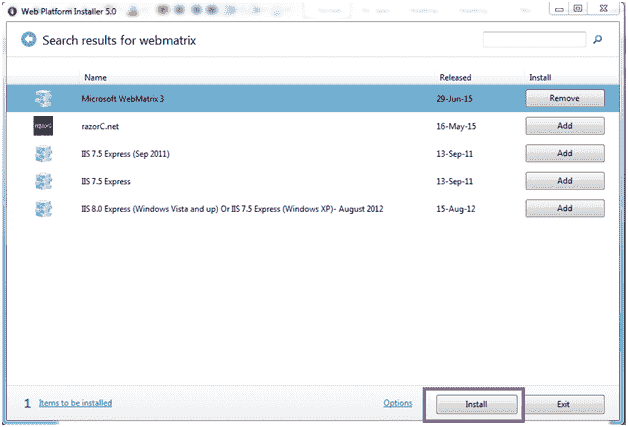

看上面的快照，在右上角搜索网络矩阵。现在，点击**微软网络矩阵 3** 前面的**添加**按钮。该按钮将转换为**移除**图标。现在点击**安装**。

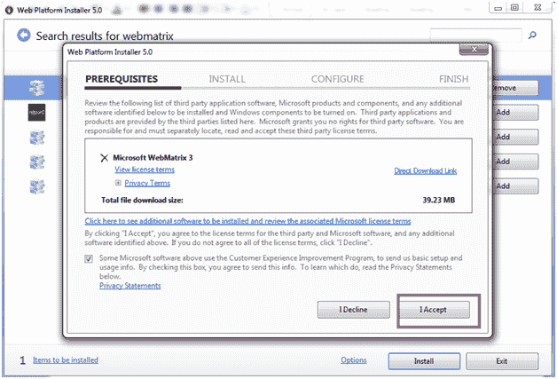

看上面的快照，点击**我同意**开始安装。

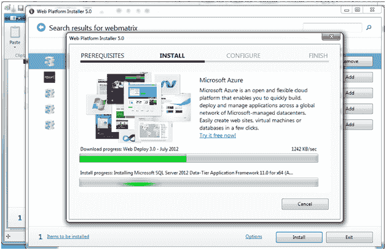

看上面的快照，所有的服务器都安装好了。

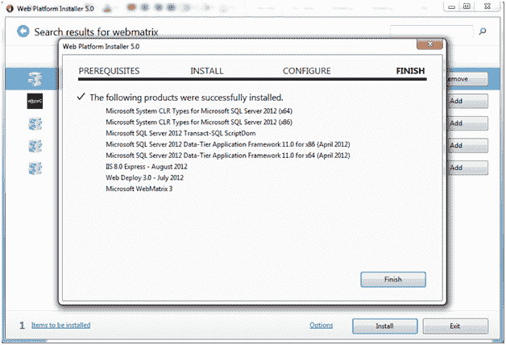

看上面的快照，我们已经用上面提到的应用程序成功地在我们的系统上安装了网络矩阵。

* * *

## 打开快速入门网站矩阵

一旦你下载了网络矩阵，在你的系统上打开它来安装 WordPress。

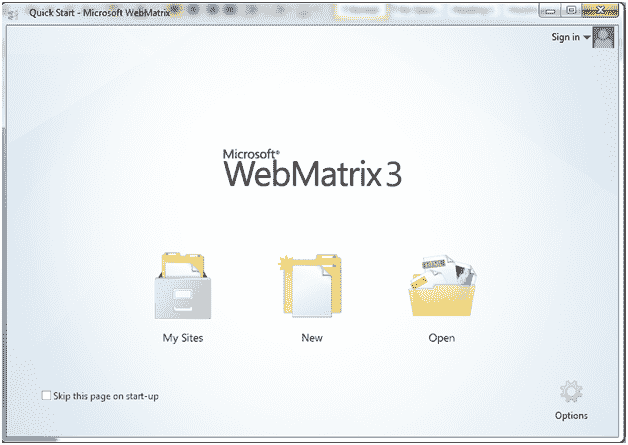

看上面的快照，上面的窗口是**快速启动**页面。

点击**新建**，你会被引导到下面的页面。

**注意:**如果不想每次都出现这个页面，请点击复选框。

* * *

## 打开应用程序库

显示三个选项。你必须去应用程序库，它将为你提供很多选项来创建一个网站。

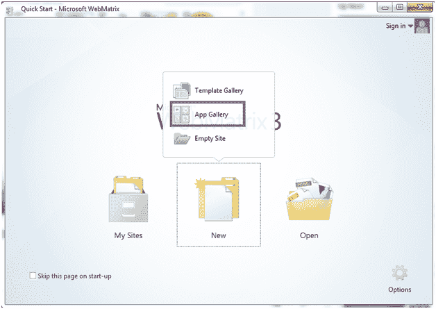

看上面的快照，点击**新建**，生成三个选项，从中你可以选择**应用程序库。**

* * *

## 选择网络应用程序

这里，我们要选择 WodPress 应用。

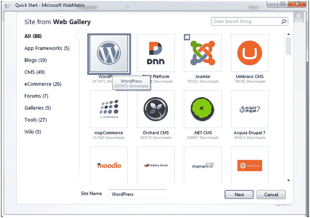

看上面的快照，这些是微软网络矩阵提供的应用程序。从这里选择 WordPress，然后点击**下一步。**

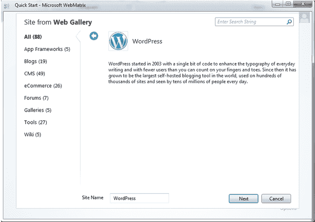

将出现此页面，再次点击**下一步。**

* * *

## 选择数据库

我们需要选择数据库。默认情况下，WordPress 只与 MySQL 兼容。如果您的系统上没有安装 MySQL，Webmatrix 将会安装它。

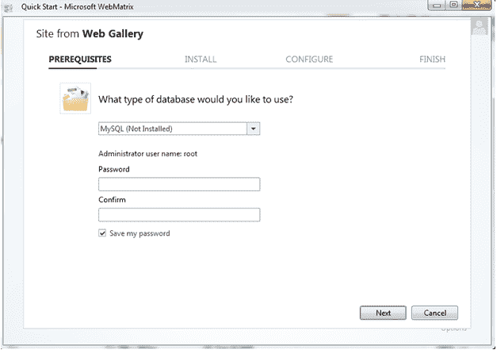

看上面的快照，默认情况下 Webmatrix 选择 MySQL 数据库。

* * *

## 选择密码和管理员名称

这里，默认的管理员名称将是 root。您可以键入任何密码，但请记住管理员名称和密码。

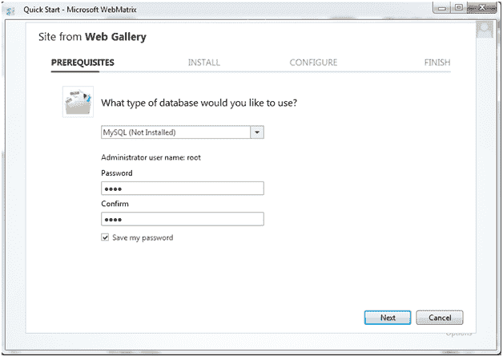

* * *

## 开始安装

这个页面会显示你需要安装的所有应用程序。所有的软件都会自己安装，你什么都不用做。

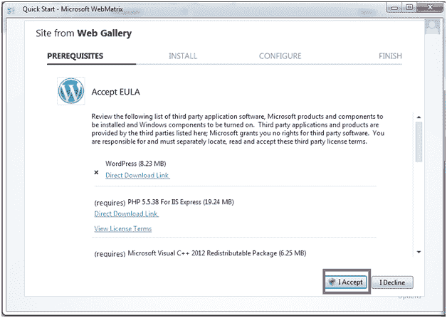

看上面的快照，接受 EULA(最终用户许可协议)后，安装开始。

如果您的互联网连接良好，那么您的安装大约需要 1-2 分钟。

* * *

## 安装完成

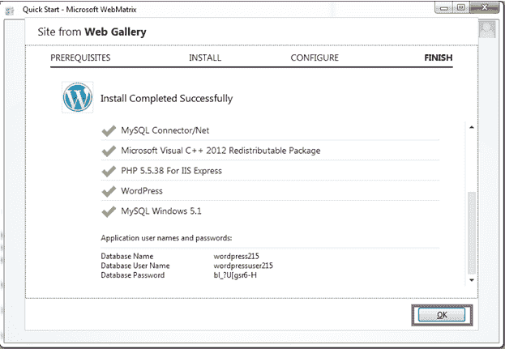

看上面的快照，安装完成。它显示了我们刚才安装的应用程序列表。

它还显示用户名和密码

* * *

## 第一次运行站点

安装完成后，工作区将出现在 Webmatrix 站点中。在网络矩阵功能区，点击**运行。**

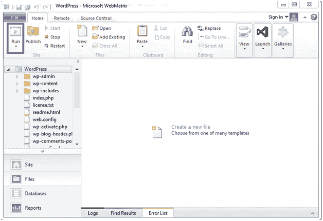

看上面的快照，点击运行按钮后，你要选择语言。

* * *

## 输入信息

选择语言后，您必须输入关于您的网站的更多信息。

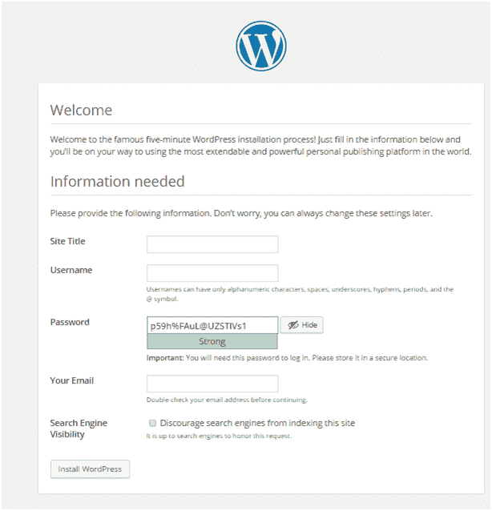

看上面的快照，在上面的信息中你可以根据自己的意愿填充任何东西。

如果您不提供密码，它会自动为您生成密码。

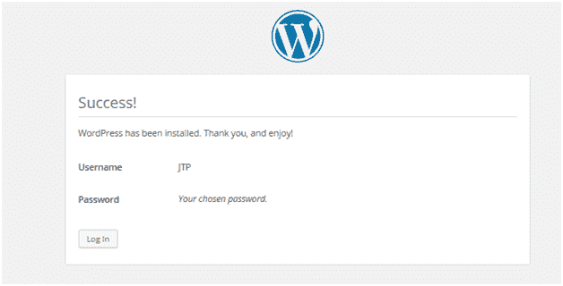

看看上面的快照，它显示成功安装了 WordPress，用户名为 JTP，密码为。

**注意:**如果不提供用户名和密码，那么默认情况下用户名是 admin，密码是自己生成的。