# 如何创建一个 WordPress 网站

> 原文：<https://www.javatpoint.com/how-to-create-wordpress-site>

在 WordPress 上创建一个网站非常容易。WordPress 的设计方式是，即使是非技术用户也可以轻松、有吸引力地设计自己的网站。

在这里，我们将讨论创建 WordPress 网站的每一步。

*   选择合适的平台
*   选择域名和主机
*   选择主题/模板
*   创建新页面
*   添加内容
*   添加媒体
*   安装插件

* * *

## 选择合适的平台

首先你必须决定一个合适的平台来建立你的网站。在这里，平台意味着要么你想用 HTML、CSS 或者内容管理系统来创建你的网站。

市场上有各种流行的 CMS，比如 WordPress、Drupal、Joomla、DotNetNuke 等。

**为什么选择 WordPress**

对于初学者来说，WordPress 将是最好的，因为它不需要任何技术技能，并且由于它的灵活性，它适合所有类型的用户。

您将获得许多选项来选择一个主题作为 WordPress 的广泛社区设计主题。它可以处理任何类型的网站，无论大小。像美国有线电视新闻网、美国国家航空航天局、易贝等大多数知名网站都使用 WordPress。

最重要的是，它为您提供了一个响应迅速的网站，使其与手机和平板电脑等小屏幕设备兼容。

共享托管是初学者的最佳选择。您可以稍后根据网站的流量升级您网站的主机。

* * *

## 选择域名和主机

你需要一个域名和一个托管空间来让你的网站上线。

域名让你可以给你的网站起自己的名字，而主机给你的网站在服务器上的空间，确保你的网站加载很快，不会停机几个小时。

域名应该简短，容易记住，品牌能力和朗朗上口，这定义了你的业务。

选择一个域名并不容易，因为数百万个域名都是活跃的。

* * *

## 选择主题/模板

安装 WordPress 后，一个站点看起来非常普通。为了使它更有吸引力，用户为他们的网站安装最合适的主题。它将视觉效果和视图添加到首页。

首先，登录你的 WordPress 网站。默认情况下，第一个屏幕将是您的仪表板。

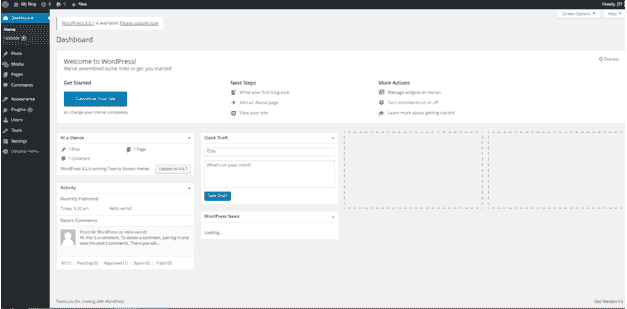

**访问免费主题**

登录后，您将获得 150 个免费主题的访问权限。

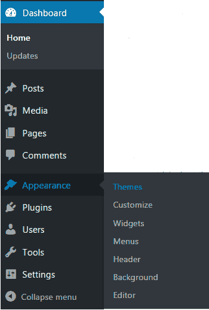

看上面的快照，要看免费主题，拿到你仪表盘的侧栏菜单，选择**外观>主题**。

屏幕下方将显示所有已安装的主题。

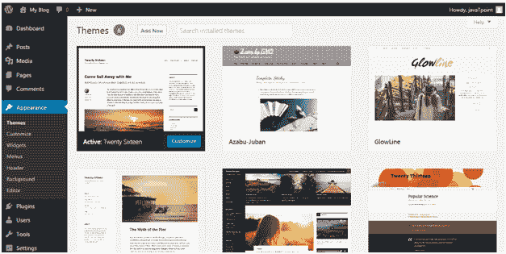

看上面的快照，如果你想安装更多的主题，点击上面的**添加新的**按钮并安装。

要安装一个主题，点击**安装**，然后点击**激活**按钮。

* * *

## 创建新页面

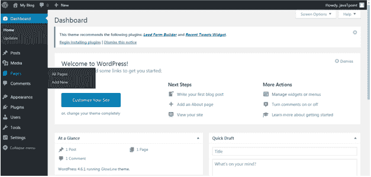

看上面的快照，进入侧边栏菜单，点击**页面>添加新的**选项。

* * *

## 添加内容

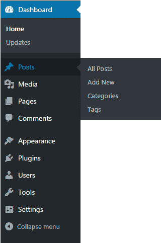

**新增岗位**

最后，我们都将来到这一点，使我们的网站受欢迎。我们需要发布不同的东西来增加我们网站的受欢迎程度。

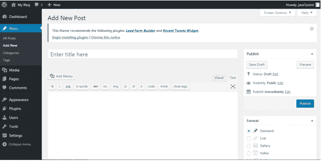

点击**发文>新增**选项，屏幕上会出现以上页面。

写文章有两种方法，你可以用可视化编辑器写，也可以用文本编辑器写(HTML 格式)。目前这个快照是文本编辑器的。

**添加类别**

您可以通过向内容添加类别来将内容分为不同的类别。当您发布多个领域的内容时，此工具非常方便。

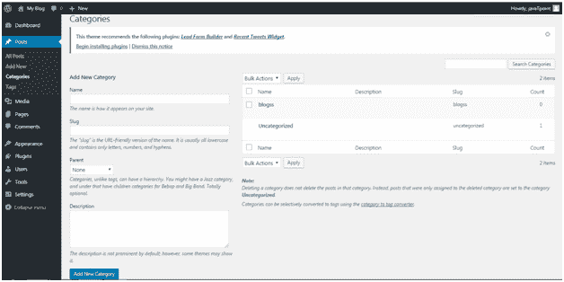

点击**帖子>类别**，你将被引导到上面的页面。

在这里，在**名称**中，为您的新类别添加一个标题。在 **Slug** 中，你可以添加一些单词，这些单词将在搜索时成为网址的一部分。

**标签**

标签与类别非常相似，唯一的区别是每个帖子都有自己的标签集。

**启用或禁用注释**

评论会在一些帖子或网站上引起争论。一些用户不希望他们的访问者发表评论。他们可以在 WordPress 中关闭评论。

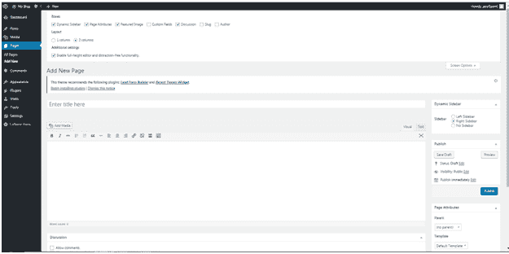

要禁用特定页面的注释

*   转到**页面>添加新的**
*   点击右上角的**屏幕选项**
*   勾选**讨论**框
*   向下滚动，取消勾选**允许注释**选项

默认情况下禁用注释

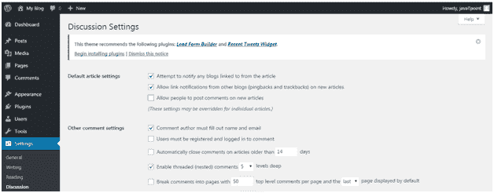

*   转到**设置>讨论**
*   取消勾选“允许人们对新文章发表评论”

**编辑侧栏**

侧边栏通常出现在右侧(有时出现在左侧)，包含档案、类别和元等小部件。

要编辑侧栏，请转到**外观>部件**

使用拖放方法来使用小部件或移除小部件。

**添加媒体**

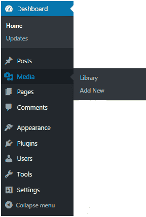

每个网站都需要一些照片和视频来描述它的内容和价值。WordPress 还提供了添加媒体功能。您可以添加图像标题、标题和描述以及媒体。另外添加 alt 文本有助于搜索引擎识别图像。

* * *

## 安装插件

插件是 WordPress 中的扩展，通过特定的代码扩展特定的功能到你的站点。它们不是内置的。

有将近 25，000 种不同的插件可供选择。

安装一个插件非常简单。点击**插件**。您将看到三个选项，如下图所示。

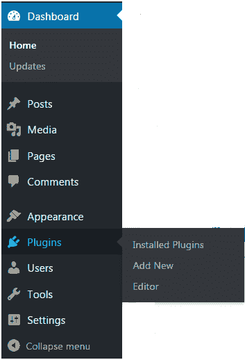

点击**插件>新增。**下面的画面会出现在你面前。

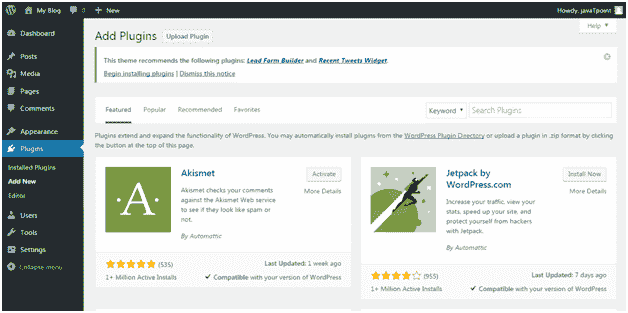

你可以从给定的选项中选择一个插件。只需点击**立即安装**即可使用。