# WordPress 帖子

> 原文:[https://www.javatpoint.com/wordpress-posts](https://www.javatpoint.com/wordpress-posts)

帖子允许你写一篇博客，然后发布在你的网站上。它们以相反的时间顺序排列在你博客的首页。

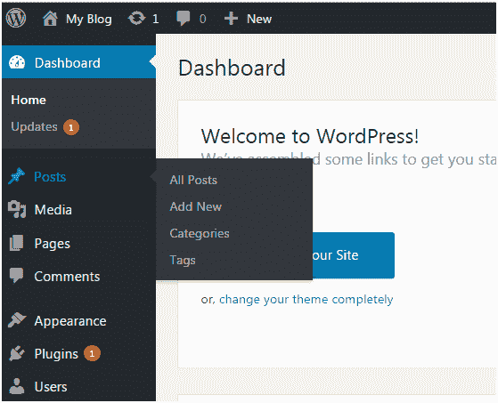

看上面的快照，这些是帖子的子菜单。

* * *

## 如何添加新帖子

转到**帖子>添加新内容。**

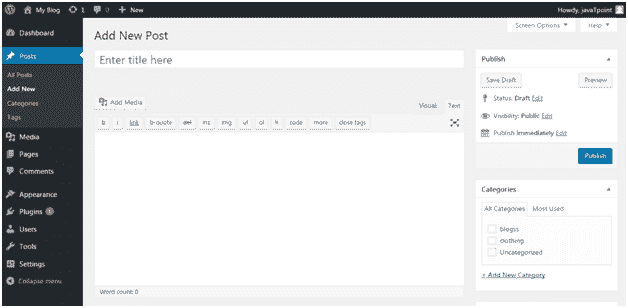

看上面的快照，编辑器页面就会出现在你面前。有两个字段，

**标题-** 输入你帖子的标题

**内容-** 这里你要写你帖子的内容。

在可视化模式下，可以用普通格式书写。

在文本模式下，您可以用 HTML 格式编写。

**预览-** 这个按钮可以让你在发布帖子之前先看一下。

* * *

## 如何发布帖子

填写完以上两个字段后，点击**发布**按钮。这意味着你已经准备好在你的网站上发布你的博客了。

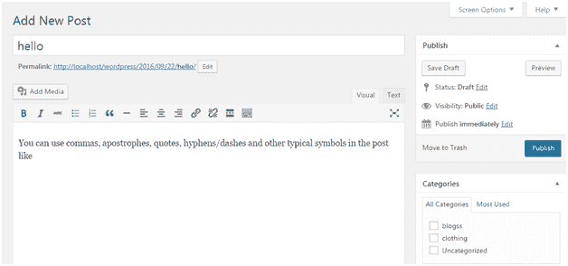

看看上面的快照，发布部分还有一些其他的选项。

预览文章/预览-让您在发布文章之前看到文章的预览

**永久链接-** 代表永久链接。它包含一个从文章标题派生的用户友好的文章名称。这可以使用“编辑”按钮进行编辑。

**保存草稿-** 这里可以保存一篇帖子

**状态-** 让您将帖子的状态更改为待处理和草稿。

**可见性-** 将可见性更改为公共、密码保护和私有。

**发布-** 更改帖子发布日期和时间

* * *

## 如何编辑帖子

要编辑帖子，请转到**帖子>所有帖子。**

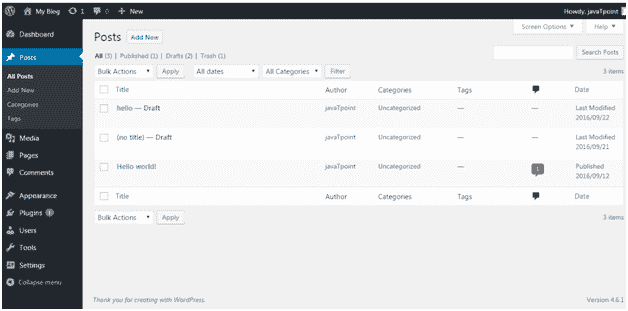

看上面的快照，这是所有已创建帖子的列表。将鼠标放在帖子上方，将出现以下选项。

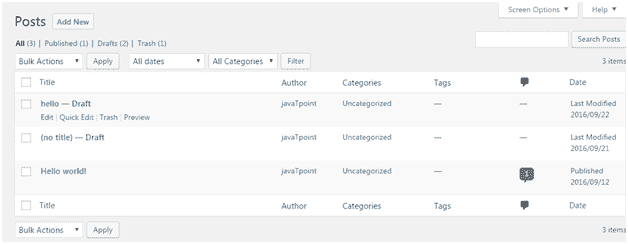

看上面的快照，有两个选项可以编辑。一个是编辑，另一个是快速编辑。

点击**编辑**，将出现以下页面。

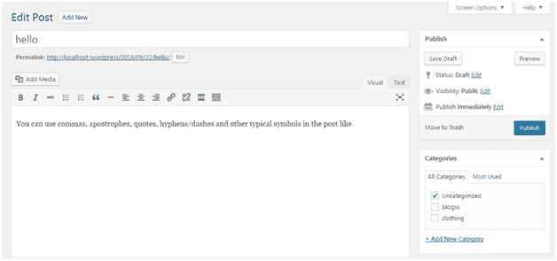

看看上面的快照，在这里你可以编辑文章的标题或内容。

点击**快速编辑**，将出现以下页面。

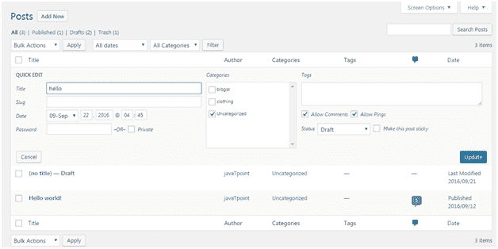

看看上面的快照，在这里你可以编辑文章的标题、日期和内容。如果你愿意，你也可以为你的文章改变类别。

* * *

## 如何删除帖子

要删除帖子，请转到**帖子>所有帖子**

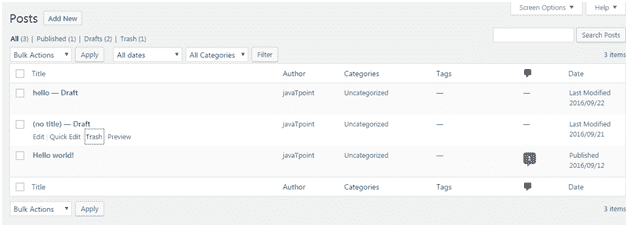

看上面的快照，**垃圾桶**选项会让你删除各自的帖子。

* * *

## 如何预览帖子

预览选项有助于在向公众发布之前看到您的帖子。在向世界发布之前，最好先看看你的帖子是什么样子的。

转到**帖子>所有帖子**

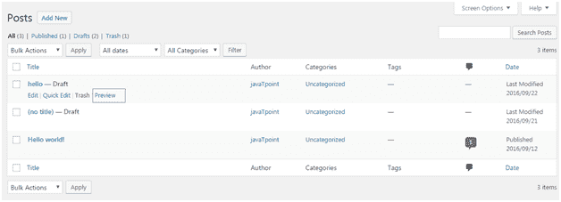

看上面的快照，打卡**预览**时，会出现以下页面。

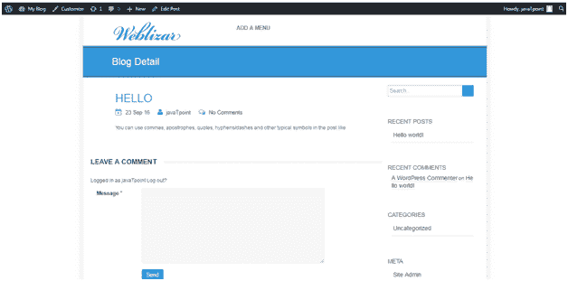

看上面的快照，这是我们帖子的预览。它让你知道你的文章是否需要编辑。

* * *

## 如何发布帖子

从发布按钮，你可以让你的文章对你的观众可用。

转到**帖子>添加新的**

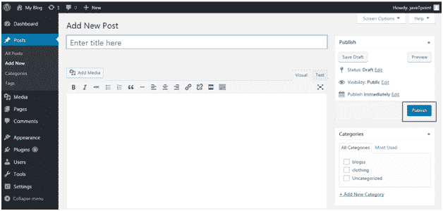

看上面的快照，写完帖子后点击**发布**按钮。你的文章将会公开发表。